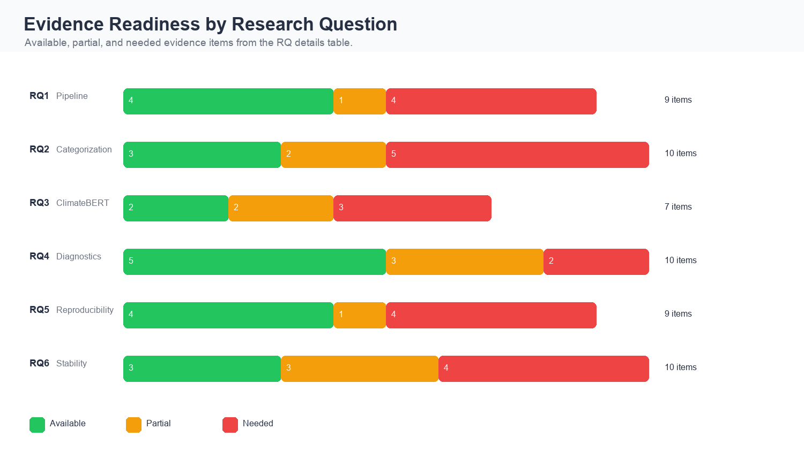
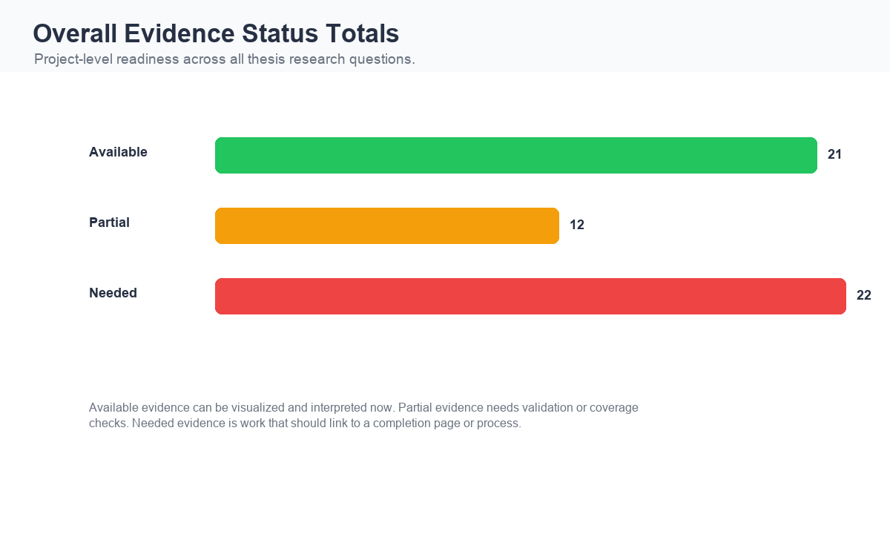
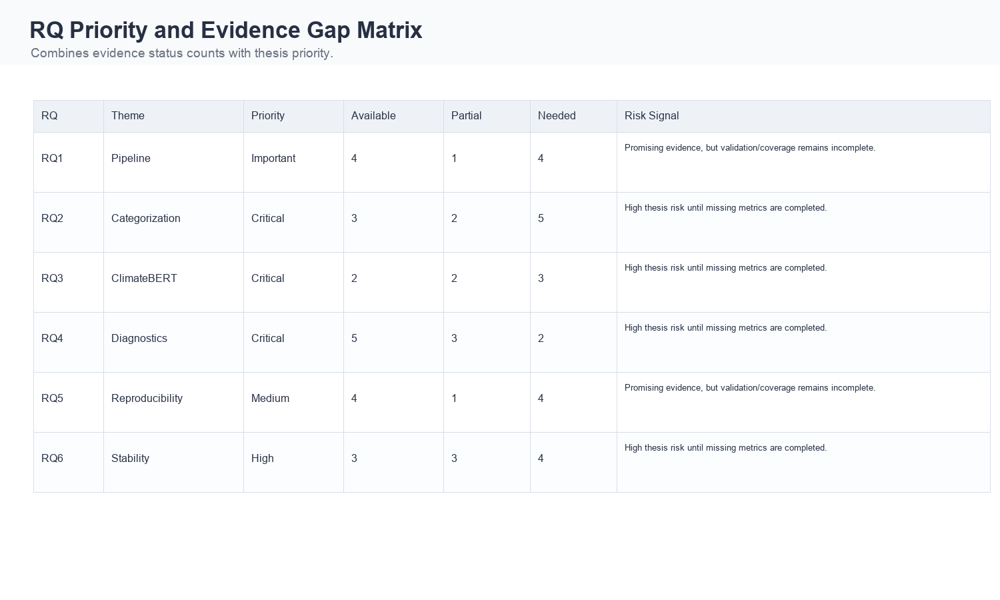
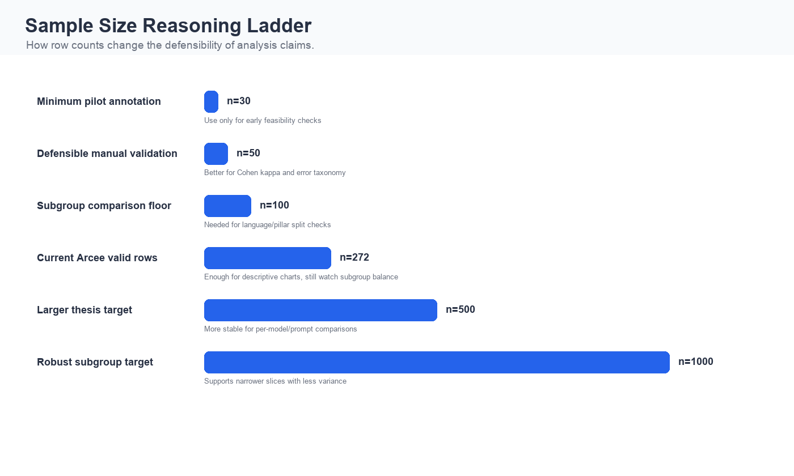
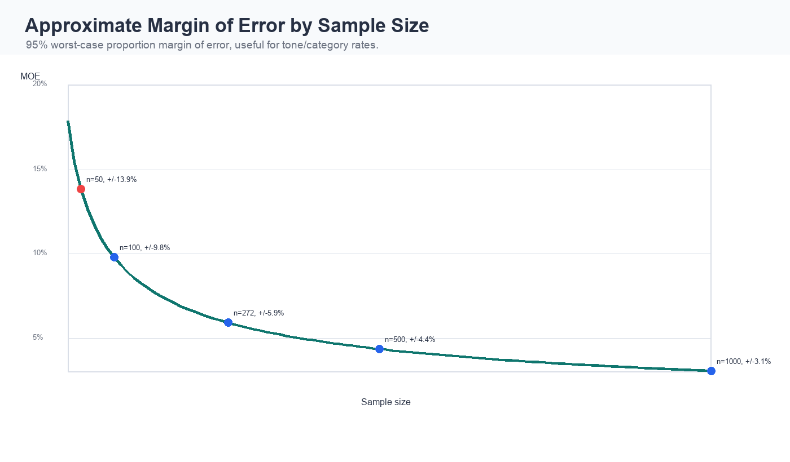
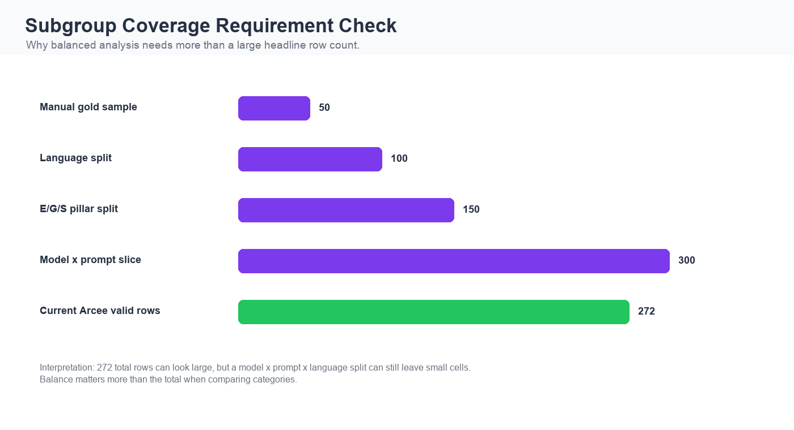
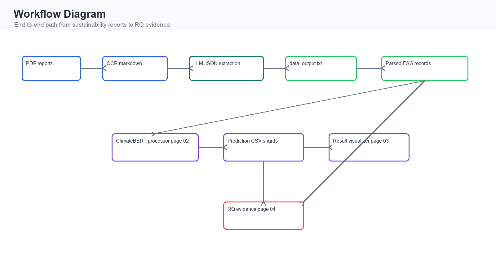
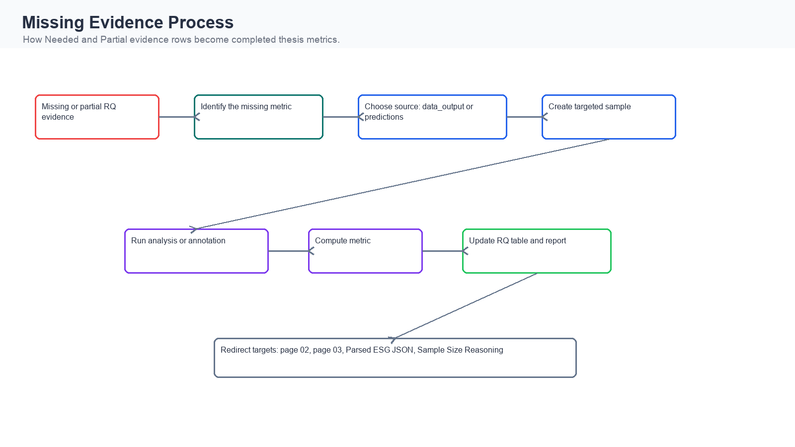
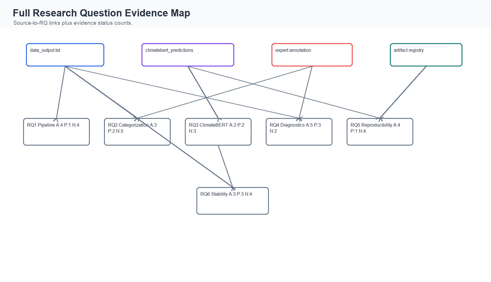

# Research Question Artifact Export

Generated: 2026-05-09T07:09:07

## Sources

- Existing data: `/home/ubuntu/apps/benchmarks/esg_dashboard_new-main/dashboard/data/data/data_output.txt`
- Prediction outputs: `/home/ubuntu/apps/benchmarks/esg_dashboard_new-main/dashboard/data/data/climatebert_predictions`
- Streamlit RQ page: `/Users/darisdzakwanhoesien/Documents/project_documentation/codebase/esg_project/benchmarks/esg_dashboard_new-main/dashboard/pages/04_Research_Questions_Visualizer.py`

## Image Outputs and Explanations

### Evidence Readiness by Research Question

**What it shows:** A stacked count of available, partial, and needed evidence for each research question.

**Expected metrics:** Each RQ should move toward more Available items and fewer Needed/Partial items before the thesis makes strong claims.

**Interpretation:** RQ2 and RQ3 are critical because their missing validation and ClimateBERT comparison work directly determine whether the ABSA results are defensible.

**If underperforming:** If a row remains dominated by Needed or Partial evidence, the RQ should be presented as preliminary or narrowed until the missing metric is computed.

### Overall Evidence Status Totals

**What it shows:** The total count of evidence rows by status across the whole RQ evidence matrix.

**Expected metrics:** A mature thesis evidence set should have most rows Available, with only low-priority items remaining Partial or Needed.

**Interpretation:** This chart is a readiness check, not a statistical test. It tells you how much of the evidence pipeline has been completed.

**If underperforming:** Large Partial/Needed counts mean the dashboard should redirect users to processing, annotation, or validation workflows.

### RQ Priority and Evidence Gap Matrix

**What it shows:** A compact table image linking RQ priority to the amount of available, partial, and needed evidence.

**Expected metrics:** Critical and High RQs should have direct metrics, traceable sources, and low unclosed Needed counts.

**Interpretation:** The most important risk is not simply the number of gaps; it is whether a gap belongs to a Critical RQ.

**If underperforming:** If a Critical RQ has Needed rows, the page should route the user to the processor, result visualizer, annotation plan, or parsed-data page.

### Sample Size Reasoning Ladder

**What it shows:** A practical ladder of sample sizes and what each size can support in the thesis.

**Expected metrics:** Manual validation usually needs at least 30-50 records; subgroup comparisons need substantially more balanced rows.

**Interpretation:** Current row counts can support descriptive analysis, but smaller slices by language, pillar, prompt, or model may still be fragile.

**If underperforming:** If a subgroup has too few rows, report it as exploratory and avoid strong comparative claims.

### Approximate Margin of Error by Sample Size

**What it shows:** How uncertainty shrinks as the number of validated rows grows.

**Expected metrics:** For proportion estimates such as tone rate, more rows reduce uncertainty; n=272 gives roughly +/-5.9 percentage points in the worst case.

**Interpretation:** The thesis can report descriptive proportions, but subgroup results need enough rows per subgroup, not just a large total row count.

**If underperforming:** If a subgroup is below n=30-50, use it for qualitative diagnostics rather than quantitative claims.

### Subgroup Coverage Requirement Check

**What it shows:** The row counts needed when validation is split by language, pillar, model, or prompt.

**Expected metrics:** A useful target is 30-50 validated rows per important subgroup.

**Interpretation:** This chart explains why some RQ evidence remains Partial even when the dataset already has many rows.

**If underperforming:** If important cells are sparse, add data or collapse categories before claiming subgroup differences.

### Workflow Diagram

**What it shows:** The operational pipeline connecting source reports, parsed records, ClimateBERT processing, prediction outputs, and the RQ evidence page.

**Expected metrics:** Every output should be traceable back to data_output.txt or climatebert_predictions, with page-level or row-level provenance where possible.

**Interpretation:** The dashboard should treat page 02 as the production step, page 03 as the prediction review step, and page 04 as the thesis-evidence interpretation layer.

**If underperforming:** If any handoff is missing, the downstream chart may still render but it will be hard to audit or continue after interruption.

### Missing Evidence Process

**What it shows:** The completion workflow for rows marked Needed or Partial in the RQ details table.

**Expected metrics:** Each missing item should name a source, a process, and a metric that can be computed and added back to the evidence table.

**Interpretation:** Needed rows are not errors. They are explicit thesis work items with a destination page and completion metric.

**If underperforming:** If a Needed row has no route or metric, it should be rewritten until the next action is executable.

### Full Research Question Evidence Map

**What it shows:** A high-level lineage map from source artifacts to the six research questions.

**Expected metrics:** Each RQ should be linked to the data source that supports it and the status counts that indicate readiness.

**Interpretation:** RQ3 depends most directly on prediction outputs, while RQ2 and RQ4 also need expert annotation to become fully defensible.

**If underperforming:** If a source-to-RQ link is weak or missing, the RQ should not be presented as fully supported yet.

## Research Question Details

### RQ1 - Pipeline

How can a PDF-to-structured ESG transformation pipeline convert Indonesian/English sustainability reports into a governance-aligned, sentence-level representation that supports ABSA?

Priority: **Important**

Status counts: Available=4, Partial=1, Needed=4.

Interpretation: Pipeline evidence is strong for parsing and traceability, but OCR and sentence-boundary quality still need direct measurement.

Key metrics:

- `JSON parse success`: 100% (332/332 records parseable)
- `Records extracted`: 332 (from 6 docs and 39 unique runs)
- `OCR quality CER`: missing (critical gap)

Needed/partial completion logic:

- Available: visualize and cite with traceability.
- Partial: compute the missing validation or coverage metric before strong claims.
- Needed: redirect to the relevant dashboard/process page and complete the metric.

### RQ2 - Categorization

How should ESG be categorized by aspect/pillar, sentiment, and tone in bilingual disclosures to enable fine-grained ABSA while preserving cross-language comparability?

Priority: **Critical**

Status counts: Available=3, Partial=2, Needed=5.

Interpretation: Categorization has useful descriptive distributions, but gold labels and inter-annotator agreement are required before treating labels as validated ABSA.

Key metrics:

- `Tone: commitment`: 34.6% (115/332, dominant category)
- `E/G/S split`: 54/36/1% (S severely underrepresented)
- `Non-standard aspects`: 41 (ontology gap)

Needed/partial completion logic:

- Available: visualize and cite with traceability.
- Partial: compute the missing validation or coverage metric before strong claims.
- Needed: redirect to the relevant dashboard/process page and complete the metric.

### RQ3 - ClimateBERT

Do tone-based ABSA outputs differ meaningfully from ClimateBERT-style label classifications, and what is the relationship between detected tone and climate-specific targets?

Priority: **Critical**

Status counts: Available=2, Partial=2, Needed=3.

Interpretation: ClimateBERT comparison becomes defensible only when local model prediction CSVs cover all valid records and can be joined back to the parsed dataset.

Key metrics:

- `CB alignment commitment`: 34.3% (91/265 commitment records carry climate-commitment)
- `CB remote inputs`: 3 (far too few; must run locally)
- `CB models available`: 13 (detection, netzero, TCFD, sentiment, specificity)

Needed/partial completion logic:

- Available: visualize and cite with traceability.
- Partial: compute the missing validation or coverage metric before strong claims.
- Needed: redirect to the relevant dashboard/process page and complete the metric.

### RQ4 - Diagnostics

What weaknesses arise in ABSA extraction outputs, and how can a diagnostics framework detect and quantify extraction errors to inform model improvement?

Priority: **Critical**

Status counts: Available=5, Partial=3, Needed=2.

Interpretation: Diagnostics are already useful for identifying schema drift and missing tone, but manual error labels are needed for a formal error taxonomy.

Key metrics:

- `Missing tone, Arcee only`: 0.4% (1/272)
- `Schema drift rate`: 30% (18/60 records from data.md)
- `Ontology gap`: 41 (all Indonesian free-text)

Needed/partial completion logic:

- Available: visualize and cite with traceability.
- Partial: compute the missing validation or coverage metric before strong claims.
- Needed: redirect to the relevant dashboard/process page and complete the metric.

### RQ5 - Reproducibility

How can documentation and visualization practices be designed to maximize reproducibility and auditability of ESG ABSA experiments?

Priority: **Medium**

Status counts: Available=4, Partial=1, Needed=4.

Interpretation: Reproducibility has several artifacts in place; the remaining work is a formal rerun checklist and independent replication log.

Key metrics:

- `Artifacts available`: 5+5+1 (5 CSVs, 5 PNGs, 1 Streamlit app)
- `Prompt templates logged`: 6 (zero-shot, few-shot, CoT, EN/ID variants)
- `Replication study`: 0 (not yet conducted)

Needed/partial completion logic:

- Available: visualize and cite with traceability.
- Partial: compute the missing validation or coverage metric before strong claims.
- Needed: redirect to the relevant dashboard/process page and complete the metric.

### RQ6 - Stability

What is the stability of ABSA outputs across cross-model and cross-prompt configurations, and what ensemble or verification strategies yield the most reliable results?

Priority: **High**

Status counts: Available=3, Partial=3, Needed=4.

Interpretation: Stability analysis shows prompt sensitivity; balanced model x prompt x document coverage is needed before ensemble claims are strong.

Key metrics:

- `Prompt instability CV`: 38.2% (high variation across 5 prompts)
- `CoT vs zero-shot gap`: +31pp (55% vs 23% commitment)
- `Cross-model kappa`: missing (imbalanced runs)

Needed/partial completion logic:

- Available: visualize and cite with traceability.
- Partial: compute the missing validation or coverage metric before strong claims.
- Needed: redirect to the relevant dashboard/process page and complete the metric.

## Mermaid Sources

- [Workflow Diagram](mermaid/workflow_diagram.mmd): Mermaid source for the corresponding dashboard diagram.
- [Missing Evidence Process](mermaid/missing_evidence_process.mmd): Mermaid source for the corresponding dashboard diagram.
- [Full Research Question Evidence Map](mermaid/full_research_question_evidence_map.mmd): Mermaid source for the corresponding dashboard diagram.
