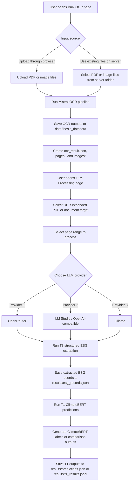
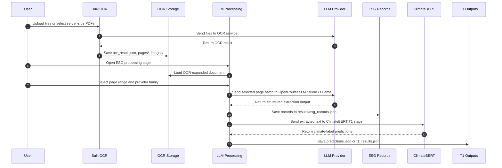

# Chapter 7 Appendices

This appendix chapter consolidates supplementary material that supports the methodological and reproducibility claims in the main thesis. The appendices are intended to document materials that are important for transparency but too detailed to place in the core chapter narrative.

## 7.1 Appendix Contents

The appendices should contain, at minimum, the following materials:

1. prompt templates used in the main thesis-facing comparisons;
1. model identifiers, providers, and decoding settings where available;
1. benchmark and comparison artifact paths;
1. annotation instructions and tone-label definitions;
1. additional difficult examples and disagreement cases;
1. supplementary failure-mode tables;
1. extended reproducibility notes for rerunning stored analyses.

## 7.2 Tone-Label Definitions

The pilot annotation and review process should use the following working definitions:

1. **Commitment:** forward-looking promises, targets, intentions, or policy declarations that do not yet demonstrate completed implementation or realized outcome.
1. **Action:** concrete activities, agreements, programs, investments, or operational steps that are being undertaken or have been initiated.
1. **Outcome:** realized, completed, or demonstrably achieved results, milestones, or measured performance changes.
1. **Needs review:** records whose language is too ambiguous, mixed, or incomplete for stable tone assignment without additional human interpretation.

## 7.3 Reproducibility Notes

The main reproducibility artifacts referenced in the thesis include:

1. OCR-expanded document folders under `data/thesis_dataset/`;
1. extracted ESG records under `results/esg_records.json`;
1. resumable benchmark outputs under `results/t1_results.jsonl` and `results/t2_results.jsonl`;
1. prompt and model stability summaries under `results/revision_analysis/`;
1. dashboard-ready figures and tables under `results/thesis_workflow_dashboard/`.

These artifacts support rerunning, auditing, and extending the workflow even where exact third-party LLM outputs may vary across time.

## 7.4 End-to-End User Workflow Diagram

The appendix should also document the operational user flow across the main thesis-facing tools. In the implemented repository, the workflow begins with OCR preparation in `pages/Bulk_OCR.py`, continues through page-range-aware ESG extraction in `pages/llm_processing.py`, and then passes through the ClimateBERT comparison stage as the T1 pipeline.

### 7.4.1 Workflow Summary

The implemented user flow is:

1. upload or select PDF files in **Bulk OCR**
1. run OCR and save page-level outputs into `data/thesis_dataset/`
1. open **LLM Processing**
1. select the OCR-expanded PDF/document target
1. choose a page range for processing
1. choose one of three LLM-provider families:
   - **OpenRouter**
   - **LM Studio / OpenAI-compatible**
   - **Ollama**
1. run structured ESG extraction over the selected page range
1. save structured records into `results/esg_records.json`
1. run **ClimateBERT** processing as the T1 comparison layer
1. save ClimateBERT outputs into `results/predictions.json` or resumable T1 artifacts

### 7.4.2 Mermaid Flow Diagram



### 7.4.3 Mermaid Sequence Diagram



### 7.4.4 LaTeX Figure Version

The same operational workflow can also be represented in a LaTeX-ready figure block for the final thesis.

```latex
\begin{figure}[ht]
\begin{center}
  \includegraphics*[width=\textwidth]{appendix_workflow_bulkocr_llm_climatebert}
\end{center}
\caption{Appendix workflow from Bulk OCR to page-range-based LLM extraction and downstream ClimateBERT processing. The implemented flow begins with OCR expansion, continues with provider-specific ESG extraction over selected page ranges, and ends with ClimateBERT comparison over the extracted text layer.}
\alt{Workflow diagram showing user upload or file selection in Bulk OCR, OCR storage into thesis dataset folders, page-range selection in LLM Processing, choice among OpenRouter, LM Studio, or Ollama, storage of structured ESG records, and downstream ClimateBERT T1 processing.}
\label{fig:appendix_bulkocr_llm_climatebert_workflow}
\end{figure}
```

### 7.4.5 Interpretation

This diagram shows that ClimateBERT processing is not the first-stage ingestion tool. Instead, it is a downstream comparison or benchmark layer applied after OCR expansion and after page-range-based ESG extraction. That distinction is methodologically important because the thesis does not compare ClimateBERT directly against raw PDFs. It compares ClimateBERT-style predictions against the extracted text layer produced by the broader ESG pipeline.

## 7.5 JSON Data Examples

The repository uses JSON extensively for OCR outputs, extraction records, dashboard artifacts, model caches, logs, and workflow decisions. This appendix section provides representative examples of the actual JSON structures used by the implemented system.

### 7.5.1 OCR Output JSON

Path example:

- `data/thesis_dataset/2017 Sustainability Report PT Bank Permata Tbk (Rev May2018)_0_pdf/ocr_result.json`

Purpose:

- stores page-level OCR output
- preserves extracted markdown text
- stores image coordinates and embedded image payloads
- records OCR model and usage metadata

Example:

```json
{
  "pages": [
    {
      "index": 0,
      "markdown": "PermataBank\n\nLaporan Keberlanjutan 2017 Sustainability Report\n\n\n\n# Realizing Commitment\n\nto Improve Life",
      "images": [
        {
          "id": "img-0.jpeg",
          "top_left_x": 48,
          "top_left_y": 260,
          "bottom_right_x": 667,
          "bottom_right_y": 777,
          "image_base64": "data:image/jpeg;base64,..."
        }
      ]
    }
  ],
  "model": "...",
  "document_annotation": "...",
  "usage_info": "..."
}
```

### 7.5.2 ESG Extraction Run JSON

Path example:

- `results/esg_records.json`

Purpose:

- stores T3 LLM extraction runs
- preserves prompt, model, page target, records, and failure state
- acts as the main structured ESG evidence store

Example:

```json
{
  "timestamp": "2026-06-03T18:37:59Z",
  "model": "nvidia/nemotron-nano-12b-v2-vl:free",
  "target": "Bank Neo Commerce Annual and Sustainable Report Tahun 2024_pdf/batch_27",
  "target_pages": "page_0052.md, page_0053.md",
  "prompt": "tone_few_shot_indonesian.md",
  "ok": false,
  "records": [],
  "error": "OpenRouter returned HTTP 401: {\"error\":{\"message\":\"User not found.\",\"code\":401}}",
  "error_type": "unknown",
  "raw_output": "",
  "background_job_id": "llm_processing_bg_20260603T183739Z_855dc4"
}
```

### 7.5.3 ClimateBERT Result JSON

Path example:

- `results/climatebert_results.json`

Purpose:

- stores ClimateBERT or remote-space comparison runs
- keeps the original input text
- preserves raw multi-model response text
- supports later parsing into label-level comparison tables

Example:

```json
{
  "timestamp": "2026-03-26T15:43:20.151168Z",
  "mode": "remote_space",
  "space_url": "https://darisdzakwanhoesien-climatebert-multi-model-demo-8aae81e.hf.space/",
  "input_text": "Company's media and entertainment portfolio has successfully maintained its dominance in the country's media industry...",
  "response_raw": "### econbert\n❌ Error: Unrecognized model...\n### netzero-reduction\n• none: 1.00\n### climate-commitment\n• yes: 0.92",
  "response_parsed": null
}
```

### 7.5.4 Workflow Decision JSON

Path example:

- `results/revision_analysis/chapter_4_6_resolution_decisions.json`

Purpose:

- stores explicit analytic-policy decisions used in thesis reporting
- keeps chapter-resolution logic auditable

Example:

```json
{
  "missing_tone_policy": "exclude_from_agreement",
  "data_md_policy": "retain_as_failed_experiment",
  "greenwashing_policy": "median_primary_log1p_sensitivity",
  "ontology_top_n": 15,
  "updated_at": "2026-05-23T04:59:10Z"
}
```

### 7.5.5 Dashboard Metrics JSON

Path example:

- `results/thesis_workflow_dashboard/dashboard_metrics.json`

Purpose:

- stores compact dashboard metrics
- supports reproducibility summaries in the thesis and Streamlit pages

Example:

```json
{
  "workflow_rqs": 6,
  "tone_records": 332,
  "t2_rows": 2074,
  "pilot_labels": 70,
  "ocr_docs": 23,
  "artifacts": 1220,
  "llm_jobs": 184,
  "ground_truth_jobs": 0,
  "climatebert_percent_agreement": 0.8373493975903614,
  "climatebert_cohen_kappa": 0.6451446894422231
}
```

### 7.5.6 Dashboard Image Manifest JSON

Path example:

- `results/thesis_workflow_dashboard/dashboard_image_manifest.json`

Purpose:

- maps generated figure names to saved dashboard copies
- supports figure reuse and artifact inventory

Example:

```json
{
  "name": "tone_distribution.png",
  "source": "results/visualizations/tone_distribution.png",
  "saved_to": "results/thesis_workflow_dashboard/tone_distribution.png"
}
```

### 7.5.7 Model Cache JSON

Path example:

- `pages/models_cache.json`

Purpose:

- stores cached model identifiers for provider-backed model selection
- supports UI dropdowns and backend refresh logic

Example:

```json
[
  "stepfun/step-3.7-flash",
  "arcee-ai/trinity-large-preview:free",
  "openai/gpt-oss-120b:free"
]
```

### 7.5.8 OCR Log JSON

Path example:

- `logs/bulk_ocr_log.json`

Purpose:

- keeps resume-safe OCR processing status
- prevents already completed files from being reprocessed accidentally

Representative structure:

```json
{
  "example_document.pdf": {
    "status": "done",
    "file_id": "ocr_file_id",
    "saved_to": "data/thesis_dataset/example_document_pdf"
  }
}
```

### 7.5.9 Background Job JSON

Path examples:

- `results/climatebert_background_jobs/.../config.json`
- `results/climatebert_background_jobs/.../control.json`
- `results/climatebert_background_jobs/.../status.json`

Purpose:

- stores asynchronous job configuration
- records runtime control state
- records job progress and completion status

Representative structure:

```json
{
  "job_id": "climatebert_multi_20260526T063741Z_3a2e94",
  "status": "running",
  "created_at": "2026-05-26T06:37:41Z",
  "models": ["model_a", "model_b"],
  "rows_total": 332,
  "rows_done": 128
}
```

### 7.5.10 Other JSON Families Used by the Repository

Additional JSON artifact families in the repository include:

- `results/ground_truth.json`
- `results/predictions.json`
- `results/t1_results.json`
- `results/t2_results.json`
- `results/data/mapping.json`
- `results/revision_analysis/ontology.json`
- `results/thesis_workflow_dashboard/rq_report_sections.json`
- `documentation/streamlit_pages/page_relationships.json`
- `summarization/data/data_sources.json`
- `chat_history.json`

These files support benchmark generation, ontology mapping, workflow documentation, summarization inputs, and interactive tooling. They are not all equally central to the thesis narrative, but they are part of the repository’s reproducibility layer.
