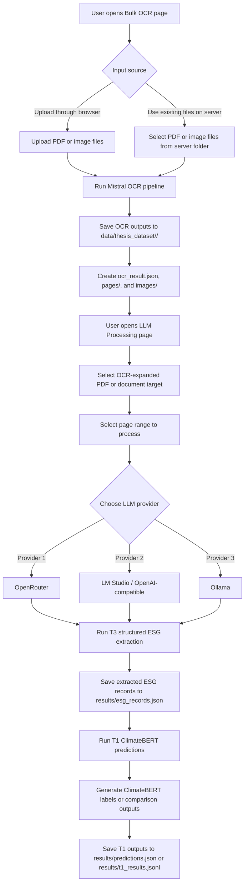
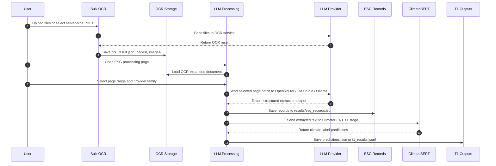
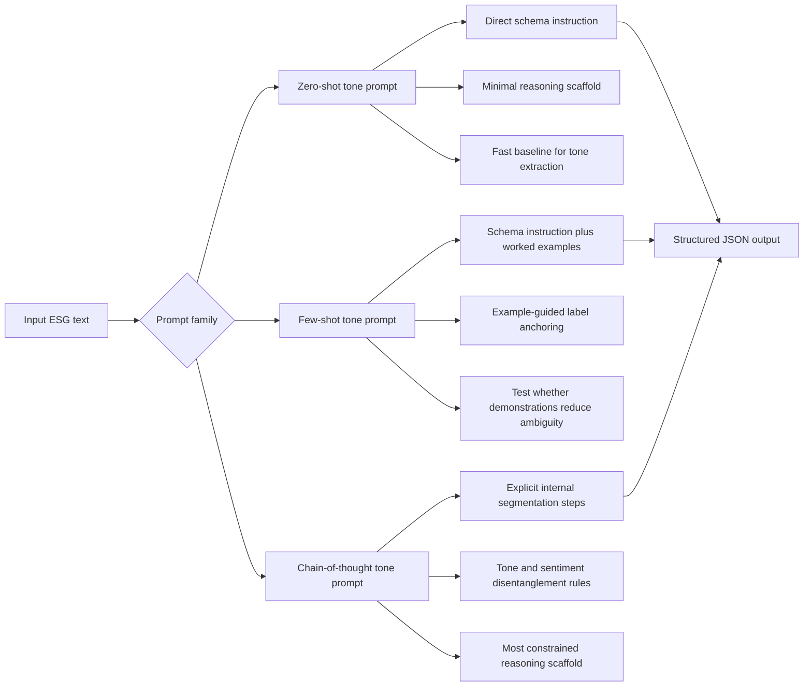

# Chapter 7 Appendices

This appendix chapter consolidates supplementary material that supports the methodological and reproducibility claims in the main thesis. The appendices are intended to document materials that are important for transparency but too detailed to place in the core chapter narrative.

## 7.1 Appendix Contents

The appendices should contain, at minimum, the following materials:

1. prompt templates used in the main thesis-facing comparisons;
1. model identifiers, providers, and decoding settings where available;
1. benchmark and comparison artifact paths;
1. annotation instructions and tone-label definitions;
1. additional difficult examples and disagreement cases;
1. supplementary failure-mode tables;
1. extended reproducibility notes for rerunning stored analyses.

## 7.2 Tone-Label Definitions

The pilot annotation and review process should use the following working definitions:

1. **Commitment:** forward-looking promises, targets, intentions, or policy declarations that do not yet demonstrate completed implementation or realized outcome.
1. **Action:** concrete activities, agreements, programs, investments, or operational steps that are being undertaken or have been initiated.
1. **Outcome:** realized, completed, or demonstrably achieved results, milestones, or measured performance changes.
1. **Needs review:** records whose language is too ambiguous, mixed, or incomplete for stable tone assignment without additional human interpretation.

## 7.3 Reproducibility Notes

The main reproducibility artifacts referenced in the thesis include:

1. OCR-expanded document folders under `data/thesis_dataset/`;
1. extracted ESG records under `results/esg_records.json`;
1. resumable benchmark outputs under `results/t1_results.jsonl` and `results/t2_results.jsonl`;
1. prompt and model stability summaries under `results/revision_analysis/`;
1. dashboard-ready figures and tables under `results/thesis_workflow_dashboard/`.

These artifacts support rerunning, auditing, and extending the workflow even where exact third-party LLM outputs may vary across time.

## 7.4 End-to-End User Workflow Diagram

The appendix should also document the operational user flow across the main thesis-facing tools. In the implemented repository, the workflow begins with OCR preparation in `pages/Bulk_OCR.py`, continues through page-range-aware ESG extraction in `pages/llm_processing.py`, and then passes through the ClimateBERT comparison stage as the T1 pipeline.

### 7.4.1 Workflow Summary

The implemented user flow is:

1. upload or select PDF files in **Bulk OCR**
1. run OCR and save page-level outputs into `data/thesis_dataset/`
1. open **LLM Processing**
1. select the OCR-expanded PDF/document target
1. choose a page range for processing
1. choose one of three LLM-provider families:
   - **OpenRouter**
   - **LM Studio / OpenAI-compatible**
   - **Ollama**
1. run structured ESG extraction over the selected page range
1. save structured records into `results/esg_records.json`
1. run **ClimateBERT** processing as the T1 comparison layer
1. save ClimateBERT outputs into `results/predictions.json` or resumable T1 artifacts

### 7.4.2 Mermaid Flow Diagram



```latex
\begin{figure}[ht]
\begin{center}
  \includegraphics*[width=\textwidth]{appendix_workflow_bulkocr_llm_climatebert_flow}
\end{center}
\caption{Bulk OCR to LLM-processing flow diagram. This figure visualizes the operational path from file intake, OCR expansion, and page storage to provider-specific ESG extraction and downstream ClimateBERT comparison outputs.}
\alt{Flowchart showing user entry through Bulk OCR, OCR output storage, document selection in LLM Processing, provider choice among OpenRouter, LM Studio, and Ollama, ESG record storage, and downstream ClimateBERT output generation.}
\label{fig:appendix_bulkocr_llm_climatebert_flow}
\end{figure}
```

### 7.4.3 Mermaid Sequence Diagram



```latex
\begin{figure}[ht]
\begin{center}
  \includegraphics*[width=\textwidth]{appendix_workflow_bulkocr_llm_climatebert_sequence}
\end{center}
\caption{Bulk OCR to ClimateBERT sequence diagram. This figure shows the interaction order between the user, OCR storage, LLM processing, provider backends, ESG record storage, and the downstream ClimateBERT comparison stage.}
\alt{Sequence diagram showing the user uploading or selecting files, OCR artifact creation, page-range selection in LLM Processing, requests to an LLM provider, ESG record persistence, and ClimateBERT prediction storage.}
\label{fig:appendix_bulkocr_llm_climatebert_sequence}
\end{figure}
```

Sequence explanation:

1. The user starts in **Bulk OCR**, either by uploading files through the browser or by selecting server-side PDFs already copied into the working directory.
2. The OCR page sends the selected files to the OCR service and stores the returned artifacts as document folders containing `ocr_result.json`, page markdown files, and image crops.
3. The user then moves to **LLM Processing**, which loads one OCR-expanded document at a time.
4. Inside **LLM Processing**, the user selects a page range rather than always processing the full report. This is important because the extraction workflow is designed around page batches.
5. The user chooses one provider family for the extraction stage: **OpenRouter**, **LM Studio / OpenAI-compatible**, or **Ollama**.
6. The selected page batch is sent to the chosen LLM provider, and the returned output is parsed into the ESG record schema.
7. Structured records are appended into `results/esg_records.json`, which becomes the main evidence layer for later analysis.
8. The extracted text layer is then passed into the **ClimateBERT** T1 stage, which acts as a downstream comparison or benchmark layer rather than as the first ingestion step.
9. ClimateBERT-style predictions are saved into `results/predictions.json` or resumable T1 artifacts such as `results/t1_results.jsonl`.

### 7.4.4 LaTeX Figure Version

The same operational workflow can also be represented in a LaTeX-ready figure block for the final thesis.

```latex
\begin{figure}[ht]
\begin{center}
  \includegraphics*[width=\textwidth]{appendix_workflow_bulkocr_llm_climatebert}
\end{center}
\caption{Appendix workflow from Bulk OCR to page-range-based LLM extraction and downstream ClimateBERT processing. The implemented flow begins with OCR expansion, continues with provider-specific ESG extraction over selected page ranges, and ends with ClimateBERT comparison over the extracted text layer.}
\alt{Workflow diagram showing user upload or file selection in Bulk OCR, OCR storage into thesis dataset folders, page-range selection in LLM Processing, choice among OpenRouter, LM Studio, or Ollama, storage of structured ESG records, and downstream ClimateBERT T1 processing.}
\label{fig:appendix_bulkocr_llm_climatebert_workflow}
\end{figure}
```

### 7.4.5 Interpretation

This diagram shows that ClimateBERT processing is not the first-stage ingestion tool. Instead, it is a downstream comparison or benchmark layer applied after OCR expansion and after page-range-based ESG extraction. That distinction is methodologically important because the thesis does not compare ClimateBERT directly against raw PDFs. It compares ClimateBERT-style predictions against the extracted text layer produced by the broader ESG pipeline.

### 7.4.6 Tone-Prompt Family Visualization and Prompt Reasoning

The repository contains six thesis-facing tone prompts under `prompt/`:

- `tone_zero_shot_english.md`
- `tone_zero_shot_indonesian.md`
- `tone_few_shot_english.md`
- `tone_few_shot_indonesian.md`
- `tone_chain_of_thought_english.md`
- `tone_chain_of_thought_indonesian.md`

These prompt files share the same extraction target, but they differ in how much reasoning structure they impose before the final JSON output. The prompt family is summarized below so that the appendix makes clear that prompt variation is not cosmetic. It is one of the main experimental levers of the thesis.

#### 7.4.6.1 Prompt-Family Logic



```latex
\begin{figure}[ht]
\begin{center}
  \includegraphics*[width=\textwidth]{appendix_tone_prompt_family_logic}
\end{center}
\caption{Tone-prompt family logic. This figure shows how the zero-shot, few-shot, and chain-of-thought prompt families share the same ESG input target but differ in reasoning scaffolds before producing structured JSON output.}
\alt{Flowchart showing an ESG text input branching into zero-shot, few-shot, and chain-of-thought prompt families, each with distinct reasoning supports that converge into the same structured JSON output.}
\label{fig:appendix_tone_prompt_family_logic}
\end{figure}
```

#### 7.4.6.2 Prompt-Family Summary Table

Table 7.1. Tone-prompt family summary.

| Prompt file | Prompt style | Main reasoning structure | Intended advantage | Main risk |
| --- | --- | --- | --- | --- |
| `tone_zero_shot_english.md` | Zero-shot, English | Direct instructions, label list, tone priority rules, JSON schema | Strong baseline for testing whether explicit definitions alone are enough | May remain too shallow for ambiguous governance or mixed-tone text |
| `tone_zero_shot_indonesian.md` | Zero-shot, Indonesian | Same logic as English version, but adapted to Indonesian cue words and examples of commitment/action/outcome distinction | Better alignment with Indonesian report language and bilingual segments | Longer instruction set can still be ignored when outputs drift |
| `tone_few_shot_english.md` | Few-shot, English | Adds worked examples for commitment, outcome, and risk-oriented none tone | Demonstration-based anchoring for label and tone boundaries | Examples may overfit narrow patterns and suppress extraction breadth |
| `tone_few_shot_indonesian.md` | Few-shot, Indonesian | Adds Indonesian worked examples and local wording for target, risk, and measured result | Better grounding for Indonesian narrative style and common lexical cues | Example dependence may still fail on governance-heavy or non-example structures |
| `tone_chain_of_thought_english.md` | Chain-of-thought style, English | Hidden internal steps for segmentation, tone assignment, sentiment assignment, and final schema fill | Forces the model to separate reasoning stages before output | Longer prompt can increase verbosity pressure or schema drift in weaker models |
| `tone_chain_of_thought_indonesian.md` | Chain-of-thought style, Indonesian | Most explicit reasoning scaffold, local cue words, tone priority logic, and concise reasoning guidance | Best fit for difficult Indonesian and mixed-language extraction conditions | Most complex prompt, so weaker backends may fail to follow every instruction consistently |

#### 7.4.6.3 Why the Prompt Reasoning Matters

The central prompt-design idea is not just to ask for JSON, but to force the model to reason about disclosure function before assigning sentiment. In this thesis, that means the prompt must first distinguish:

1. whether a segment is explicitly ESG-relevant;
2. what aspect and label family it belongs to;
3. whether the statement is a commitment, action, or outcome;
4. only after that, whether the statement carries positive, negative, neutral, or none sentiment.

This ordering matters because many sustainability disclosures are future-oriented promises written in positive language. If the prompt does not explicitly disentangle tone from sentiment, the model can collapse a promise into a falsely positive achieved result. The tone prompts therefore use reasoning scaffolds to reduce this specific validity error.

#### 7.4.6.4 Prompt Reasoning Description by Family

**Zero-shot reasoning.**  
The zero-shot prompts rely on explicit definitions, priority rules, and schema constraints without demonstration examples. Their reasoning philosophy is that tone extraction should remain possible from a strong instruction set alone. In methodological terms, zero-shot prompts act as the cleanest test of whether the schema itself is intelligible to the model.

**Few-shot reasoning.**  
The few-shot prompts add short worked examples so the model sees what commitment, outcome, and climate-risk cases should look like in JSON form. Their reasoning philosophy is analogical: the model is guided to map new inputs to demonstrated output patterns. This is useful for ambiguous ESG phrasing, but it can also narrow the extraction behavior if the examples are too stereotyped.

**Chain-of-thought-style reasoning.**  
The chain-of-thought prompts explicitly instruct the model to segment text, identify ESG relevance, assign tone, then assign sentiment, while keeping the actual reasoning hidden from the final response. Their reasoning philosophy is procedural: a difficult extraction problem is decomposed into smaller internal steps so that tone and sentiment are less likely to be conflated. This is the most thesis-aligned prompt family because the research question depends on stable tone disentanglement rather than generic JSON completion alone.

#### 7.4.6.5 Appendix Interpretation

This prompt family should be read as a controlled prompt-engineering ladder rather than as six unrelated files. The zero-shot prompts test direct schema interpretability. The few-shot prompts test example anchoring. The chain-of-thought prompts test whether stepwise internal reasoning improves tone stability. That is why prompt variation in Chapter 4 is analytically meaningful: it probes whether the thesis contribution depends only on model choice or also on reasoning structure embedded in the prompt itself.

## 7.5 JSON Data Examples

The repository uses JSON extensively for OCR outputs, extraction records, dashboard artifacts, model caches, logs, and workflow decisions. This appendix section provides representative examples of the actual JSON structures used by the implemented system.

### 7.5.1 OCR Output JSON

Path example:

- `data/thesis_dataset/2017 Sustainability Report PT Bank Permata Tbk (Rev May2018)_0_pdf/ocr_result.json`

Purpose:

- stores page-level OCR output
- preserves extracted markdown text
- stores image coordinates and embedded image payloads
- records OCR model and usage metadata

Example:

```json
{
  "pages": [
    {
      "index": 0,
      "markdown": "PermataBank\n\nLaporan Keberlanjutan 2017 Sustainability Report\n\n\n\n# Realizing Commitment\n\nto Improve Life",
      "images": [
        {
          "id": "img-0.jpeg",
          "top_left_x": 48,
          "top_left_y": 260,
          "bottom_right_x": 667,
          "bottom_right_y": 777,
          "image_base64": "data:image/jpeg;base64,..."
        }
      ]
    }
  ],
  "model": "...",
  "document_annotation": "...",
  "usage_info": "..."
}
```

### 7.5.2 ESG Extraction Run JSON

Path example:

- `results/esg_records.json`

Purpose:

- stores T3 LLM extraction runs
- preserves prompt, model, page target, records, and failure state
- acts as the main structured ESG evidence store

Success example:

```json
{
  "timestamp": "2026-06-03T18:38:40Z",
  "model": "nvidia/nemotron-3-nano-30b-a3b:free",
  "target": "Sustainability_Report_PT_Sentul_City_Tbk_2025_pdf/batch_7",
  "target_pages": "page_0012.md, page_0013.md",
  "prompt": "tone_chain_of_thought_indonesian.md",
  "ok": true,
  "records": [
    {
      "text": "Elevating Lives, Building Sustainable Growth",
      "aspect": "strategic vision",
      "labels": ["climate-d", "climate-commitment"],
      "esg": "E",
      "tone": "commitment",
      "sentiment": "positive",
      "sentiment_score": 1,
      "reasoning": "The phrase expresses a forward-looking sustainability ambition and explicitly states a commitment to sustainable growth."
    }
  ]
}
```

LaTeX-ready format:

```latex
\begin{verbatim}
{
  "timestamp": "2026-06-03T18:38:40Z",
  "model": "nvidia/nemotron-3-nano-30b-a3b:free",
  "target": "Sustainability_Report_PT_Sentul_City_Tbk_2025_pdf/batch_7",
  "target_pages": "page_0012.md, page_0013.md",
  "prompt": "tone_chain_of_thought_indonesian.md",
  "ok": true,
  "records": [
    {
      "text": "Elevating Lives, Building Sustainable Growth",
      "aspect": "strategic vision",
      "labels": ["climate-d", "climate-commitment"],
      "esg": "E",
      "tone": "commitment",
      "sentiment": "positive",
      "sentiment_score": 1,
      "reasoning": "The phrase expresses a forward-looking sustainability ambition and explicitly states a commitment to sustainable growth."
    }
  ]
}
\end{verbatim}
```

Error example:

```json
{
  "timestamp": "2026-06-03T18:37:59Z",
  "model": "nvidia/nemotron-nano-12b-v2-vl:free",
  "target": "Bank Neo Commerce Annual and Sustainable Report Tahun 2024_pdf/batch_27",
  "target_pages": "page_0052.md, page_0053.md",
  "prompt": "tone_few_shot_indonesian.md",
  "ok": false,
  "records": [],
  "error": "OpenRouter returned HTTP 401: {\"error\":{\"message\":\"User not found.\",\"code\":401}}",
  "error_type": "unknown",
  "raw_output": "",
  "background_job_id": "llm_processing_bg_20260603T183739Z_855dc4"
}
```

### 7.5.3 ClimateBERT Result JSON

Path example:

- `results/climatebert_results.json`

Purpose:

- stores ClimateBERT or remote-space comparison runs
- keeps the original input text
- preserves raw multi-model response text
- supports later parsing into label-level comparison tables

Example:

```json
{
  "timestamp": "2026-03-26T15:43:20.151168Z",
  "mode": "remote_space",
  "space_url": "https://darisdzakwanhoesien-climatebert-multi-model-demo-8aae81e.hf.space/",
  "input_text": "Company's media and entertainment portfolio has successfully maintained its dominance in the country's media industry...",
  "response_raw": "### econbert\n❌ Error: Unrecognized model...\n### netzero-reduction\n• none: 1.00\n### climate-commitment\n• yes: 0.92",
  "response_parsed": null
}
```

### 7.5.10 Other JSON Families Used by the Repository

Additional JSON artifact families in the repository include the following. These are not all equally central to the thesis argument, but each one supports a specific part of the executable research workflow.

- `results/data/mapping.json`
  Purpose:
  stores label-normalization mappings used to standardize ESG and sentiment terminology.
  Example content includes mappings such as `"environmental": "E"`, `"governance": "G"`, and `"lingkungan": "E"`. This file acts as a normalization bridge between raw extracted labels and the thesis-facing schema.

- `results/ground_truth.json`
  Purpose:
  stores manually entered or review-oriented ground-truth style records.
  The sampled structure includes a timestamp, model name, source, input text, and a nested `result` object. In the current repository state, some entries still preserve model-side errors, which is useful because it shows that the reference-building layer keeps incomplete or failed cases visible rather than silently discarding them.

- `results/predictions.json`
  Purpose:
  stores prediction outputs, especially from ClimateBERT-style or T1 comparison runs.
  The current file contains long source text segments together with model identifiers and prediction payloads. In practice, this file acts as a raw comparison layer before more compact summary tables are derived.

- `results/t1_results.json`
  Purpose:
  stores serialized T1-stage prediction results in JSON form.
  These records are similar to `predictions.json`, but they are part of the more formal T1 artifact family used by the benchmark side of the workflow. The sampled entries show model names, original text, and nested result objects.

- `results/t2_results.json`
  Purpose:
  stores T2-stage ABSA-style outputs.
  The sampled entries contain both a `rule_based` block and a `hybrid` block. This is important because it shows that T2 is not one monolithic classifier. It compares rule-based aspect/polarity/tone output against a hybrid contextual model that also records ontology alignment and summary metrics.

- `results/revision_analysis/ontology.json`
  Purpose:
  stores the ontology backbone used for aspect-to-path mapping.
  The sampled structure contains ontology nodes with `aspect`, `path`, `path_text`, and `keywords`. This file is central for demonstrating that the extraction layer is not only structurally parseable but also semantically mappable into ESG concept paths.

- `results/thesis_workflow_dashboard/rq_report_sections.json`
  Purpose:
  stores structured narrative sections for each research question in the dashboard layer.
  Each entry includes fields such as `rq`, `title`, `graph`, `results`, `interpretation`, `baseline`, `discussion`, and `conclusion`. This file is effectively a JSON-backed narrative scaffold for the thesis-facing workflow dashboard.

- `results/transfer_learning/dataset_summary.json`
  Purpose:
  stores high-level summary statistics for the transfer-learning dataset.
  The sampled structure includes total row count, number of unique aspects, top aspects, sentiment distribution, tone distribution, and ESG-pillar distribution. This file is useful for reporting corpus scale and distributional properties without loading the full dataset every time.

- `documentation/streamlit_pages/page_relationships.json`
  Purpose:
  stores the canonical workflow registry for Streamlit pages.
  The sampled structure includes `pages`, `rq_workflows`, and `relationships`, with each page entry describing stage, purpose, research-question relevance, and outputs. This file is important for the appendix because it documents how the repository’s interactive tools map to the thesis workflow.

- `summarization/data/data_sources.json`
  Purpose:
  stores a compact registry of CSV inputs used by the summarization layer.
  Instead of holding analytic results directly, this file maps logical names such as `tone_records_flat`, `model_stability_summary`, and `ontology_coverage` to their corresponding artifact paths.

- `chat_history.json`
  Purpose:
  stores interactive conversation history metadata.
  The sampled structure contains an `id`, timestamp, role, content, and model name. This file is not central to the thesis analysis itself, but it belongs to the broader reproducibility environment of the workspace.

- `pages/data_001_001.json`
  Purpose:
  appears to be an auxiliary page-side JSON artifact, but the current file could not be parsed because it contains malformed JSON.
  This is worth noting explicitly in the appendix because it shows that not every repository-side JSON file is a validated analytical artifact. Some are experimental or incomplete support files.

Together, these JSON families support benchmark generation, ontology mapping, workflow documentation, summarization inputs, transfer-learning dataset reporting, and interactive tooling. They form an important part of the repository’s reproducibility and audit layer even when they are not all directly cited in the main thesis chapters.
