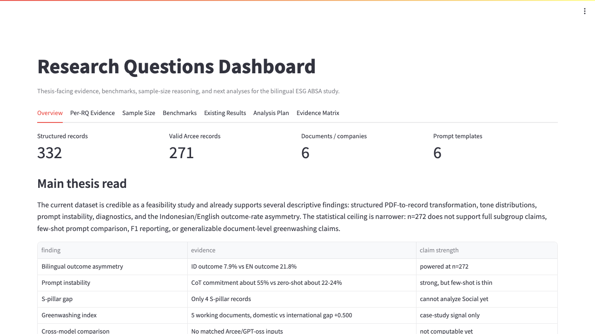
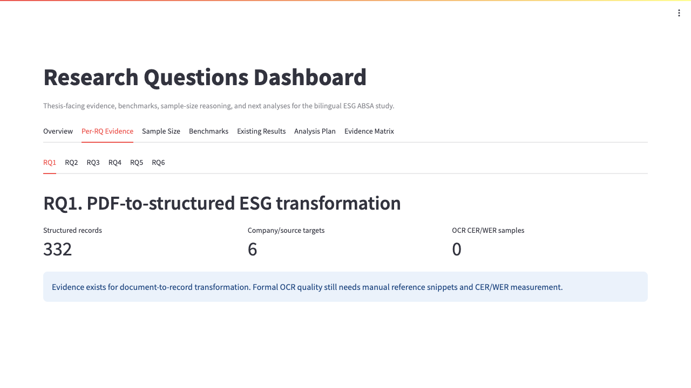
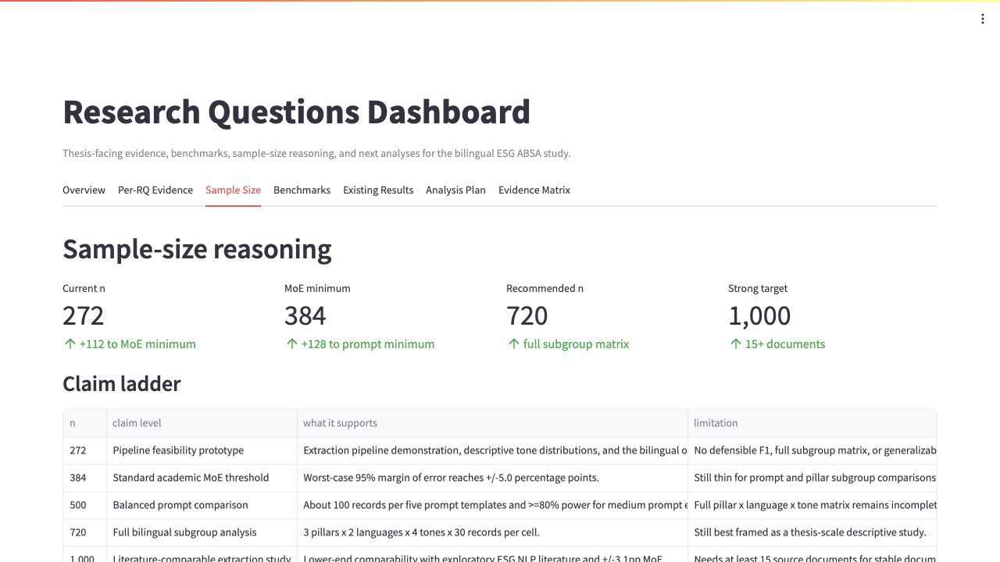
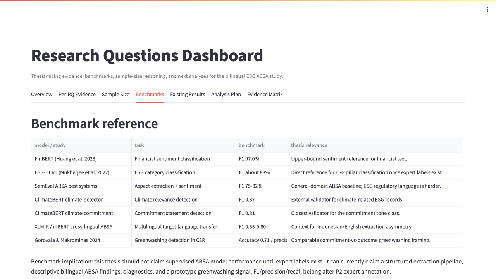
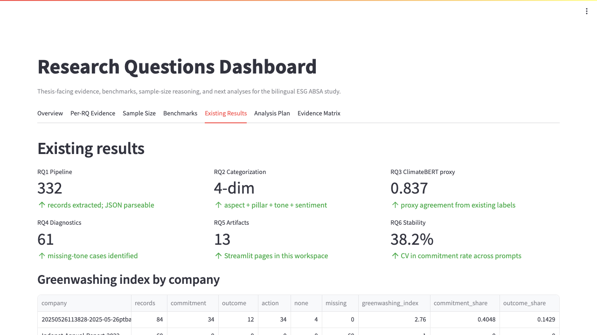
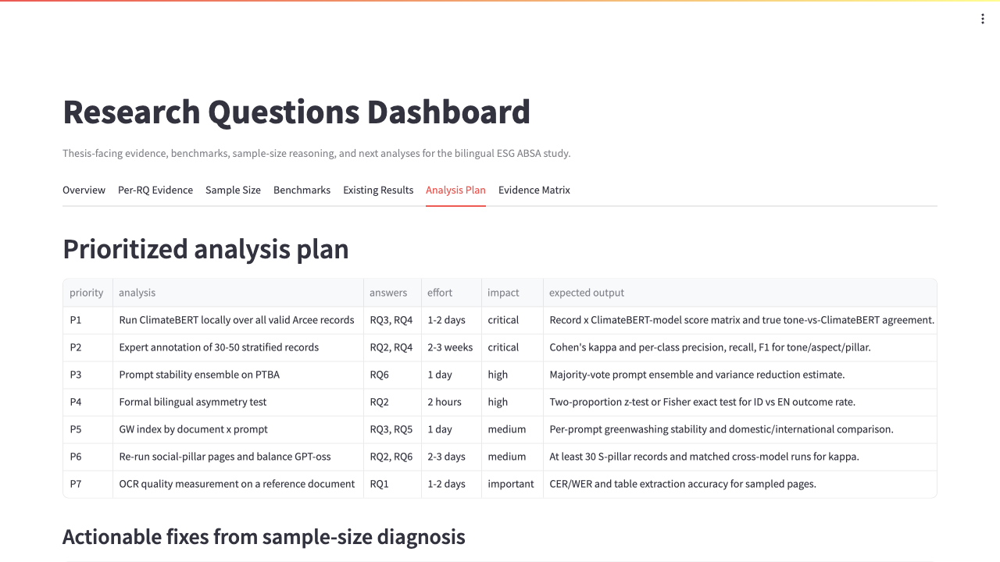
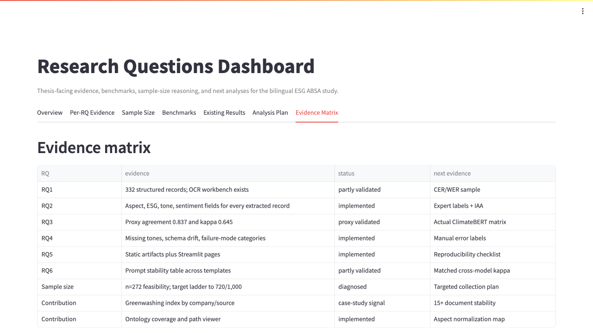
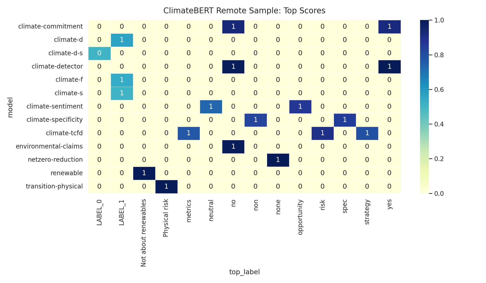

# Saved Image Outputs - ESG ABSA Dashboard

Generated: 2026-05-09T00:52:22.903Z

This file catalogs the saved image outputs for the thesis dashboard and existing visualization artifacts. Each entry includes the image path, interpretation, and suggested thesis use.

## Image Index

### Research Questions Dashboard - Overview

- ID: `rq_dashboard_overview`
- Type: `streamlit_screenshot`
- Source: `1_7_Research_Questions_Dashboard.py`
- File: `results/visualizations/streamlit_outputs/01_overview.png`
- Explanation: Summarizes the current thesis evidence base: 332 structured records, 271 valid Arcee records, 6 document/company sources, and 6 prompt templates. The view frames n=272 as a feasibility-level dataset and names the main limitations before stronger claims are made.
- Thesis use: Use as the opening visual for Chapter IV or defense slides to orient readers before per-RQ evidence.

### Research Questions Dashboard - Per-RQ Evidence

- ID: `rq_dashboard_per_rq_evidence`
- Type: `streamlit_screenshot`
- Source: `1_7_Research_Questions_Dashboard.py`
- File: `results/visualizations/streamlit_outputs/02_per_rq_evidence.png`
- Explanation: Shows how each research question maps to available evidence, missing validation, and current metrics. It makes clear which claims are implemented, partly validated, or still dependent on expert annotation, OCR references, or matched reruns.
- Thesis use: Use as a bridge between methodology and results, especially when explaining RQ coverage.

### Research Questions Dashboard - Sample Size

- ID: `rq_dashboard_sample_size`
- Type: `streamlit_screenshot`
- Source: `1_7_Research_Questions_Dashboard.py`
- File: `results/visualizations/streamlit_outputs/03_sample_size.png`
- Explanation: Captures the sample-size ladder, margin-of-error curve, power table, and subgroup requirements. It explains why n=272 is adequate for feasibility, why n=384 fixes the worst-case MoE threshold, and why n=720-1,000 is the stronger thesis target.
- Thesis use: Use in limitations, defense Q&A, and any section justifying target sample size.

### Research Questions Dashboard - Benchmarks

- ID: `rq_dashboard_benchmarks`
- Type: `streamlit_screenshot`
- Source: `1_7_Research_Questions_Dashboard.py`
- File: `results/visualizations/streamlit_outputs/04_benchmarks.png`
- Explanation: Places the thesis beside FinBERT, ESG-BERT, ClimateBERT, cross-lingual ABSA, and greenwashing-detection references. The visual makes the boundary explicit: current outputs support descriptive/prototype claims, while F1, precision, and recall need expert-labeled ground truth.
- Thesis use: Use in related work positioning and evaluation limitations.

### Research Questions Dashboard - Existing Results

- ID: `rq_dashboard_existing_results`
- Type: `streamlit_screenshot`
- Source: `1_7_Research_Questions_Dashboard.py`
- File: `results/visualizations/streamlit_outputs/05_existing_results.png`
- Explanation: Collects existing results such as pipeline output size, ClimateBERT proxy agreement, missing-tone diagnostics, artifact count, prompt coefficient of variation, greenwashing index, and language-by-tone distributions.
- Thesis use: Use as a compact results overview for Chapter IV.

### Research Questions Dashboard - Analysis Plan

- ID: `rq_dashboard_analysis_plan`
- Type: `streamlit_screenshot`
- Source: `1_7_Research_Questions_Dashboard.py`
- File: `results/visualizations/streamlit_outputs/06_analysis_plan.png`
- Explanation: Lists the prioritized next analyses: full ClimateBERT batch scoring, expert annotation, prompt ensemble testing, bilingual significance testing, greenwashing stability, S-pillar extraction, and OCR quality measurement. It also maps each action to thesis impact and effort.
- Thesis use: Use as the roadmap for remaining validation work or future work.

### Research Questions Dashboard - Evidence Matrix

- ID: `rq_dashboard_evidence_matrix`
- Type: `streamlit_screenshot`
- Source: `1_7_Research_Questions_Dashboard.py`
- File: `results/visualizations/streamlit_outputs/07_evidence_matrix.png`
- Explanation: Shows a concise matrix linking each RQ and contribution to evidence status and the next evidence required. It turns the implementation artifacts into a thesis audit map.
- Thesis use: Use in contribution summary and defense appendix.

### Tone Distribution

- ID: `tone_distribution`
- Type: `static_visualization`
- Source: `0_9_Tone_ClimateBERT_Visualization.py / results/visualizations`
- File: `results/visualizations/tone_distribution.png`
- Explanation: Displays the overall distribution of extracted tones. This is the baseline descriptive result for the ABSA layer and shows whether the corpus is dominated by commitments, actions, outcomes, none, or missing labels.
- Thesis use: Use for RQ2 results and as context for greenwashing-index interpretation.

### ESG Pillar by Tone

- ID: `esg_by_tone`
- Type: `static_visualization`
- Source: `0_9_Tone_ClimateBERT_Visualization.py / results/visualizations`
- File: `results/visualizations/esg_by_tone.png`
- Explanation: Shows how tone categories distribute across Environmental, Social, and Governance pillars. The key interpretation is subgroup coverage: Environmental and Governance dominate, while Social remains too sparse for strong pillar-level claims.
- Thesis use: Use for RQ2, subgroup limitation discussion, and targeted data-collection justification.

### ClimateBERT-Style Label by Tone

- ID: `climatebert_label_by_tone`
- Type: `static_visualization`
- Source: `0_9_Tone_ClimateBERT_Visualization.py / results/visualizations`
- File: `results/visualizations/climatebert_label_by_tone.png`
- Explanation: Compares LLM-assigned tone labels against ClimateBERT-style label families already present in the extraction records. This is a proxy alignment view, not a substitute for running real ClimateBERT over every record.
- Thesis use: Use for RQ3 as preliminary evidence, with a caveat that actual ClimateBERT batch output is still needed.

### Aspect by Tone Heatmap

- ID: `aspect_by_tone_heatmap`
- Type: `static_visualization`
- Source: `0_9_Tone_ClimateBERT_Visualization.py / results/visualizations`
- File: `results/visualizations/aspect_by_tone_heatmap.png`
- Explanation: Shows which ESG aspects most frequently appear under each tone. It helps identify whether commitments, actions, and outcomes cluster around environmental claims, governance practices, or other recurring themes.
- Thesis use: Use for RQ2 taxonomy interpretation and ontology-normalization discussion.

### ClimateBERT Remote Top Scores

- ID: `climatebert_remote_top_scores`
- Type: `static_visualization`
- Source: `0_9_Tone_ClimateBERT_Visualization.py / results/visualizations`
- File: `results/visualizations/climatebert_remote_top_scores.png`
- Explanation: Summarizes the top remote ClimateBERT scores available from the limited remote runs. Because the remote sample is very small, it should be treated as a sanity check rather than final validation.
- Thesis use: Use only as preliminary RQ3 validation context, not as final model-performance evidence.

