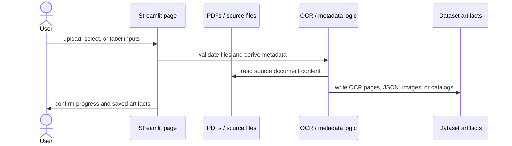

# Source Data Catalog

- Source page: `0_11_Source_Data_Catalog.py`
- Category: `ingestion`
- Summary: Ingestion and provenance capture.

```mermaid
sequenceDiagram
    actor User as User
    participant page as Streamlit page
    participant data as PDFs / source files
    participant compute as OCR / metadata logic
    participant output as Dataset artifacts
    User->>page: upload, select, or label inputs
    page->>compute: validate files and derive metadata
    compute->>data: read source document content
    compute->>output: write OCR pages, JSON, images, or catalogs
    page->>User: confirm progress and saved artifacts
```
