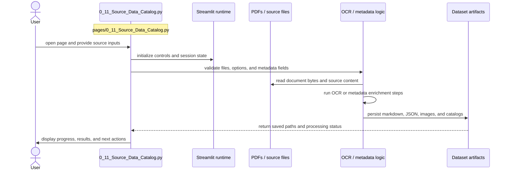

# Source Data Catalog

- Filename: `0_11_Source_Data_Catalog.py`
- Source path: `pages/0_11_Source_Data_Catalog.py`
- Diagram file: `documentation/streamlit_pages/mermaid_sequence_diagram/0_11_Source_Data_Catalog.md`
- Page slug: `0_11_Source_Data_Catalog`
- Category: `ingestion`
- Purpose: Collect source documents, enrich provenance, and persist reusable dataset artifacts.
- Primary inputs: PDFs, page images, OCR payloads, metadata forms
- Primary outputs: OCR markdown, JSON, images, catalog entries
- Summary: Ingestion and provenance capture.

## What This Page Documents

This file documents the interaction flow for `0_11_Source_Data_Catalog.py` and gives a reusable filename pattern for the artifacts that this page reads or writes.

## Filename Placeholders

Use these placeholders when you want to substitute your own files such as `CSV`, `JSON`, `JSONL`, `XLSX`, `PNG`, or `PDF` assets.

- Input examples: `<source_report>.pdf`, `<page_image>.png`, `<ocr_request>.json`, `<document_manifest>.csv`
- Output examples: `<ocr_output>.md`, `<ocr_output>.json`, `<page_preview>.png`, `<catalog_export>.csv`

Recommended placeholder format:

- `<name>.csv` for tabular inputs or exports
- `<name>.json` for structured objects or config-like artifacts
- `<name>.jsonl` for line-by-line run logs or benchmark rows
- `<name>.xlsx` for spreadsheet deliverables
- `<name>.md` for OCR text or narrative output
- `<name>.png` for figure snapshots or image intermediates
- `<name>.pdf` for source documents

## Naming Guidance

- Use the original document stem when possible so OCR outputs stay traceable back to the PDF.
- Keep page or batch numbers in the filename when one source document produces multiple artifacts.

## Customization Steps

1. Choose the file stem that matches your dataset or experiment, for example `esg_records`, `ontology_map`, or `ground_truth_seed`.
2. Keep the extension aligned with the artifact type, for example `CSV` for tables and `JSON` for nested structures.
3. If multiple runs exist, append a stable suffix such as `_v2`, `_2026_06`, `_prompt_3`, or `_model_a`.
4. Update this page documentation if the real source path, output path, or artifact role changes.

## Detailed Sequence

