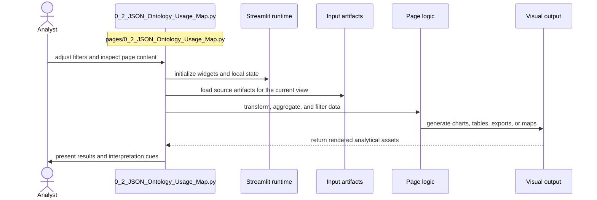

# JSON Ontology Usage Map

- Filename: `0_2_JSON_Ontology_Usage_Map.py`
- Source path: `pages/0_2_JSON_Ontology_Usage_Map.py`
- Diagram file: `documentation/streamlit_pages/mermaid_sequence_diagram/0_2_JSON_Ontology_Usage_Map.md`
- Page slug: `0_2_JSON_Ontology_Usage_Map`
- Category: `analysis`
- Purpose: Load prepared artifacts and turn them into filtered analytical views.
- Primary inputs: CSV, JSON, cached tables, visualization inputs
- Primary outputs: charts, filtered tables, lineage views, exportable summaries
- Summary: Analysis and visualization flow.

## Detailed Sequence

