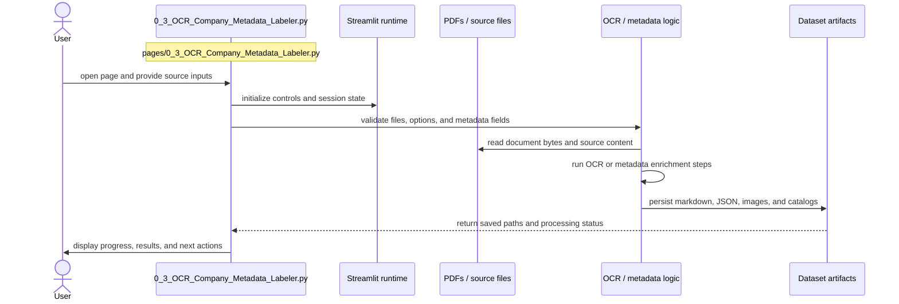

# OCR Company Metadata Labeler

- Filename: `0_3_OCR_Company_Metadata_Labeler.py`
- Source path: `pages/0_3_OCR_Company_Metadata_Labeler.py`
- Diagram file: `documentation/streamlit_pages/mermaid_sequence_diagram/0_3_OCR_Company_Metadata_Labeler.md`
- Page slug: `0_3_OCR_Company_Metadata_Labeler`
- Category: `ingestion`
- Purpose: Collect source documents, enrich provenance, and persist reusable dataset artifacts.
- Primary inputs: PDFs, page images, OCR payloads, metadata forms
- Primary outputs: OCR markdown, JSON, images, catalog entries
- Summary: Ingestion and provenance capture.

## Detailed Sequence

