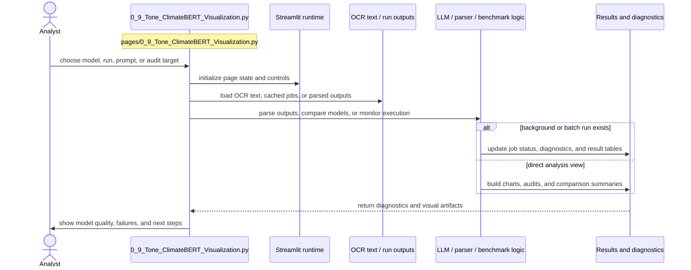

# Tone vs ClimateBERT

- Filename: `0_9_Tone_ClimateBERT_Visualization.py`
- Source path: `pages/0_9_Tone_ClimateBERT_Visualization.py`
- Diagram file: `documentation/streamlit_pages/mermaid_sequence_diagram/0_9_Tone_ClimateBERT_Visualization.md`
- Page slug: `0_9_Tone_ClimateBERT_Visualization`
- Category: `llm`
- Purpose: Run or inspect model outputs, parse results, and surface diagnostics for review.
- Primary inputs: OCR text, model outputs, background job files, parser results
- Primary outputs: parsed records, diagnostics, model comparisons, run status views
- Summary: LLM extraction and diagnostics.

## Detailed Sequence

