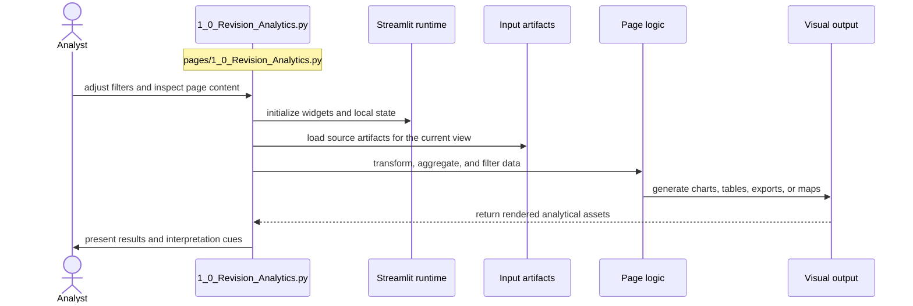

# Revision Analytics

- Filename: `1_0_Revision_Analytics.py`
- Source path: `pages/1_0_Revision_Analytics.py`
- Diagram file: `documentation/streamlit_pages/mermaid_sequence_diagram/1_0_Revision_Analytics.md`
- Page slug: `1_0_Revision_Analytics`
- Category: `analysis`
- Purpose: Load prepared artifacts and turn them into filtered analytical views.
- Primary inputs: CSV, JSON, cached tables, visualization inputs
- Primary outputs: charts, filtered tables, lineage views, exportable summaries
- Summary: Analysis and visualization flow.

## What This Page Documents

This file documents the interaction flow for `1_0_Revision_Analytics.py` and gives a reusable filename pattern for the artifacts that this page reads or writes.

## Filename Placeholders

Use these placeholders when you want to substitute your own files such as `CSV`, `JSON`, `JSONL`, `XLSX`, `PNG`, or `PDF` assets.

- Input examples: `<dataset>.csv`, `<mapping>.json`, `<events>.jsonl`, `<summary_table>.xlsx`
- Output examples: `<filtered_output>.csv`, `<chart_spec>.json`, `<dashboard_export>.png`, `<summary_export>.xlsx`

Recommended placeholder format:

- `<name>.csv` for tabular inputs or exports
- `<name>.json` for structured objects or config-like artifacts
- `<name>.jsonl` for line-by-line run logs or benchmark rows
- `<name>.xlsx` for spreadsheet deliverables
- `<name>.md` for OCR text or narrative output
- `<name>.png` for figure snapshots or image intermediates
- `<name>.pdf` for source documents

## Naming Guidance

- Prefer filenames that describe both content and grain, for example `record_level`, `page_level`, or `summary`.
- If the page accepts multiple formats, reuse the same stem across `CSV`, `JSON`, and `XLSX` variants when they describe the same dataset.

## Customization Steps

1. Choose the file stem that matches your dataset or experiment, for example `esg_records`, `ontology_map`, or `ground_truth_seed`.
2. Keep the extension aligned with the artifact type, for example `CSV` for tables and `JSON` for nested structures.
3. If multiple runs exist, append a stable suffix such as `_v2`, `_2026_06`, `_prompt_3`, or `_model_a`.
4. Update this page documentation if the real source path, output path, or artifact role changes.

## Detailed Sequence

