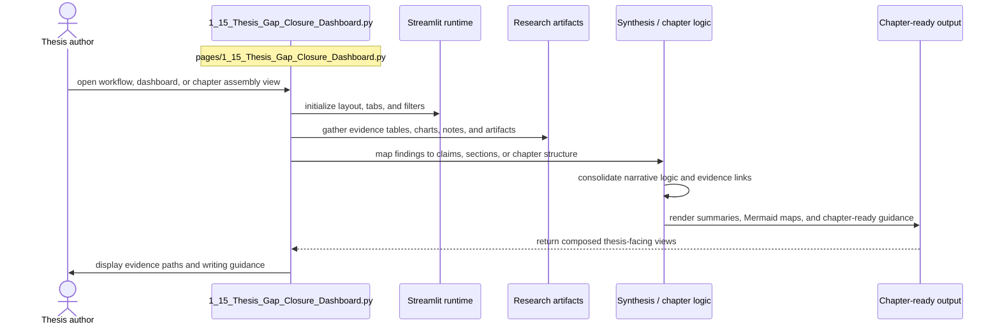

# Thesis Gap Closure Dashboard

- Filename: `1_15_Thesis_Gap_Closure_Dashboard.py`
- Source path: `pages/1_15_Thesis_Gap_Closure_Dashboard.py`
- Diagram file: `documentation/streamlit_pages/mermaid_sequence_diagram/1_15_Thesis_Gap_Closure_Dashboard.md`
- Page slug: `1_15_Thesis_Gap_Closure_Dashboard`
- Category: `thesis`
- Purpose: Aggregate evidence into workflow, dashboard, and chapter-ready thesis views.
- Primary inputs: research artifacts, charts, notes, chapter evidence tables
- Primary outputs: chapter summaries, Mermaid maps, narrative guidance, evidence matrices
- Summary: Thesis synthesis and navigation.

## Detailed Sequence

