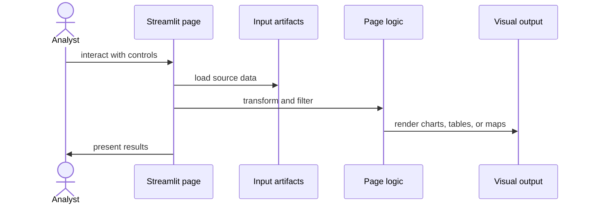

# Phase PDF Distribution

- Source page: `1_20_Phase_PDF_Distribution.py`
- Category: `analysis`
- Summary: Analysis and visualization flow.

```mermaid
sequenceDiagram
    actor User as Analyst
    participant page as Streamlit page
    participant data as Input artifacts
    participant compute as Page logic
    participant output as Visual output
    User->>page: interact with controls
    page->>data: load source data
    page->>compute: transform and filter
    compute->>output: render charts, tables, or maps
    page->>User: present results
```
