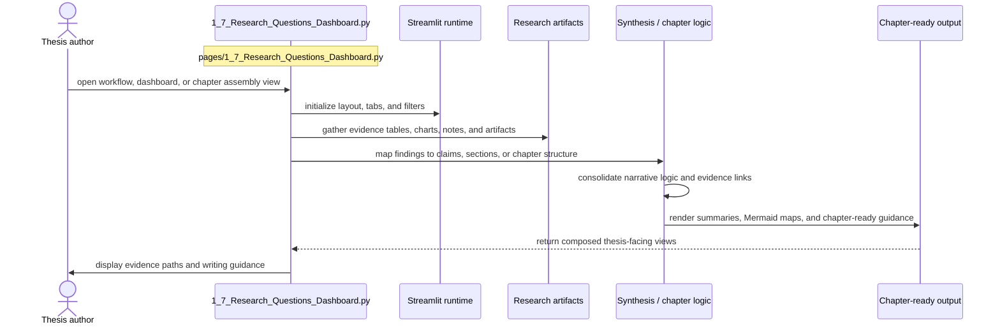

# Research Questions Dashboard

- Filename: `1_7_Research_Questions_Dashboard.py`
- Source path: `pages/1_7_Research_Questions_Dashboard.py`
- Diagram file: `documentation/streamlit_pages/mermaid_sequence_diagram/1_7_Research_Questions_Dashboard.md`
- Page slug: `1_7_Research_Questions_Dashboard`
- Category: `thesis`
- Purpose: Aggregate evidence into workflow, dashboard, and chapter-ready thesis views.
- Primary inputs: research artifacts, charts, notes, chapter evidence tables
- Primary outputs: chapter summaries, Mermaid maps, narrative guidance, evidence matrices
- Summary: Thesis synthesis and navigation.

## What This Page Documents

This file documents the interaction flow for `1_7_Research_Questions_Dashboard.py` and gives a reusable filename pattern for the artifacts that this page reads or writes.

## Filename Placeholders

Use these placeholders when you want to substitute your own files such as `CSV`, `JSON`, `JSONL`, `XLSX`, `PNG`, or `PDF` assets.

- Input examples: `<chapter_notes>.md`, `<evidence_table>.csv`, `<workflow_map>.json`, `<results_snapshot>.xlsx`
- Output examples: `<chapter_summary>.md`, `<figure_export>.png`, `<evidence_matrix>.csv`, `<chapter_bundle>.json`

Recommended placeholder format:

- `<name>.csv` for tabular inputs or exports
- `<name>.json` for structured objects or config-like artifacts
- `<name>.jsonl` for line-by-line run logs or benchmark rows
- `<name>.xlsx` for spreadsheet deliverables
- `<name>.md` for OCR text or narrative output
- `<name>.png` for figure snapshots or image intermediates
- `<name>.pdf` for source documents

## Naming Guidance

- Use filenames that encode chapter or section ownership so exported artifacts stay citation-ready.
- Keep evidence snapshots and narrative drafts separate to avoid mixing analytical data with prose outputs.

## Customization Steps

1. Choose the file stem that matches your dataset or experiment, for example `esg_records`, `ontology_map`, or `ground_truth_seed`.
2. Keep the extension aligned with the artifact type, for example `CSV` for tables and `JSON` for nested structures.
3. If multiple runs exist, append a stable suffix such as `_v2`, `_2026_06`, `_prompt_3`, or `_model_a`.
4. Update this page documentation if the real source path, output path, or artifact role changes.

## Detailed Sequence

