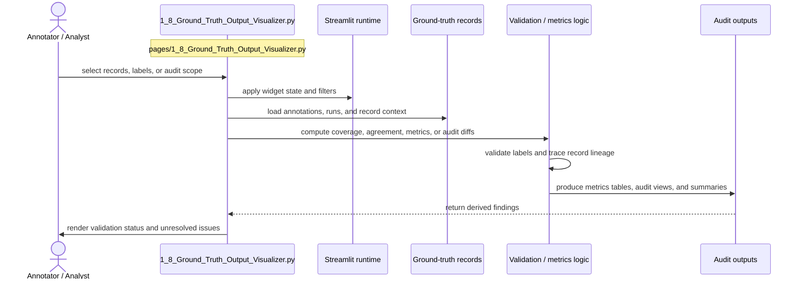

# Ground Truth Output Visualizer

- Filename: `1_8_Ground_Truth_Output_Visualizer.py`
- Source path: `pages/1_8_Ground_Truth_Output_Visualizer.py`
- Diagram file: `documentation/streamlit_pages/mermaid_sequence_diagram/1_8_Ground_Truth_Output_Visualizer.md`
- Page slug: `1_8_Ground_Truth_Output_Visualizer`
- Category: `ground_truth`
- Purpose: Inspect or curate labeled data, then compute validation and audit outputs.
- Primary inputs: annotated records, audit tables, validation datasets
- Primary outputs: coverage tables, audit reports, metrics, record views
- Summary: Annotation and audit workflow.

## Detailed Sequence

