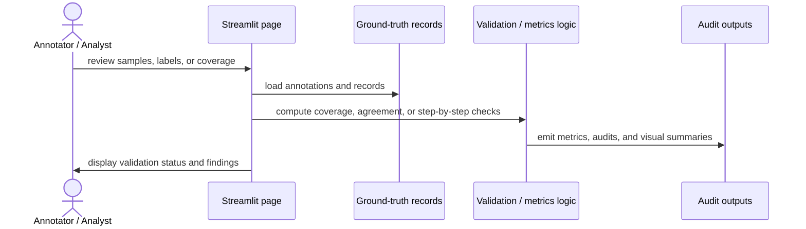

# Ground Truth Pipeline Output Visualizer

- Source page: `1_9_Ground_Truth_Pipeline_Output_Visualizer.py`
- Category: `ground_truth`
- Summary: Annotation and audit workflow.

```mermaid
sequenceDiagram
    actor User as Annotator / Analyst
    participant page as Streamlit page
    participant data as Ground-truth records
    participant compute as Validation / metrics logic
    participant output as Audit outputs
    User->>page: review samples, labels, or coverage
    page->>data: load annotations and records
    page->>compute: compute coverage, agreement, or step-by-step checks
    compute->>output: emit metrics, audits, and visual summaries
    page->>User: display validation status and findings
```
