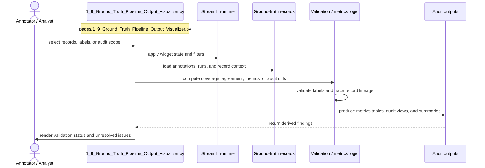

# Ground Truth Pipeline Output Visualizer

- Filename: `1_9_Ground_Truth_Pipeline_Output_Visualizer.py`
- Source path: `pages/1_9_Ground_Truth_Pipeline_Output_Visualizer.py`
- Diagram file: `documentation/streamlit_pages/mermaid_sequence_diagram/1_9_Ground_Truth_Pipeline_Output_Visualizer.md`
- Page slug: `1_9_Ground_Truth_Pipeline_Output_Visualizer`
- Category: `ground_truth`
- Purpose: Inspect or curate labeled data, then compute validation and audit outputs.
- Primary inputs: annotated records, audit tables, validation datasets
- Primary outputs: coverage tables, audit reports, metrics, record views
- Summary: Annotation and audit workflow.

## What This Page Documents

This file documents the interaction flow for `1_9_Ground_Truth_Pipeline_Output_Visualizer.py` and gives a reusable filename pattern for the artifacts that this page reads or writes.

## Filename Placeholders

Use these placeholders when you want to substitute your own files such as `CSV`, `JSON`, `JSONL`, `XLSX`, `PNG`, or `PDF` assets.

- Input examples: `<ground_truth_seed>.csv`, `<annotation_export>.csv`, `<record_audit>.json`, `<benchmark_rows>.jsonl`
- Output examples: `<coverage_report>.csv`, `<metrics_summary>.json`, `<audit_queue>.csv`, `<annotation_backup>.jsonl`

Recommended placeholder format:

- `<name>.csv` for tabular inputs or exports
- `<name>.json` for structured objects or config-like artifacts
- `<name>.jsonl` for line-by-line run logs or benchmark rows
- `<name>.xlsx` for spreadsheet deliverables
- `<name>.md` for OCR text or narrative output
- `<name>.png` for figure snapshots or image intermediates
- `<name>.pdf` for source documents

## Naming Guidance

- Use filenames that distinguish seed data, human labels, and audit exports so evaluation stages do not get mixed.
- Prefer stable suffixes such as `_ground_truth`, `_review_queue`, or `_metrics` for downstream joins.

## Customization Steps

1. Choose the file stem that matches your dataset or experiment, for example `esg_records`, `ontology_map`, or `ground_truth_seed`.
2. Keep the extension aligned with the artifact type, for example `CSV` for tables and `JSON` for nested structures.
3. If multiple runs exist, append a stable suffix such as `_v2`, `_2026_06`, `_prompt_3`, or `_model_a`.
4. Update this page documentation if the real source path, output path, or artifact role changes.

## Detailed Sequence

