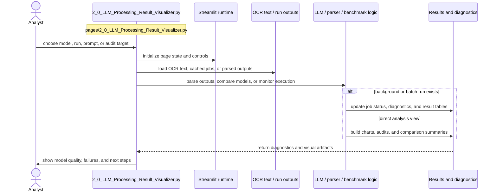

# LLM Processing Result Visualizer

- Filename: `2_0_LLM_Processing_Result_Visualizer.py`
- Source path: `pages/2_0_LLM_Processing_Result_Visualizer.py`
- Diagram file: `documentation/streamlit_pages/mermaid_sequence_diagram/2_0_LLM_Processing_Result_Visualizer.md`
- Page slug: `2_0_LLM_Processing_Result_Visualizer`
- Category: `llm`
- Purpose: Run or inspect model outputs, parse results, and surface diagnostics for review.
- Primary inputs: OCR text, model outputs, background job files, parser results
- Primary outputs: parsed records, diagnostics, model comparisons, run status views
- Summary: LLM extraction and diagnostics.

## What This Page Documents

This file documents the interaction flow for `2_0_LLM_Processing_Result_Visualizer.py` and gives a reusable filename pattern for the artifacts that this page reads or writes.

## Filename Placeholders

Use these placeholders when you want to substitute your own files such as `CSV`, `JSON`, `JSONL`, `XLSX`, `PNG`, or `PDF` assets.

- Input examples: `<ocr_text>.md`, `<llm_result>.json`, `<background_run>.jsonl`, `<parsed_records>.csv`
- Output examples: `<parsed_output>.json`, `<diagnostics>.csv`, `<run_status>.jsonl`, `<comparison_export>.xlsx`

Recommended placeholder format:

- `<name>.csv` for tabular inputs or exports
- `<name>.json` for structured objects or config-like artifacts
- `<name>.jsonl` for line-by-line run logs or benchmark rows
- `<name>.xlsx` for spreadsheet deliverables
- `<name>.md` for OCR text or narrative output
- `<name>.png` for figure snapshots or image intermediates
- `<name>.pdf` for source documents

## Naming Guidance

- Include model, prompt, or run identifiers when one text source can produce multiple LLM outputs.
- Separate raw outputs from parsed outputs in the filename to avoid schema-confusion during audits.

## Customization Steps

1. Choose the file stem that matches your dataset or experiment, for example `esg_records`, `ontology_map`, or `ground_truth_seed`.
2. Keep the extension aligned with the artifact type, for example `CSV` for tables and `JSON` for nested structures.
3. If multiple runs exist, append a stable suffix such as `_v2`, `_2026_06`, `_prompt_3`, or `_model_a`.
4. Update this page documentation if the real source path, output path, or artifact role changes.

## Detailed Sequence

