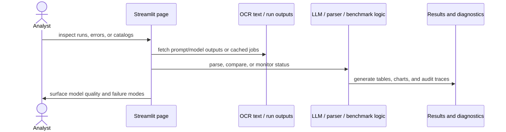

# LLM Error & Parse Audit

- Source page: `2_1_LLM_Error_Parse_Audit.py`
- Category: `llm`
- Summary: LLM extraction and diagnostics.

```mermaid
sequenceDiagram
    actor User as Analyst
    participant page as Streamlit page
    participant data as OCR text / run outputs
    participant compute as LLM / parser / benchmark logic
    participant output as Results and diagnostics
    User->>page: inspect runs, errors, or catalogs
    page->>data: fetch prompt/model outputs or cached jobs
    page->>compute: parse, compare, or monitor status
    compute->>output: generate tables, charts, and audit traces
    page->>User: surface model quality and failure modes
```
