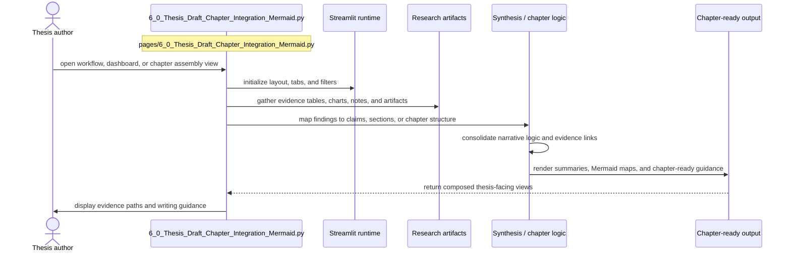

# Thesis Draft + Chapters Mermaid Integration

- Filename: `6_0_Thesis_Draft_Chapter_Integration_Mermaid.py`
- Source path: `pages/6_0_Thesis_Draft_Chapter_Integration_Mermaid.py`
- Diagram file: `documentation/streamlit_pages/mermaid_sequence_diagram/6_0_Thesis_Draft_Chapter_Integration_Mermaid.md`
- Page slug: `6_0_Thesis_Draft_Chapter_Integration_Mermaid`
- Category: `thesis`
- Purpose: Aggregate evidence into workflow, dashboard, and chapter-ready thesis views.
- Primary inputs: research artifacts, charts, notes, chapter evidence tables
- Primary outputs: chapter summaries, Mermaid maps, narrative guidance, evidence matrices
- Summary: Thesis synthesis and navigation.

## Detailed Sequence

