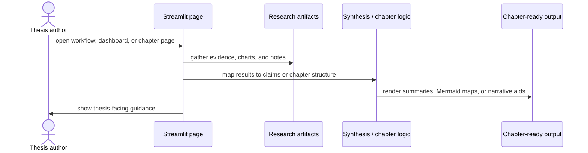

# Chapter 4 - Implementation and Results

- Source page: `6_1_Chapter_4_Implementation_Results.py`
- Category: `thesis`
- Summary: Thesis synthesis and navigation.

```mermaid
sequenceDiagram
    actor User as Thesis author
    participant page as Streamlit page
    participant data as Research artifacts
    participant compute as Synthesis / chapter logic
    participant output as Chapter-ready output
    User->>page: open workflow, dashboard, or chapter page
    page->>data: gather evidence, charts, and notes
    page->>compute: map results to claims or chapter structure
    compute->>output: render summaries, Mermaid maps, or narrative aids
    page->>User: show thesis-facing guidance
```
