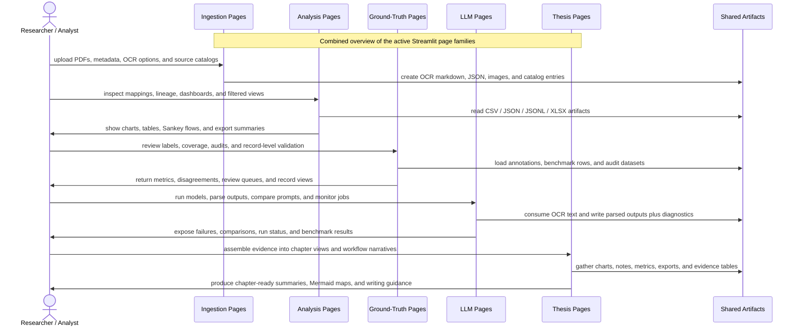

# Combined Streamlit Workflow

- Scope: All active Streamlit page families
- Diagram file: `documentation/streamlit_pages/mermaid_sequence_diagram/Combined_Streamlit_Workflow.md`
- Purpose: Show the end-to-end relationship between ingestion, analysis, ground-truth, LLM, and thesis pages.
- Shared artifacts: CSV, JSON, JSONL, XLSX, MD, PNG, PDF

## What This Diagram Shows

This combined sequence diagram summarizes how the Streamlit pages work together around shared research artifacts.
It is the high-level entry point for the whole folder: use it first, then drill down into the page-level markdown files for the detailed Mermaid sequence of each Streamlit page.

## Workflow Explanation

The workflow starts with ingestion pages, which create the source artifacts that the rest of the application depends on.
Those artifacts are then reused by analysis pages, ground-truth pages, and LLM pages depending on whether the researcher is exploring data, validating labels, or running extraction jobs.
The final stage is the thesis layer, where validated outputs, figures, notes, and metrics are assembled into chapter-ready explanations and research evidence.

In short, the overall flow is:

`PDF or source document -> OCR or metadata capture -> analytical inspection -> validation or LLM processing -> thesis synthesis`

## Page Families

### Ingestion Pages

These pages create source-side artifacts such as OCR text, metadata, images, and catalog records.

- [`0_11_Source_Data_Catalog.md`](./0_11_Source_Data_Catalog.md) - Source Data Catalog
- [`0_3_OCR_Company_Metadata_Labeler.md`](./0_3_OCR_Company_Metadata_Labeler.md) - OCR Company Metadata Labeler
- [`Bulk_OCR.md`](./Bulk_OCR.md) - 📚 Bulk OCR — Mistral

### Analysis Pages

These pages inspect prepared datasets, lineage, mappings, dashboards, and analytical summaries.

- [`0_10_Live_Numbers_Lineage.md`](./0_10_Live_Numbers_Lineage.md) - Live Numbers + Lineage
- [`0_2_JSON_Ontology_Usage_Map.md`](./0_2_JSON_Ontology_Usage_Map.md) - JSON Ontology Usage Map
- [`0_4_Sustainable_Framework_API_Reader.md`](./0_4_Sustainable_Framework_API_Reader.md) - Sustainable Framework API Reader
- [`1_0_Revision_Analytics.md`](./1_0_Revision_Analytics.md) - Revision Analytics
- [`1_13_Semantic_Graph_Exporter.md`](./1_13_Semantic_Graph_Exporter.md) - Semantic Graph Exporter
- [`1_16_Dataset_Phase_Manager.md`](./1_16_Dataset_Phase_Manager.md) - Dataset Phase Manager
- [`1_17_Phase_2_Resolver.md`](./1_17_Phase_2_Resolver.md) - Phase 2 Resolver
- [`1_18_Phase_3_Resolver.md`](./1_18_Phase_3_Resolver.md) - Phase 3 Resolver
- [`1_19_Phase_1_Completed_Dataset.md`](./1_19_Phase_1_Completed_Dataset.md) - Phase 1 Completed Dataset
- [`1_20_Phase_PDF_Distribution.md`](./1_20_Phase_PDF_Distribution.md) - Phase PDF Distribution
- [`1_5_ESG_Flow_Sankey.md`](./1_5_ESG_Flow_Sankey.md) - ESG Flow Sankey
- [`1_6_Ontology_Path_Viewer.md`](./1_6_Ontology_Path_Viewer.md) - Ontology Path Viewer
- [`3_1_A4_Per_Model_Background_Run.md`](./3_1_A4_Per_Model_Background_Run.md) - A.4 Per-Model Background Run
- [`3_2_A4_Per_Model_Dashboard.md`](./3_2_A4_Per_Model_Dashboard.md) - A.4 Per-Model Dashboard
- [`3_3_A4_Regenerate_Fix_Grouping.md`](./3_3_A4_Regenerate_Fix_Grouping.md) - A.4 Regenerate (Tone x ClimateBERT)

### Ground-Truth Pages

These pages validate labeled records, benchmark coverage, disagreements, and audit status.

- [`1_10_Ground_Truth_Run_Coverage.md`](./1_10_Ground_Truth_Run_Coverage.md) - Ground Truth Run Coverage
- [`1_11_Ground_Truth_Record_Audit.md`](./1_11_Ground_Truth_Record_Audit.md) - Ground Truth Record Audit
- [`1_12_Ground_Truth_Step_By_Step_Visualizer.md`](./1_12_Ground_Truth_Step_By_Step_Visualizer.md) - Ground Truth Step-by-Step Visualizer
- [`1_1_Ground_Truth_Workbench.md`](./1_1_Ground_Truth_Workbench.md) - Ground Truth Workbench
- [`1_2_OCR_Quality_Workbench.md`](./1_2_OCR_Quality_Workbench.md) - OCR Quality Workbench
- [`1_3_Ground_Truth_Metrics.md`](./1_3_Ground_Truth_Metrics.md) - Ground Truth Metrics
- [`1_8_Ground_Truth_Output_Visualizer.md`](./1_8_Ground_Truth_Output_Visualizer.md) - Ground Truth Output Visualizer
- [`1_9_Ground_Truth_Pipeline_Output_Visualizer.md`](./1_9_Ground_Truth_Pipeline_Output_Visualizer.md) - Ground Truth Pipeline Output Visualizer
- [`ground_truth.md`](./ground_truth.md) - ESG Pipeline

### LLM Pages

These pages run, parse, compare, and monitor model-driven extraction workflows.

- [`0_9_Tone_ClimateBERT_Visualization.md`](./0_9_Tone_ClimateBERT_Visualization.md) - Tone vs ClimateBERT
- [`1_14_ClimateBERT_Multi_Model_Runner.md`](./1_14_ClimateBERT_Multi_Model_Runner.md) - ClimateBERT Multi-Model Runner
- [`1_4_ClimateBERT_Record_Batch.md`](./1_4_ClimateBERT_Record_Batch.md) - ClimateBERT Record Batch
- [`2_0_LLM_Processing_Result_Visualizer.md`](./2_0_LLM_Processing_Result_Visualizer.md) - LLM Processing Result Visualizer
- [`2_1_LLM_Error_Parse_Audit.md`](./2_1_LLM_Error_Parse_Audit.md) - LLM Error & Parse Audit
- [`2_2_LLM_Statement_Page_Verifier.md`](./2_2_LLM_Statement_Page_Verifier.md) - LLM Statement Page Verifier
- [`2_3_LLM_Background_Run_Monitor.md`](./2_3_LLM_Background_Run_Monitor.md) - LLM Background Run Monitor
- [`2_4_PDF_Page_Processing_Audit.md`](./2_4_PDF_Page_Processing_Audit.md) - PDF Page Processing Audit
- [`2_5_LLM_Model_Catalog_Visualizer.md`](./2_5_LLM_Model_Catalog_Visualizer.md) - LLM Model Catalog Visualizer
- [`llm_processing.md`](./llm_processing.md) - 🌿 ESG Combined Pipeline

### Thesis Pages

These pages assemble evidence, narrative structure, and chapter-ready research outputs.

- [`0_0_Streamlit_Page_Workflow.md`](./0_0_Streamlit_Page_Workflow.md) - Streamlit Page Workflow
- [`0_5_Thesis_Systematic_Workflow.md`](./0_5_Thesis_Systematic_Workflow.md) - Thesis Systematic Workflow
- [`1_15_Thesis_Gap_Closure_Dashboard.md`](./1_15_Thesis_Gap_Closure_Dashboard.md) - Thesis Gap Closure Dashboard
- [`1_7_Research_Questions_Dashboard.md`](./1_7_Research_Questions_Dashboard.md) - Research Questions Dashboard
- [`3_0_Thesis_Action_Plan.md`](./3_0_Thesis_Action_Plan.md) - Thesis Action Plan
- [`5_1_Thesis_Systematic_Workflow_dashboard_generated.md`](./5_1_Thesis_Systematic_Workflow_dashboard_generated.md) - Thesis Systematic Workflow Dashboard
- [`5_Thesis_Systematic_Workflow_dashboard.md`](./5_Thesis_Systematic_Workflow_dashboard.md) - Thesis Systematic Workflow Dashboard
- [`6_0_Thesis_Draft_Chapter_Integration_Mermaid.md`](./6_0_Thesis_Draft_Chapter_Integration_Mermaid.md) - Thesis Draft + Chapters Mermaid Integration
- [`6_1_Chapter_4_Implementation_Results.md`](./6_1_Chapter_4_Implementation_Results.md) - Chapter 4 - Implementation and Results
- [`6_2_Chapter_5_Discussion.md`](./6_2_Chapter_5_Discussion.md) - Chapter 5 - Discussion
- [`6_3_Chapter_6_Conclusion.md`](./6_3_Chapter_6_Conclusion.md) - Chapter 6 - Conclusion
- [`6_4_ch4-6.md`](./6_4_ch4-6.md) - Ch4-6 Benchmarks + DOCX Graphs

## How To Use It

1. Start at `Ingestion Pages` if you are documenting document intake, OCR, or source registration.
2. Move to `Analysis Pages`, `Ground-Truth Pages`, or `LLM Pages` depending on the workflow branch you want to explain.
3. End at `Thesis Pages` when you need chapter-ready outputs, evidence synthesis, or narrative summaries.
4. Replace artifact examples with your actual filenames, such as `esg_records.csv`, `ontology_map.json`, or `background_runs.jsonl`.

## Shared Artifact Types

- `CSV`: tabular exports such as record tables, metrics, review queues, and summaries
- `JSON`: structured mappings, metadata, parsed records, and configuration-like files
- `JSONL`: run logs, benchmark rows, event streams, and parser diagnostics
- `XLSX`: review workbooks, spreadsheet deliverables, and manually curated tables
- `MD`: OCR text, notes, chapter drafts, and markdown summaries
- `PNG`: charts, screenshots, figure exports, and page previews
- `PDF`: raw reports, source documents, and exported document outputs

## Combined Sequence

