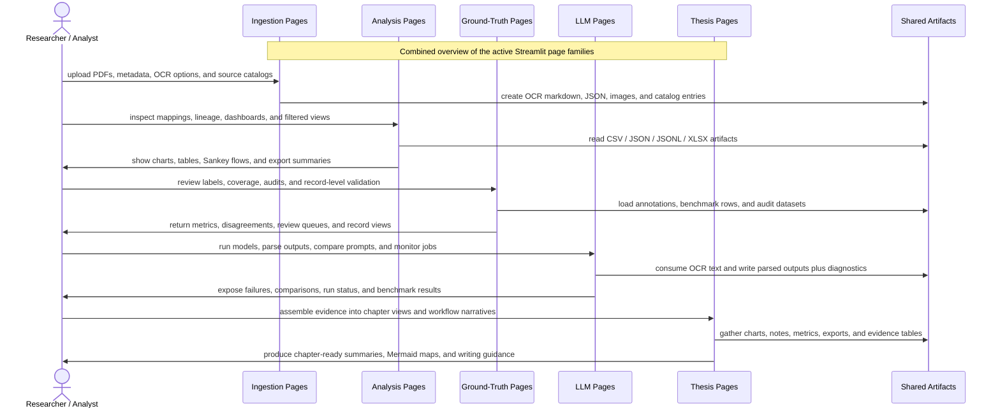
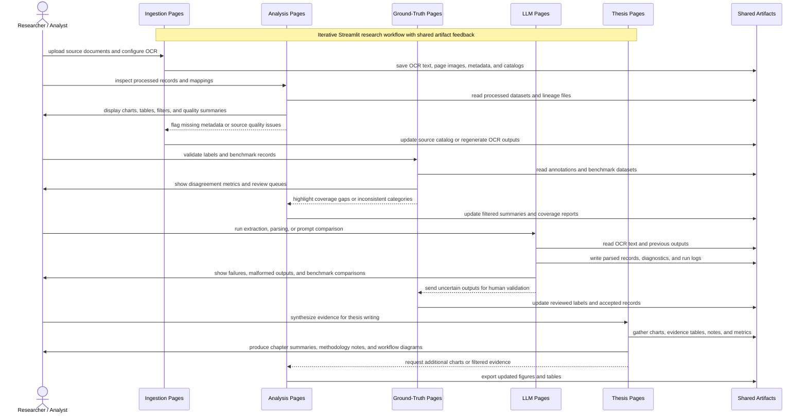

Below is an expanded, documentation-ready version of your **Combined Streamlit Workflow**. I structured it so you can paste it directly into `Combined_Streamlit_Workflow.md`.

# Combined Streamlit Workflow

* **Scope:** All active Streamlit page families
* **Diagram file:** `documentation/streamlit_pages/mermaid_sequence_diagram/Combined_Streamlit_Workflow.md`
* **Purpose:** Show the end-to-end relationship between ingestion, analysis, ground-truth, LLM, and thesis-support pages.
* **Shared artifacts:** CSV, JSON, JSONL, XLSX, MD, PNG, PDF

---

## 1. Overview

The Combined Streamlit Workflow describes how all major Streamlit page families interact within the research dashboard. Instead of treating each page as an isolated interface, this diagram shows how the pages form a connected research pipeline.

The workflow begins with **Ingestion Pages**, where source documents, metadata, OCR outputs, and document catalogs are created. These outputs become shared artifacts that are reused by downstream pages.

From there, the workflow branches into three major operational areas:

1. **Analysis Pages**, which inspect, filter, visualize, and summarize processed artifacts.
2. **Ground-Truth Pages**, which support annotation review, benchmark validation, label auditing, and disagreement analysis.
3. **LLM Pages**, which run model-based extraction, compare prompts, parse outputs, and diagnose failures.

The workflow ends with **Thesis Pages**, which transform the accumulated artifacts, metrics, charts, and evidence into chapter-ready research outputs.

This combined view is useful for explaining the dashboard as a full research-support system rather than a collection of separate Streamlit scripts.

---

## 2. Main Page Families

### 2.1 Ingestion Pages

The ingestion pages are the entry point of the system. They handle document intake and prepare source materials for later processing.

Typical responsibilities include:

* Uploading PDF files or document batches.
* Registering source metadata.
* Running or inspecting OCR output.
* Creating markdown text files from scanned or digital documents.
* Extracting page images, figures, or tables.
* Creating document catalog entries.
* Saving structured records into shared artifacts.

Example artifacts created by ingestion pages:

* `ocr_output.md`
* `document_catalog.json`
* `source_metadata.csv`
* `page_images/`
* `raw_pdf_records.json`
* `ingestion_log.jsonl`

The ingestion stage is important because every downstream workflow depends on the quality and consistency of the extracted source material.

---

### 2.2 Analysis Pages

The analysis pages help users inspect processed datasets and understand relationships across records, sources, mappings, and outputs.

Typical responsibilities include:

* Loading CSV, JSON, JSONL, or XLSX artifacts.
* Inspecting ESG records, ontology mappings, source lineage, and model outputs.
* Filtering records by company, issue, document, page, topic, or label.
* Visualizing trends, distributions, and relationships.
* Generating charts, tables, Sankey diagrams, and summary exports.
* Supporting exploratory analysis before formal evaluation or thesis writing.

Example artifacts used by analysis pages:

* `esg_records.csv`
* `ontology_map.json`
* `entity_mapping.xlsx`
* `lineage_records.jsonl`
* `analysis_summary.md`
* `chart_exports/`

The analysis stage helps researchers understand what the data contains, where it came from, and how different artifacts relate to each other.

---

### 2.3 Ground-Truth Pages

Ground-truth pages focus on validation, annotation, benchmark preparation, and quality control. These pages are useful when human-reviewed labels are required for evaluation.

Typical responsibilities include:

* Reviewing manually annotated records.
* Comparing model outputs against human labels.
* Checking label coverage across ESG categories, aspects, companies, and documents.
* Identifying disagreements between annotators or between model and ground truth.
* Creating review queues for uncertain or incomplete records.
* Supporting record-level audit workflows.

Example artifacts used by ground-truth pages:

* `ground_truth_labels.csv`
* `benchmark_rows.jsonl`
* `annotation_audit.xlsx`
* `label_coverage.json`
* `review_queue.csv`
* `disagreement_report.md`

The ground-truth stage is essential for measuring reliability. It provides the reference data needed to evaluate extraction quality, classification performance, and model consistency.

---

### 2.4 LLM Pages

LLM pages support model-based processing, prompt comparison, parsing, diagnostics, and benchmark inspection. These pages connect OCR text and structured artifacts with LLM-based extraction or reasoning workflows.

Typical responsibilities include:

* Running LLM extraction over OCR text or selected document sections.
* Comparing different prompts, models, or parser settings.
* Parsing unstructured model responses into structured records.
* Monitoring background runs or batch jobs.
* Inspecting failed outputs, malformed JSON, missing fields, or low-confidence results.
* Producing diagnostics for debugging and evaluation.
* Writing parsed outputs back into shared artifact files.

Example artifacts used or produced by LLM pages:

* `background_runs.jsonl`
* `llm_outputs.json`
* `parsed_records.csv`
* `prompt_comparison.xlsx`
* `parser_errors.jsonl`
* `diagnostics.md`
* `benchmark_results.csv`

The LLM stage acts as the automation layer of the dashboard. It converts text-heavy research materials into structured outputs that can be analyzed, audited, and reused in thesis writing.

---

### 2.5 Thesis Pages

Thesis pages transform operational artifacts into research-facing outputs. They help convert evidence, metrics, diagrams, and analysis results into chapter-ready material.

Typical responsibilities include:

* Gathering selected charts, tables, notes, and metrics.
* Producing narrative summaries for thesis chapters.
* Organizing evidence by research question, ESG dimension, company, source, or method.
* Creating Mermaid diagrams and workflow explanations.
* Preparing methodology descriptions.
* Summarizing evaluation results.
* Supporting literature-to-method-to-result alignment.

Example artifacts used by thesis pages:

* `chapter_notes.md`
* `methodology_summary.md`
* `evidence_table.xlsx`
* `result_charts/`
* `evaluation_metrics.csv`
* `workflow_diagrams.md`
* `thesis_export.md`

The thesis stage is the final synthesis layer. It connects technical work with academic writing, helping the researcher explain what was done, why it matters, and how the evidence supports the research claims.

---

## 3. Shared Artifact Layer

The shared artifacts act as the central data layer connecting all Streamlit page families. Each page does not need to directly communicate with every other page. Instead, pages read from and write to common files.

Common artifact types include:

| Artifact Type | Purpose                                           | Example                                |
| ------------- | ------------------------------------------------- | -------------------------------------- |
| CSV           | Structured tabular records                        | `esg_records.csv`                      |
| JSON          | Configs, mappings, metadata, structured outputs   | `ontology_map.json`                    |
| JSONL         | Batch runs, logs, model outputs, diagnostics      | `background_runs.jsonl`                |
| XLSX          | Review sheets, benchmark tables, manual audits    | `annotation_audit.xlsx`                |
| MD            | OCR text, summaries, notes, documentation         | `ocr_output.md`                        |
| PNG           | Charts, page images, visual exports               | `chart_exports/topic_distribution.png` |
| PDF           | Original sources, reports, exported documentation | `company_report.pdf`                   |

This artifact-centered design makes the workflow easier to debug, document, reproduce, and extend.

---

## 4. End-to-End Workflow Explanation

The workflow begins when the researcher uploads or registers source documents through the ingestion pages. These pages prepare the raw materials by creating OCR text, metadata files, images, and catalog entries.

Once the artifacts exist, the researcher can move into analysis pages to inspect the extracted data. This includes checking source coverage, viewing dashboards, filtering records, and generating visual summaries.

If the workflow requires evaluation, the researcher can use ground-truth pages to inspect manually labeled records, compare annotations, and identify disagreements. These pages help ensure that the dataset and model outputs can be evaluated against a trusted reference.

In parallel, the researcher can use LLM pages to run extraction, parse model responses, compare prompt versions, and inspect failures. LLM outputs are written back into shared artifacts so they can be analyzed and validated by other pages.

Finally, the thesis pages gather validated outputs, charts, notes, evidence tables, and diagrams into research-ready summaries. These pages help convert technical pipeline outputs into academic writing material.

The combined workflow therefore supports a full research cycle:

**Document intake → OCR and metadata → analysis → annotation and validation → LLM extraction → diagnostics → evidence synthesis → thesis writing**

---

## 5. Combined Sequence Diagram

---

## 6. Research Workflow Interpretation

This diagram can be interpreted as a layered research system.

### Layer 1: Source Preparation

The ingestion layer prepares the raw source documents. Without this layer, the system has no reliable OCR text, page-level evidence, or document metadata.

### Layer 2: Data Exploration

The analysis layer allows the researcher to understand the structure, quality, and coverage of the processed artifacts. This supports exploratory research and helps identify gaps before evaluation.

### Layer 3: Human Validation

The ground-truth layer introduces human-reviewed labels and benchmark data. This makes it possible to evaluate model outputs and support stronger research claims.

### Layer 4: Model Processing

The LLM layer automates extraction, summarization, parsing, and comparison. It helps scale the research workflow beyond manual reading.

### Layer 5: Thesis Synthesis

The thesis layer converts operational work into academic outputs. It connects the pipeline to research questions, methodology, results, and discussion chapters.

---

## 7. Example Practical Scenario

A researcher uploads several ESG reports through the ingestion pages. The system extracts OCR markdown, page images, and source metadata.

The researcher then opens the analysis pages to inspect whether the reports were correctly processed. They review company names, ESG categories, ontology mappings, and source coverage.

Next, they use ground-truth pages to compare selected records against manually labeled examples. Any disagreement is added to a review queue.

After that, they use LLM pages to run extraction prompts over the OCR text. The LLM outputs are parsed into structured JSON or CSV records. Failed outputs are logged into diagnostic files.

Finally, the researcher opens thesis pages to generate evidence tables, workflow diagrams, chapter summaries, and methodology descriptions.

This makes the Streamlit dashboard useful not only as a data-processing tool, but also as a research documentation and thesis-writing environment.

---

## 8. Suggested Filenames for Real Projects

You can replace the generic artifact examples with project-specific names such as:

* `esg_records.csv`
* `company_source_catalog.json`
* `ontology_map.json`
* `ocr_markdown_outputs/`
* `background_runs.jsonl`
* `llm_parsed_outputs.json`
* `ground_truth_labels.xlsx`
* `benchmark_results.csv`
* `annotation_disagreements.csv`
* `thesis_evidence_table.xlsx`
* `chapter_summary.md`
* `workflow_mermaid_maps.md`

Using consistent filenames will make the workflow easier to explain and maintain.

---

## 9. Why This Combined Workflow Matters

This combined workflow is useful because it explains how the Streamlit dashboard supports the complete research process.

It shows that the dashboard is not only for visualization. It also supports:

* Document ingestion.
* OCR inspection.
* Data cleaning and artifact management.
* ESG record analysis.
* Ontology and lineage inspection.
* Ground-truth validation.
* LLM extraction and diagnostics.
* Benchmark comparison.
* Thesis writing and evidence synthesis.

The diagram therefore provides a high-level map of how different Streamlit pages contribute to the full research pipeline.

---

## 10. Recommended Documentation Placement

This document should be placed at:

`documentation/streamlit_pages/mermaid_sequence_diagram/Combined_Streamlit_Workflow.md`

It can also be referenced from:

* `PROJECT_CONTEXT.md`
* `documentation/streamlit_pages/README.md`
* `documentation/workflow_overview.md`
* Thesis methodology notes
* Dashboard onboarding documentation

This makes the combined workflow available both for developers maintaining the dashboard and for researchers using the dashboard to explain their methodology.

---

## 11. Suggested Extended Diagram With Artifact Feedback Loops

The basic diagram shows the main flow. However, the real workflow is often iterative. Analysis may reveal missing metadata, ground-truth review may reveal annotation issues, and LLM diagnostics may require prompt revisions.

The following extended version shows these feedback loops:

---

## 12. Short Summary

The Combined Streamlit Workflow shows how the dashboard supports the full research pipeline from document ingestion to thesis writing. The workflow uses shared artifacts as the central connection layer, allowing ingestion, analysis, ground-truth validation, LLM processing, and thesis synthesis pages to work together in an iterative and reproducible way.
