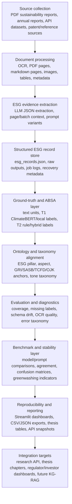

# Systematic Workflow for the ESG ABSA Thesis Pipeline

Source document: `thesis_draft_1.pdf`

This workflow translates the thesis draft into an executable research-data pipeline. The draft frames the project as an end-to-end, bilingual Indonesian/English ESG ABSA system that converts PDF sustainability reports into structured, auditable ESG evidence records; separates aspect, sentiment, and tone; compares tone outputs with ClimateBERT-style labels; diagnoses extraction weaknesses; preserves reproducible artifacts; and measures stability across models and prompts.

## 1. Research Workflow Overview



## 2. Research Questions to Executable Modules

| Thesis target | Operational meaning | Current / proposed implementation | Primary generated data |
|---|---|---|---|
| RQ1 PDF-to-structured ESG | Convert PDF disclosures into sentence/page/batch-level ESG evidence | `Bulk_OCR.py`, `llm_processing.py`, `2_3_LLM_Background_Run_Monitor.py`, `2_4_PDF_Page_Processing_Audit.py` | OCR markdown pages, `ocr_result.json`, LLM job configs, page audit rows, `esg_records.json` |
| RQ2 Aspect, pillar, sentiment, tone schema | Define multi-dimensional ESG ABSA labels | `ground_truth.py`, `1_1_Ground_Truth_Workbench.py`, `1_12_Ground_Truth_Step_By_Step_Visualizer.py` | text units, annotation seed CSVs, T1/T2 JSONL, human labels |
| RQ3 Tone vs ClimateBERT | Compare disclosure tone to climate-focused labels | `1_4_ClimateBERT_Record_Batch.py`, `0_9_Tone_ClimateBERT_Visualization.py`, `1_9_Ground_Truth_Pipeline_Output_Visualizer.py` | model label outputs, tone-label crosstabs, agreement tables |
| RQ4 Diagnostics | Detect weaknesses in extraction and ABSA outputs | `2_1_LLM_Error_Parse_Audit.py`, `1_11_Ground_Truth_Record_Audit.py`, `1_10_Ground_Truth_Run_Coverage.py` | parse errors, missing fields, schema drift, failed/partial records |
| RQ5 Reproducibility | Preserve data lineage, configs, prompts, dashboards, exports | `0_0_Streamlit_Page_Workflow.py`, `documentation/streamlit_pages`, `results/visualizations` | workflow docs, dashboard screenshots, CSV/JSON exports |
| RQ6 Stability | Quantify model/prompt variability and identify robust combinations | `2_0_LLM_Processing_Result_Visualizer.py`, background jobs, prompt folder | prompt/model matrices, per-run output variance, best configuration reports |

## 3. Data That Can Be Generated

### 3.1 Source and Collection Data

| Data artifact | Shape | Purpose | Integration |
|---|---|---|---|
| PDF inventory | CSV/JSON: company, report year, source URL, sector, language, file path | Defines the experimental corpus and sampling frame | Join with OCR outputs and ESG scores |
| Company metadata | CSV/JSON: ticker, sector, industry, country, report type | Enables sector/language stratification and benchmark grouping | `data/stock_info`, `data/ESG Score.xlsx` |
| External API catalog snapshots | JSON from Sustainable Framework API | Adds patent, research-group, workflow, benchmark, and reference metadata | `0_4_Sustainable_Framework_API_Reader.py`, `results/api_reader/` |
| Patent/reference source records | JSON/CSV: code, title, abstract, method, advantages, source URLs | Supports literature positioning and novelty mapping | API reader, thesis literature/research-gap sections |

### 3.2 OCR and Document Structure Data

| Data artifact | Shape | Purpose | Integration |
|---|---|---|---|
| OCR result | `ocr_result.json` per document | Full extracted document with page-level content | Base input for extraction and page audit |
| Markdown pages | `data/thesis_dataset/<doc>/pages/page_XXXX.md` | Page-level text for page/batch LLM extraction | `llm_processing.py`, background worker |
| Image/table inventory | JSON/CSV: page, image path, table region, caption | Supports document-structure aware ABSA and OCR QA | Future OCR quality workbench, KG evidence nodes |
| OCR quality metrics | CSV: CER, WER, table extraction accuracy, page completeness | Quantifies RQ1/RQ4 OCR risk | `1_2_OCR_Quality_Workbench.py`, page audit |

### 3.3 LLM ESG Extraction Data

| Data artifact | Shape | Purpose | Integration |
|---|---|---|---|
| Background job config | `results/background_llm_jobs/<job>/config.json` | Reproducible run settings: document, pages, prompts, models | Monitor and audit pages |
| Background events | JSONL: started, completed, failed, skipped, retry metadata | Tracks long-running LLM jobs | `2_3_LLM_Background_Run_Monitor.py` |
| Raw LLM output | JSON/string in `esg_records.json` | Preserves model output for parsing/error review | parse audit and result visualizer |
| Parsed ESG records | JSON list: text, aspect, ESG pillar, sentiment, tone, labels, reasoning | Core structured ESG evidence layer | all ABSA, ClimateBERT, metrics, dashboards |
| Recovery metadata | JSON: context chars, prompt chars, retry attempts | Measures prompt/context fragility | RQ6 stability diagnostics |

### 3.4 Ground Truth and ABSA Data

| Data artifact | Shape | Purpose | Integration |
|---|---|---|---|
| Text-unit coverage | CSV: label, source index, T1/T2 attempts, processing status | Shows which extracted records are processed or pending | `1_12_Ground_Truth_Step_By_Step_Visualizer.py` |
| T1 outputs | `results/t1_results.jsonl`: label, model, text, prediction, success/error | ClimateBERT/local model classification layer | `1_9_Ground_Truth_Pipeline_Output_Visualizer.py` |
| T2 outputs | `results/t2_results.jsonl`: rule-based labels, hybrid predictions, metrics | Rule/hybrid ABSA layer | same visualizer and metrics pages |
| Annotation seed | CSV: text, predicted labels, blank ground-truth fields | Human labeling scaffold | `1_1_Ground_Truth_Workbench.py` |
| Human annotation file | CSV: ground-truth tone, ESG, aspect, notes | Gold/pilot evaluation corpus | `1_3_Ground_Truth_Metrics.py` |
| Inter-annotator agreement | CSV/JSON: annotator labels, Cohen kappa, disagreements | Required for formal ground truth validity | proposed expansion of metrics page |

### 3.5 Ontology and Regulatory Alignment Data

| Data artifact | Shape | Purpose | Integration |
|---|---|---|---|
| ESG ontology map | JSON: pillar, aspect, sub-aspect, synonyms, regulatory anchors | Aligns Indonesian/English terms to common ESG concepts | `0_2_JSON_Ontology_Usage_Map.py`, `1_6_Ontology_Path_Viewer.py` |
| Bilingual lexicon | CSV/JSON: Indonesian term, English term, aliases, ontology node | Reduces cross-language drift | rule-based and hybrid models |
| Regulatory mapping table | CSV/JSON: ontology node to GRI/SASB/TCFD/OJK/IDX references | Makes output regulator-readable | future API/export layer |
| Ontology path assignments | CSV: record label, ontology path, alignment score | Supports explainability and diagnostics | T2 hybrid output, Sankey/ontology pages |

### 3.6 Evaluation, Diagnostics, and Benchmark Data

| Data artifact | Shape | Purpose | Integration |
|---|---|---|---|
| Confusion matrices | CSV/Altair: predicted vs ground truth | Measures tone/ESG/aspect performance | `1_3_Ground_Truth_Metrics.py` |
| Agreement metrics | CSV: accuracy, macro-F1, weighted-F1, kappa | Formal model comparison | thesis results tables |
| Error taxonomy | CSV/JSON: error type, source, severity, fix action | Turns failures into model-improvement tasks | audit pages |
| Stability benchmark | CSV: model, prompt, label, output hash, agreement group | Measures prompt/model variance | RQ6 dashboard |
| Greenwashing indicators | CSV: commitment/outcome imbalance, unsupported claim flag, KPI evidence flag | Connects tone taxonomy to credibility risk | future greenwashing validation |
| Reproducibility package manifest | JSON: data files, prompts, models, code versions, run IDs | Makes thesis experiments auditable | `documentation/`, API exports |

## 4. Integration Architecture

### 4.1 Local Repository Integration

| Layer | Existing location | Integration action |
|---|---|---|
| PDFs | `data/thesis_pdf/` | Treat as immutable source documents; add inventory metadata |
| OCR output | `data/thesis_dataset/` | Maintain page-level markdown and `ocr_result.json`; add OCR metrics |
| Prompts | `prompt/*.md` | Version prompt templates and include prompt IDs in every run |
| LLM outputs | `results/esg_records.json`, `results/background_llm_jobs/` | Use as canonical structured evidence store |
| Ground truth outputs | `results/t1_results.jsonl`, `results/t2_results.jsonl` | Use text label as resume/integration key |
| Visualization outputs | `results/visualizations/` | Store reproducible chart artifacts and dashboard screenshots |
| API snapshots | `results/api_reader/` | Save external reference and patent/research metadata snapshots |
| Documentation | `documentation/` | Store workflow, data dictionary, thesis tables, reproducibility manifests |

### 4.2 API Integration

The Sustainable Framework API should function as the external knowledge and planning layer.

| API source | Use in thesis workflow | Local integration |
|---|---|---|
| `/api/v1/catalog` | Discover available reference datasets | API reader dataset dropdown |
| `/api/v1/patent-analysis` | Patent landscape for novelty and prior-art framing | Export to `results/api_reader/api_v1_patent-analysis.json`; join with literature gap notes |
| `/api/v1/research-groups` | Supervisor/lab fit, research positioning, collaboration tracking | Export snapshots; generate research-group comparison table |
| `/api/v1/paper-workflows` | Paper-by-paper execution planning | Align workflow stages to paper outputs |
| `/api/v1/extra-sources` | Benchmark HTML/Markdown/SVG references | Use as supporting benchmark and methodology context |

Recommended integration key pattern:

| Entity | Stable key |
|---|---|
| Document | `document_id` from PDF folder/report filename |
| Page | `document_id + page_name` |
| ESG record | `target` or `label` from extraction run |
| Ground-truth unit | `label` |
| Model output | `label + model + prompt` |
| Ontology node | canonical `ontology_path` |
| API snapshot | endpoint path + timestamp |

## 5. Recommended Execution Order

1. Build or refresh the PDF inventory.
2. Run OCR and page extraction.
3. Audit OCR/page completeness.
4. Run LLM extraction in background batches.
5. Audit raw and parsed LLM outputs.
6. Normalize records into a stable ESG evidence schema.
7. Generate text-unit coverage.
8. Run missing T1/T2 ground-truth processing in background chunks.
9. Create or refresh human annotation seed.
10. Fill pilot ground-truth labels.
11. Compute metrics and confusion matrices.
12. Run tone vs ClimateBERT comparison.
13. Build ontology/path visualizations and ESG Sankey summaries.
14. Save API snapshots for patent analysis, research groups, paper workflows, and extra sources.
15. Generate reproducibility manifest and thesis-ready tables.

## 6. Minimum Viable Thesis Dataset

For a defensible pilot:

| Component | Minimum target |
|---|---|
| Documents | 20-30 sustainability/annual reports |
| Languages | Indonesian, English, mixed bilingual |
| OCR/page units | All pages with markdown extraction |
| LLM ESG records | At least 300-500 structured records |
| Human-labeled records | 100-200 pilot records |
| T1 labels | One-to-one ClimateBERT/local model label for every ESG record text |
| T2 labels | Rule/hybrid output for every ESG record text |
| OCR metrics | CER/WER sample on representative pages |
| Stability runs | At least 2 models x 3 prompt families x fixed sample |
| API snapshots | Patent analysis, research groups, paper workflow, benchmark sources |

## 7. Practical Data Schema

Use this as the common row shape for downstream integration:

```json
{
  "record_id": "stable hash or label",
  "document_id": "company_report_year",
  "company": "",
  "year": "",
  "language": "id|en|mixed",
  "page": "",
  "section": "",
  "text": "",
  "esg_pillar": "E|S|G",
  "aspect": "",
  "ontology_path": "",
  "regulatory_anchor": ["GRI", "SASB", "TCFD", "OJK"],
  "sentiment": "positive|neutral|negative",
  "tone": "commitment|action|outcome|unknown",
  "evidence_type": "narrative|kpi|table|figure|footnote",
  "model": "",
  "prompt": "",
  "confidence": null,
  "reasoning": "",
  "ground_truth_tone": "",
  "ground_truth_esg": "",
  "ground_truth_aspect": "",
  "processing_status": "",
  "source_url": "",
  "run_id": ""
}
```

## 8. Streamlit Page Map

| Need | Page |
|---|---|
| Workflow overview | `0_0_Streamlit_Page_Workflow.py` |
| API/reference reader | `0_4_Sustainable_Framework_API_Reader.py` |
| OCR/company metadata | `0_3_OCR_Company_Metadata_Labeler.py` |
| OCR quality | `1_2_OCR_Quality_Workbench.py` |
| LLM processing | `llm_processing.py` |
| Background LLM jobs | `2_3_LLM_Background_Run_Monitor.py` |
| PDF page audit | `2_4_PDF_Page_Processing_Audit.py` |
| LLM result visualizer | `2_0_LLM_Processing_Result_Visualizer.py` |
| Parse/error audit | `2_1_LLM_Error_Parse_Audit.py` |
| Ground-truth workbench | `1_1_Ground_Truth_Workbench.py` |
| Step-by-step ground truth | `1_12_Ground_Truth_Step_By_Step_Visualizer.py` |
| Metrics | `1_3_Ground_Truth_Metrics.py` |
| ClimateBERT visualization | `0_9_Tone_ClimateBERT_Visualization.py` |
| Ontology/path viewer | `1_6_Ontology_Path_Viewer.py` |
| Sankey | `1_5_ESG_Flow_Sankey.py` |

## 9. Integration Priorities

1. Add a PDF inventory table and ensure every document has `document_id`, company, year, sector, language, and source URL.
2. Promote `results/esg_records.json` into a normalized flat CSV/Parquet export for joining with T1/T2 and annotations.
3. Use the text-unit `label` as the short-term key, but add a stable `record_id` hash based on document, page, and text.
4. Create a single `results/reproducibility_manifest.json` that records source PDFs, prompts, API snapshots, run IDs, model IDs, and output files.
5. Add API snapshots from `patent-analysis`, `research-groups`, `paper-workflows`, and `extra-sources` to the methodology/literature evidence store.
6. Build the formal annotation loop: seed generation, human labeling, inter-annotator agreement, metrics, disagreement review.
7. Add stability runs with fixed record samples across models and prompt templates.
8. Connect greenwashing indicators to verifiable evidence: commitment/action/outcome imbalance, missing KPI evidence, and external rating or known-case validation.

## 10. Final Target

The target system should produce a reproducible research package:

- source document inventory,
- OCR/page artifacts,
- structured ESG records,
- model and prompt run logs,
- T1/T2 ABSA outputs,
- human annotation tables,
- evaluation metrics,
- error taxonomy,
- ontology mappings,
- API reference snapshots,
- dashboard screenshots,
- thesis-ready result tables.

This package directly supports the thesis claim that the current system is not only an ESG extraction prototype, but a benchmark-construction and auditability platform for bilingual ESG ABSA.
