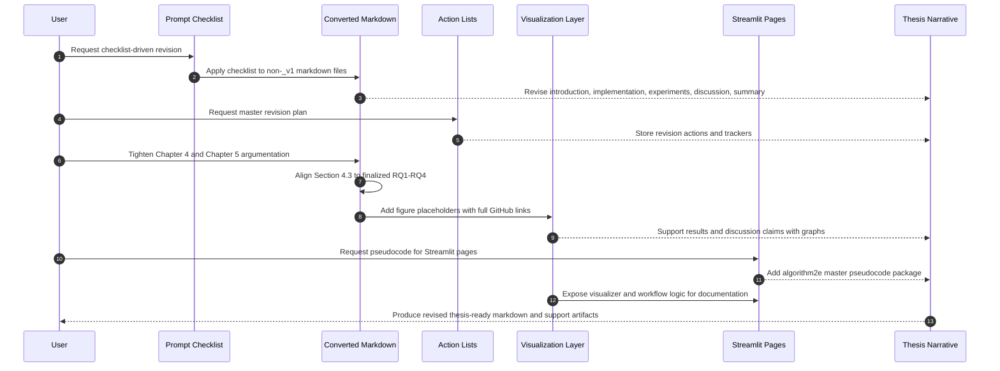

# Fixing Report

## Scope

This report compiles the work completed so far for the thesis revision and supporting Streamlit/documentation assets in `new_page/`.

Primary focus:
- revise the non-`_v1` thesis markdown files in `converted_markdown/`
- create action-planning artifacts in `action_list/`
- tighten Chapter 4 and Chapter 5 argumentation
- align Chapter 4 with the finalized research questions
- normalize image references to complete GitHub links in the targeted markdown files
- create thesis-ready pseudocode documentation for the Streamlit page system

## Files Revised in `converted_markdown/`

The following non-`_v1` files were revised:

- [converted_markdown/introduction.md](/home/ubuntu/apps/benchmarks/new_page/converted_markdown/introduction.md)
- [converted_markdown/implementation.md](/home/ubuntu/apps/benchmarks/new_page/converted_markdown/implementation.md)
- [converted_markdown/relatedwork.md](/home/ubuntu/apps/benchmarks/new_page/converted_markdown/relatedwork.md)
- [converted_markdown/experiments.md](/home/ubuntu/apps/benchmarks/new_page/converted_markdown/experiments.md)
- [converted_markdown/discussion.md](/home/ubuntu/apps/benchmarks/new_page/converted_markdown/discussion.md)
- [converted_markdown/summary.md](/home/ubuntu/apps/benchmarks/new_page/converted_markdown/summary.md)
- [converted_markdown/abstract.md](/home/ubuntu/apps/benchmarks/new_page/converted_markdown/abstract.md)
- [converted_markdown/tiivistelma.md](/home/ubuntu/apps/benchmarks/new_page/converted_markdown/tiivistelma.md)
- [converted_markdown/appendices.md](/home/ubuntu/apps/benchmarks/new_page/converted_markdown/appendices.md)
- [converted_markdown/foreword.md](/home/ubuntu/apps/benchmarks/new_page/converted_markdown/foreword.md)
- [converted_markdown/abbreviations.md](/home/ubuntu/apps/benchmarks/new_page/converted_markdown/abbreviations.md)

## Main Thesis Corrections Implemented

### 1. Research-question consistency

The results chapter was refactored to align with the finalized four research questions:

- `RQ1. ESG ABSA Schema`
- `RQ2. Tone vs. Climate-Specific Models`
- `RQ3. Pipeline Diagnostics`
- `RQ4. Stability and Reproducibility`

This included removing or neutralizing inconsistent references to nonexistent `RQ5` and `RQ6` in the revised markdown narrative where those claims were no longer valid.

### 2. Chapter 4 reframing

The Chapter 4 narrative was tightened so it no longer overclaims:

- no longer presents the work as a full formal benchmark when the evidence base is partial
- no longer presents the study as a completed ablation-study program
- frames the chapter as a pipeline evaluation and diagnostic study
- explicitly recognizes partial validation and prototype-level evidence where appropriate

### 3. Argumentation tightening in `experiments.md`

Section `4.3` in [converted_markdown/experiments.md](/home/ubuntu/apps/benchmarks/new_page/converted_markdown/experiments.md) was rewritten to map directly onto the four finalized research questions:

- `4.3.1 RQ1: ESG ABSA Schema`
- `4.3.2 RQ2: Tone vs. Climate-Specific Models`
- `4.3.3 RQ3: Pipeline Diagnostics`
- `4.3.4 RQ4: Stability and Reproducibility`

The downstream section numbering was shifted accordingly:

- `4.4 Explainability Outputs`
- `4.5 Validation of Reference Data and Pilot Reference Layer`
- `4.6 Comparative Component Analysis`
- `4.7 Chapter Synthesis`

### 4. Discussion tightening

[converted_markdown/discussion.md](/home/ubuntu/apps/benchmarks/new_page/converted_markdown/discussion.md) was revised to better match the available evidence:

- stronger separation between empirical findings and interpretive claims
- clearer treatment of limitations, ontology gaps, and OCR-linked weaknesses
- better connection between Chapter 4 evidence and Chapter 5 claims
- tighter narrative around automated ESG assessment validity and reproducibility boundaries

### 5. Front matter and supporting chapter cleanup

The front matter and support sections were completed or cleaned up so they no longer contain obvious placeholders or broken partial narrative:

- abstract
- tiivistelma
- foreword
- abbreviations
- appendices
- summary

### 6. Metric and wording fixes

Additional cleanup included:

- fixing truncated metrics in the summary material
- reducing overclaiming language
- making chapter-to-chapter framing more internally consistent

## Image-Link Normalization

Complete GitHub image links were inserted into the targeted non-`_v1` markdown where image placeholders needed concrete URLs.

Affected files:

- [converted_markdown/implementation.md](/home/ubuntu/apps/benchmarks/new_page/converted_markdown/implementation.md)
- [converted_markdown/experiments.md](/home/ubuntu/apps/benchmarks/new_page/converted_markdown/experiments.md)
- [converted_markdown/discussion.md](/home/ubuntu/apps/benchmarks/new_page/converted_markdown/discussion.md)

Visualization links currently point to:

- `https://github.com/darisdzakwanhoesien2/benchmarks/blob/main/new_page/results/visualizations/...`
- `https://github.com/darisdzakwanhoesien2/benchmarks/blob/main/new_page/report_standardized/Toward_an_Executable_ESG_Aspect_Based_Sentiment_Analysis_Framework_for_Indonesian_Sustainability_Reports__1_/Figures/...`

Follow-up check performed:

- current non-`_v1` files already use the full GitHub `blob/main/new_page/...` links
- no additional non-`_v1` fixes were needed at the latest check
- `_v1` files were intentionally not changed

## Figures and Graph Integration Added to Chapter 4 and Chapter 5

The results and discussion markdown were updated to reference a broader figure set for the thesis narrative, including:

- `tone_distribution.png`
- `esg_by_tone.png`
- `aspect_by_tone_heatmap.png`
- `climatebert_label_by_tone.png`
- `failure_mode_pareto.png`
- `failure_mode_pie.png`
- `model_tradeoff_scatter.png`
- `prompt_strategy_comparison.png`
- `information_density_by_tone.png`
- `soft_language_ratio_by_tone.png`
- `greenwashing_gap_scatter.png`
- `commitment_outcome_ratio.png`

These were used to support:

- RQ1 schema representation evidence
- RQ2 comparison against ClimateBERT-style labels
- RQ3 failure-mode analysis
- RQ4 stability and reproducibility discussion
- Chapter 5 interpretation of greenwashing-style disclosure gaps and commitment-outcome imbalance

## Graph Exporter Updates

The exporter script was extended to support additional thesis figures:

- [code/visualize_tone_climatebert.py](/home/ubuntu/apps/benchmarks/new_page/code/visualize_tone_climatebert.py)

New export targets added in that script:

- `failure_mode_pareto.png`
- `failure_mode_pie.png`
- `model_tradeoff_scatter.png`
- `prompt_strategy_comparison.png`
- `information_density_by_tone.png`
- `soft_language_ratio_by_tone.png`
- `greenwashing_gap_scatter.png`
- `commitment_outcome_ratio.png`

Constraint:

- the plotting script was patched, but the new graphs were not verified by execution in this shell because the default `python3` environment lacked the required plotting/data dependencies

## Action-Planning Artifacts Created

A structured revision-plan set was created in [action_list/](/home/ubuntu/apps/benchmarks/new_page/action_list):

- [action_list/master_revision_plan.md](/home/ubuntu/apps/benchmarks/new_page/action_list/master_revision_plan.md)
- [action_list/master_revision_tracker.md](/home/ubuntu/apps/benchmarks/new_page/action_list/master_revision_tracker.md)
- per-section action lists for abstract, introduction, related work, implementation, experiments, discussion, summary, foreword, appendices, abbreviations, and tiivistelma

Purpose of these files:

- consolidate checklist actions derived from the thesis prompt set
- translate checklist requirements into concrete revision steps
- track completion status chapter by chapter

## Streamlit Pseudocode Package Added

A thesis-ready pseudocode package was created in [pages_pseudocode/](/home/ubuntu/apps/benchmarks/new_page/pages_pseudocode):

- [pages_pseudocode/README.md](/home/ubuntu/apps/benchmarks/new_page/pages_pseudocode/README.md)
- [pages_pseudocode/streamlit_pages_algorithm2e_master.tex](/home/ubuntu/apps/benchmarks/new_page/pages_pseudocode/streamlit_pages_algorithm2e_master.tex)

What this adds:

- a master `algorithm2e` LaTeX source for the Streamlit page ecosystem
- grouped pseudocode for thin wrapper pages and shared renderers
- pseudocode coverage for operational pages such as:
  - [pages/llm_processing.py](/home/ubuntu/apps/benchmarks/new_page/pages/llm_processing.py)
  - [pages/ground_truth.py](/home/ubuntu/apps/benchmarks/new_page/pages/ground_truth.py)
  - [pages/Bulk_OCR.py](/home/ubuntu/apps/benchmarks/new_page/pages/Bulk_OCR.py)
  - [pages/6_6_Chapter_4_Results_Visualizer.py](/home/ubuntu/apps/benchmarks/new_page/pages/6_6_Chapter_4_Results_Visualizer.py)

## Limits and Unverified Items

The following items remain partially unverified:

- newly added graph exports were not generated in the current shell session because plotting dependencies were unavailable in the default `python3`
- the pseudocode LaTeX file was written and sanity-checked as text, but not compiled
- some thesis claims still depend on whether the underlying visual outputs are regenerated successfully in the correct environment

## Recommended Next Steps

1. Run the visualization export script inside the project environment that has `pandas`, `matplotlib`, and related dependencies.
2. Verify that every image linked in `experiments.md` and `discussion.md` exists in the expected GitHub path.
3. Compile `pages_pseudocode/streamlit_pages_algorithm2e_master.tex` in the thesis LaTeX environment and check label/caption formatting.
4. Do one final claim-audit pass on Chapter 4 and Chapter 5 to ensure every interpretive statement is backed by an actual table or figure.
5. Update any Streamlit pages that still present obsolete six-RQ framing if those pages are intended to be used directly in the thesis workflow.

## Mermaid Sequence Diagram

## Summary

The work completed so far moved the thesis material from a partially inconsistent and overclaiming draft toward a more defensible pipeline-study narrative. The key improvements were research-question alignment, Chapter 4/5 argument tightening, figure-link insertion, revision planning artifacts, and a formal pseudocode package for the Streamlit system.
