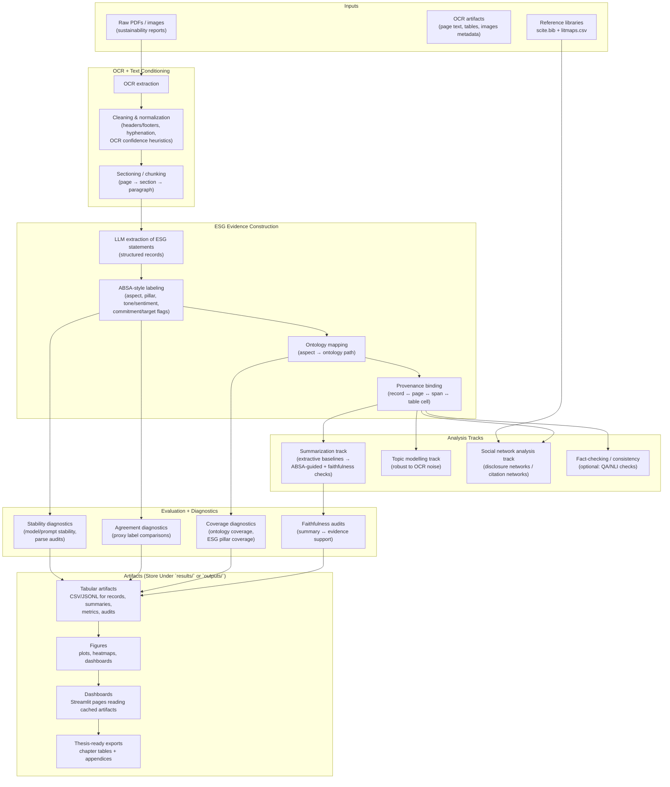
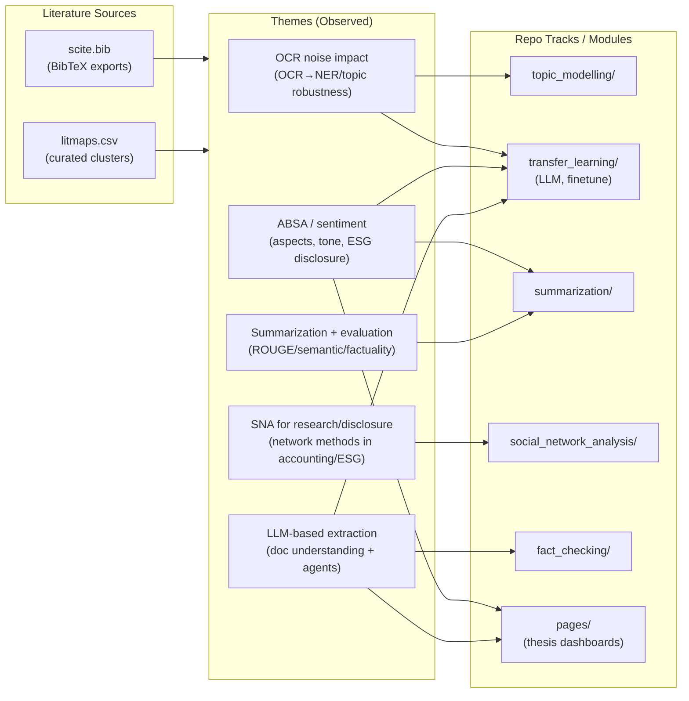

# Mermaid Workflow + Literature Insights (From `outputs/`, `scite.bib`, `litmaps.csv`)

Date: 2026-05-30

This document was generated by reading:
- `outputs/` (current state of exported artifacts)
- `social_network_analysis/scite.bib` and `social_network_analysis/litmaps.csv`
- `summarization/summarization/scite.bib`
- `topic_modelling/scite.bib`
- `pages/litmaps.csv`

---

## 1) Quick Inventory Findings

### 1.1 `outputs/` status
`outputs/` currently contains only a placeholder file:
- `outputs/.keep/.gitkeep`

Implication: the repo’s “final exports” convention likely exists, but automated exporters are either not implemented for all tracks or not run in this environment yet.

### 1.2 Reference libraries present

BibTeX (scite exports):
- `summarization/summarization/scite.bib`: **64** entries (DOIs present for all entries)
- `social_network_analysis/scite.bib`: **28** entries (DOIs present for all entries)
- `topic_modelling/scite.bib`: **26** entries (DOIs present for all entries)

Litmaps exports (CSV):
- `pages/litmaps.csv`: **40** rows
- `social_network_analysis/litmaps.csv`: **34** rows

### 1.3 Time distribution snapshot (high-level)

Based on year fields:
- **Summarization bibliography** skews recent (peak around 2023–2024).
- **SNA bibliography** spans 2015–2026, with a strong cluster in 2022–2025.
- **Topic modelling bibliography** spans 2015–2024, highlighting OCR noise impacts and robustness.
- **Pages litmaps** is heavily **2025** (suggesting “latest LLM/agent/document extraction” interest).

---

## 2) Thematic Insights from the Reference Files

### 2.1 Cross-cutting themes (appearing across libraries)

1. **ESG disclosure analytics is multi-method**
   - The bibliographies include work on ESG disclosure, sentiment/ABSA, and governance networks, indicating the project’s scope is not “one NLP task,” but an integrated pipeline: extraction → labeling → interpretation.

2. **OCR noise is treated as a first-class risk**
   - `topic_modelling/scite.bib` includes multiple OCR→NLP impact studies (OCR quality effects; OCR errors in NER/linking; OCR errors in topic modeling; robustness of embedding topic models to OCR noise), reinforcing that OCR quality must be measured and not assumed.

3. **ESG + sentiment/ABSA is a strong backbone**
   - Summarization library titles heavily feature *aspect*, *sentiment*, *analysis*, *disclosure*, *performance*—consistent with an ABSA-centric representation of ESG evidence.

4. **Network science is positioned as a literature-mapping + disclosure-structure tool**
   - `social_network_analysis/scite.bib` includes accounting/finance SNA and sustainability networks work, supporting the idea that SNA is not only for “social media,” but for research-field mapping and disclosure ecosystem analysis.

### 2.2 Gaps suggested by the references + repo state

1. **Export layer gap**
   - References exist for multiple tracks, but `outputs/` contains no actual exported artifacts.
   - Recommendation: align on a single “export contract” under `results/` or `outputs/` with stable schemas and then build small exporters per track.

2. **Tagging gap in Litmaps files**
   - Both litmaps CSVs have a `Tags` column but appear mostly empty.
   - Recommendation: add tags per paper (e.g., `ocr`, `absa`, `summarization`, `rag`, `evaluation`, `sna`, `topic_modeling`) to enable filtered literature synthesis and chapter mapping.

3. **Method-to-evidence linkage gap**
   - The repo contains multiple method tracks; the references suggest a need for explicit links:
     - OCR quality → extraction errors → ABSA stability → summarization faithfulness → downstream analytics reliability.
   - Recommendation: integrate a “propagated uncertainty/quality” layer (even if heuristic) into artifacts and dashboards.

---

## 3) Mermaid Workflow (End-to-End Research + Engineering)

The workflow below is designed to be **repo-executable**: it represents how the repo’s components *should* connect, and where to store outputs so they become thesis/dashboard-ready.

---

## 4) Mermaid Workflow (Literature → Methods → Repo Sections)

This second diagram shows how `scite.bib` and `litmaps.csv` should map to chapters/sections and to repo tracks.

---

## 5) Actionable “Insights → Next Steps” Checklist

1. **Make `outputs/` real**
   - Decide whether `results/` or `outputs/` is the canonical export root.
   - Add per-track exporters that write stable schemas (CSV/JSONL + metadata).

2. **Normalize literature metadata**
   - Add a small script to merge BibTeX + Litmaps into one table with: DOI, year, track tags, short note, and “used-in-chapter” field.

3. **Tag the litmaps rows**
   - Populate `Tags` in `pages/litmaps.csv` and `social_network_analysis/litmaps.csv` so the literature can be filtered by track.

4. **Connect OCR quality to downstream metrics**
   - Use the OCR-impact references (topic modelling bib) to justify and implement at least one measurable OCR quality proxy and report it alongside extraction/summarization results.

5. **Add a cross-track evaluation dashboard**
   - A single page that shows: OCR quality proxy → parse success → stability → coverage → faithfulness (summary support), per document/company.

