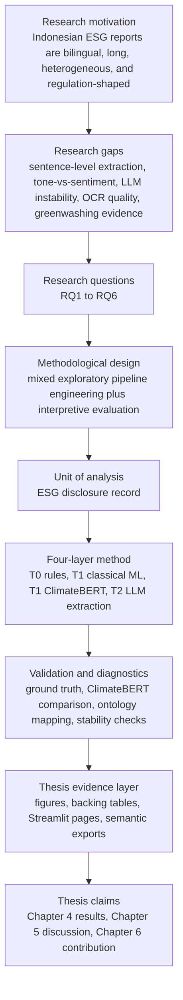
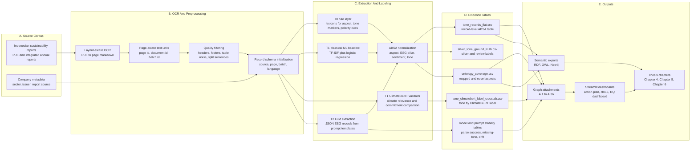
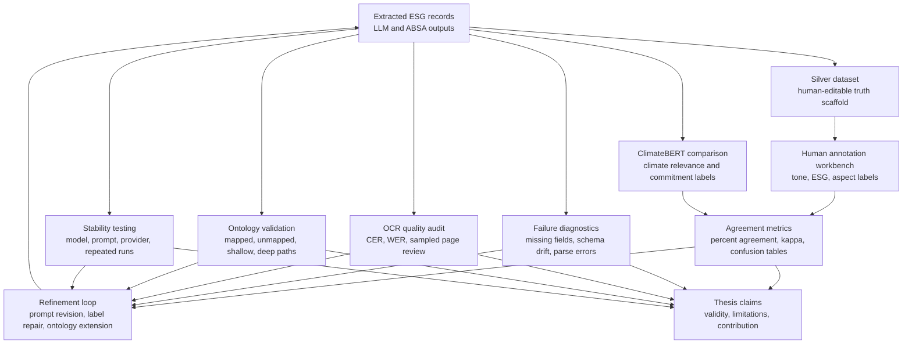
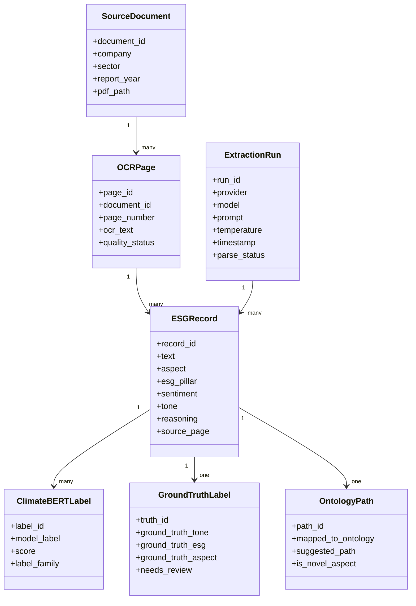
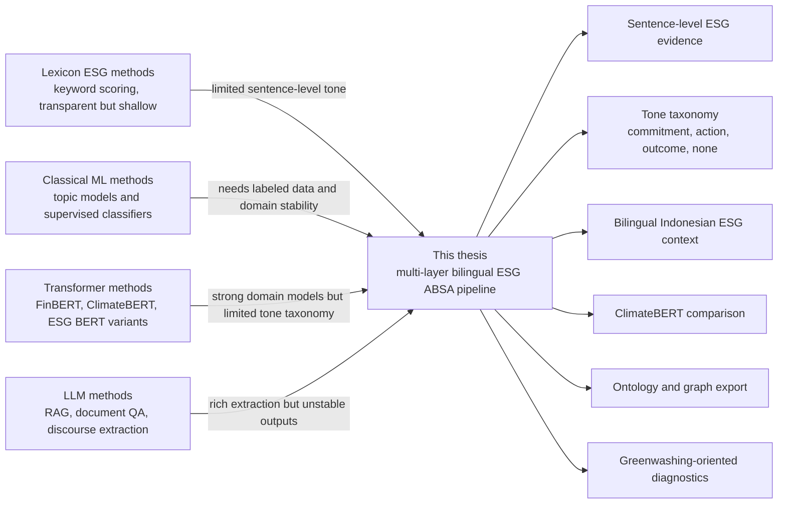
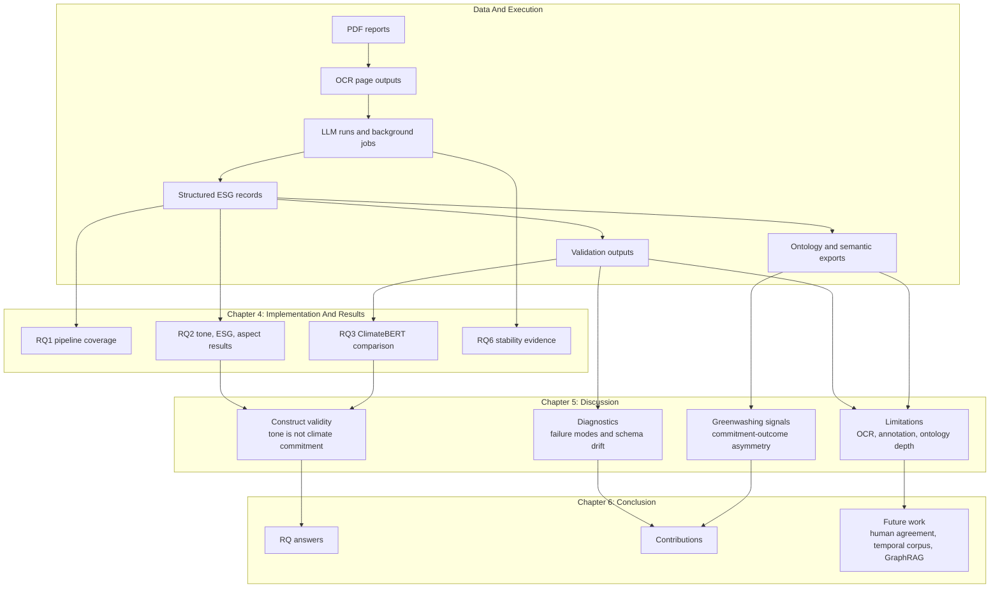

# ESG ABSA Methodology And Pipeline Mermaid

This document defines the methodology and pipeline diagrams for the ESG ABSA thesis. It is based on the reference notes in:

- `research_references/notes/thesis_chapters_1_3.docx`
- `research_references/notes/chapters_4_5_6_notes.docx`
- `research_references/notes/Final Analysis - Table Description.csv`
- `research_references/notes/esg_absa_sota_table.html`

The diagrams follow the same logic as the thesis example: start with motivation and research gaps, define a layered method, execute a reproducible pipeline, validate the outputs, and connect results back to thesis chapters and research questions.

---

## 1. Methodology Spine

### Rationale

The notes define the project as a response to five gaps: lack of sentence-level ESG evidence extraction, conflation of tone and sentiment, LLM output instability, neglect of OCR quality, and underdeveloped greenwashing detection. Therefore, the methodology should not start from a model alone. It starts from the research problem, then builds a pipeline where each stage produces auditable evidence.

The unit of analysis is the ESG disclosure record. This is important because document-level ESG scoring cannot distinguish whether a company is making a commitment, describing an action, reporting an outcome, or merely giving neutral descriptive text.

---

## 2. End-To-End Execution Pipeline

### Rationale

The notes describe preprocessing as page-aware rather than document-only. That choice is methodological, not cosmetic. Page-aware processing preserves traceability, allows OCR quality audit, and prevents large documents from exceeding LLM context windows.

The model design is layered because each layer compensates for a weakness in another layer:

- The rule layer is transparent but brittle.
- The classical ML layer provides a statistical baseline but needs labeled data.
- ClimateBERT provides external climate-specific validation but is not a direct ESG tone classifier.
- The LLM layer can extract richer structured records but requires parse auditing and prompt stability checks.

The output tables are not merely export files. They are the empirical spine of the thesis. Every figure should be traceable to a backing table and every claim should point to a Streamlit page or artifact.

---

## 3. Research Question To Artifact Map

```mermaid
flowchart TD
    subgraph RQS["Research Questions"]
      RQ1["RQ1<br/>PDF to structured ESG evidence"]
      RQ2["RQ2<br/>aspect, ESG pillar, sentiment, tone schema"]
      RQ3["RQ3<br/>tone ABSA versus ClimateBERT"]
      RQ4["RQ4<br/>diagnostics, failure modes, ontology gaps"]
      RQ5["RQ5<br/>reproducibility and auditability"]
      RQ6["RQ6<br/>model and prompt stability"]
    end

    subgraph ART["Primary Artifacts"]
      OCR_SUM["ocr_processing_summary.csv<br/>document and page audit"]
      TONE_FLAT["tone_records_flat.csv<br/>record-level ESG ABSA"]
      TONE_ESG["tone_esg_crosstab.csv<br/>pillar by tone"]
      TONE_CB["tone_climatebert_label_crosstab.csv<br/>tone by ClimateBERT label"]
      FAIL["failure_mode_counts.csv<br/>diagnostic categories"]
      ONTO["ontology_coverage.csv<br/>mapped and unmapped aspects"]
      JOBS["background job folders<br/>config, status, events, logs"]
      MODEL_STAB["model_stability_summary.csv<br/>provider and model metrics"]
      PROMPT_STAB["prompt_stability_summary.csv<br/>prompt reliability"]
    end

    subgraph FIG["Figure Attachments"]
      A1["A.1<br/>full tone distribution"]
      A2["A.2<br/>full ESG by tone"]
      A3["A.3<br/>aspect by tone heatmap"]
      A4["A.4<br/>tone by ClimateBERT label"]
      A10["A.10<br/>model parse success"]
      A11["A.11<br/>prompt missing-tone benchmark"]
      A12["A.12<br/>ontology mapped vs novel aspects"]
      A30["A.30<br/>aspect co-occurrence"]
      A31["A.31<br/>aspect network centrality"]
      A36["A.36<br/>ontology coverage paths"]
    end

    RQ1 --> OCR_SUM
    RQ1 --> TONE_FLAT
    RQ2 --> TONE_FLAT
    RQ2 --> TONE_ESG
    RQ2 --> A1
    RQ2 --> A2
    RQ2 --> A3
    RQ3 --> TONE_CB
    RQ3 --> A4
    RQ4 --> FAIL
    RQ4 --> ONTO
    RQ4 --> A12
    RQ4 --> A30
    RQ4 --> A31
    RQ4 --> A36
    RQ5 --> JOBS
    RQ6 --> MODEL_STAB
    RQ6 --> PROMPT_STAB
    RQ6 --> A10
    RQ6 --> A11
```

### Rationale

The notes repeatedly connect each figure to a gap, research question, objective, contribution, benchmark, assessment, and explanation. This diagram turns that logic into a compact artifact map. It also prevents a common thesis problem: presenting charts without showing which research question they answer.

For example:

- A.1, A.2, and A.3 support RQ2 because they show that tone is not reducible to sentiment.
- A.4 supports RQ3 because it reveals where ClimateBERT and the ESG tone taxonomy align or diverge.
- A.30 and A.31 support RQ4 because they move aspect analysis beyond heatmaps into relationship and centrality analysis.
- A.10 and A.11 support RQ6 because they quantify model and prompt stability.

---

## 4. Validation And Reliability Loop

### Rationale

The validation design distinguishes four different validation sources:

1. Human/silver labels.
2. ClimateBERT comparison.
3. Pipeline diagnostics.
4. Ontology mapping quality.

This distinction is essential because the notes warn that the kappa value is currently a proxy agreement, not a full human inter-annotator agreement. The methodology therefore treats ClimateBERT agreement as construct comparison, not final ground truth.

The refinement loop is included because the thesis is not just measuring the pipeline. It uses the measurements to improve prompts, labels, ontology paths, and OCR sampling.

---

## 5. ESG ABSA Record Schema

### Rationale

The notes define the ESG disclosure record as the central unit of analysis. This schema explains what must be preserved for each record: source provenance, extraction metadata, ABSA fields, validation labels, and ontology paths.

This structure supports three thesis requirements:

- Reproducibility: every record can be traced to a model, prompt, run, source document, and page.
- Validation: every record can be compared to ClimateBERT and ground-truth labels.
- Semantic export: every record can become RDF, OWL, or Neo4j graph data.

---

## 6. SOTA Positioning Logic

### Rationale

The SOTA table positions existing work into lexicon-based, ML-based, BERT/transformer, and LLM-based families. The thesis contribution is not that it uses one new model. Its novelty is the integration of multiple layers into a reproducible ESG ABSA research system for bilingual Indonesian reports.

The notes identify this thesis as covering four dimensions that many existing methods do not cover together:

- sentence-level analysis,
- tone taxonomy,
- bilingual context,
- greenwashing-oriented diagnostics.

---

## 7. Chapter Integration Pipeline

### Rationale

The Ch4-6 notes show that the thesis chapters should not be isolated prose. Chapter 4 reports what the system produced. Chapter 5 explains what those results mean, especially where they diverge from expectations. Chapter 6 turns the evidence and limitations into contributions and future work.

This integration is especially important for the ontology findings. A shallow mapping rate is not only a weakness; it becomes evidence for the need to extend Indonesian ESG vocabulary.

---

## 8. Methodological Explanation By Stage

| Stage | What it does | Rationale from notes | Main outputs |
|---|---|---|---|
| PDF ingestion | Collects Indonesian sustainability reports | Reports are public, bilingual, heterogeneous, and regulation-shaped | PDF corpus and source metadata |
| OCR conversion | Converts PDFs into page text | OCR quality can propagate errors downstream, so page-level traceability is necessary | OCR markdown, page audit |
| Page batching | Groups text into context-aware chunks | LLM context windows are finite and ESG statements can cross page boundaries | page/batch text units |
| T0 rules | Applies transparent lexicons | Provides interpretable baseline for tone and aspect cues | rule tone and aspect hints |
| T1 classical ML | Adds statistical baseline | Tests whether simple feature models capture ESG labels | TF-IDF baseline outputs |
| T1 ClimateBERT | Adds external climate validator | ClimateBERT is useful for climate comparison but not a direct tone classifier | ClimateBERT labels and scores |
| T2 LLM extraction | Generates structured JSON ESG records | LLMs handle complex disclosure language but require parse and stability audit | ESG records JSON and flat CSV |
| ABSA normalization | Standardizes aspect, ESG, sentiment, and tone | Record-level ABSA avoids document-level overgeneralization | `tone_records_flat.csv` |
| Ground truth | Supports human/silver validation | Pseudo labels must not be confused with final human truth | silver and pilot labels |
| Metrics | Computes agreement and confusion matrices | Kappa and agreement clarify alignment but must be interpreted carefully | agreement summaries |
| Ontology mapping | Maps aspects to ontology paths | Unmapped aspects can be local ESG vocabulary contributions | ontology coverage and exports |
| Stability testing | Compares prompts and models | LLM output instability is one of the research gaps | model and prompt stability tables |
| Dashboard integration | Connects charts, tables, pages, chapters | Reproducibility requires visible artifact lineage | Streamlit pages and graph cards |

---

## 9. Key Claims Supported By The Pipeline

1. **Sentence-level ESG evidence is necessary.**  
   The notes emphasize that document-level ESG sentiment cannot answer RQ2 because tone varies by aspect and statement.

2. **Tone and sentiment must be separated.**  
   The tone taxonomy distinguishes commitment, action, outcome, none, and missing. This prevents neutral descriptive text from being forced into positive or negative sentiment.

3. **ClimateBERT is a comparison baseline, not a full replacement.**  
   ClimateBERT supports RQ3 by showing where climate-specific labels align or diverge from ESG tone labels.

4. **LLM reliability requires model and prompt stability analysis.**  
   Parse success alone is insufficient. Missing-tone rate, schema drift, and field completion must also be measured.

5. **Ontology coverage must be judged by depth, not only mapped/unmapped count.**  
   The notes warn that shallow paths such as `Governance -> General` or placeholder paths are not equivalent to regulatory traceability.

6. **Greenwashing detection requires commitment-outcome asymmetry.**  
   Aspect-tone dynamics reveal where companies make commitments without corresponding outcomes, especially in governance and anti-corruption topics.

7. **The thesis contribution is an executable evidence system.**  
   The pipeline links raw PDFs, OCR, LLM outputs, validation tables, graph attachments, Streamlit pages, semantic exports, and chapter claims.

---

## 10. Recommended Placement In Thesis

Use the diagrams as follows:

| Diagram | Recommended thesis location |
|---|---|
| Methodology Spine | Chapter 3, methodology overview |
| End-To-End Execution Pipeline | Chapter 3, preprocessing and model design |
| Research Question To Artifact Map | Chapter 4, opening result map |
| Validation And Reliability Loop | Chapter 3 methodology or Chapter 5 reliability discussion |
| ESG ABSA Record Schema | Chapter 3 data model section |
| SOTA Positioning Logic | Chapter 2 related work gap summary |
| Chapter Integration Pipeline | Chapter 6 conclusion and reproducibility contribution |

