## Toward an Executable ESG Aspect-Based Sentiment Analysis Framework

Revision Presentation Based on the Standardized Thesis Chapters

Daris Dzakwan Hoesien

University of Oulu
---
## Presentation Scope

- Research framing
- Methodology and data flow
- Experiments and empirical findings
- Discussion, limitations, and future work
- Appendix and reproducibility
---
<!-- _header: Research Framing -->

## Problem Context

- Indonesian sustainability reports are long, bilingual, and structurally heterogeneous.
- Document-level ESG scoring is too coarse for distinguishing promises, actions, and realized outcomes.
- The thesis reframes ESG analysis as record-level evidence extraction with aspect, ESG pillar, sentiment, and disclosure tone.
- The target is not only prediction quality, but also provenance, auditability, ontology alignment, and reproducible workflow structure.
---
## Research Questions

- **RQ1. ESG ABSA Schema:** How can ESG disclosures be represented using a record-level schema integrating aspect, pillar, sentiment, and tone?
- **RQ2. Tone vs. Climate-Specific Models:** How do LLM-generated tone labels compare with ClimateBERT-style outputs?
- **RQ3. Pipeline Diagnostics:** What failure modes characterize automated ESG extraction?
- **RQ4. Stability and Reproducibility:** How stable are outputs across prompts, models, and providers?
---
## Main Contributions

- An executable OCR-to-ESG workflow implemented as a multi-page Streamlit research system.
- A record-level ESG schema that separates commitment, action, and outcome from generic positive sentiment.
- A layered evaluation design combining prompt diagnostics, model diagnostics, ontology mapping, ClimateBERT comparison, and pilot review.
- A reproducible artifact stack covering OCR folders, ESG extraction logs, benchmark JSONL files, revision analytics, and dashboard visualizations.
---
<!-- _header: Methodology -->

## Methodological Overview

- The pipeline moves from raw PDF reports to OCR-expanded pages, structured ESG records, benchmark layers, and thesis-ready analytics.
- The design is mixed-method and executable: automated extraction is paired with provenance and review surfaces.
---
## System Architecture

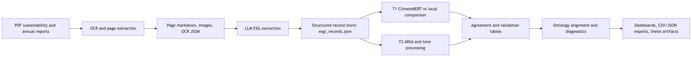
---
## Data Sources and Corpus Shape

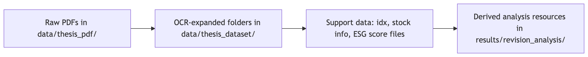

- Raw source layer: sustainability and annual report PDFs in `data/thesis_pdf/`.
- OCR-expanded layer: document folders in `data/thesis_dataset/` with `ocr_result.json`, page markdown, and images.
- Active thesis-facing subset: 23 processed reports, about 5,512 pages, 332 tone-bearing records, and 2,074 T2 rows.
- Support data includes ontology resources, pilot annotations, benchmark artifacts, and dashboard exports.
---
## Preprocessing and Provenance Design

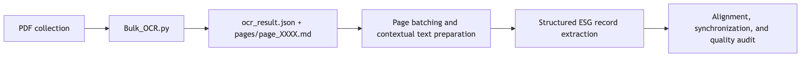

- Page-level OCR artifacts are the core provenance unit.
- Later extraction and validation stages preserve links back to document folders and page markdown.
---
## Feature and Representation Strategy

- The workflow combines rule-based lexical cues, TF-IDF baselines, contextual hybrid embeddings, and ontology-aware representations.
---
## Framework Split

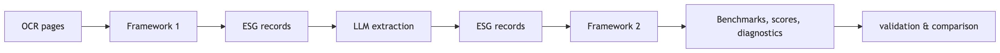

- **Framework 1:** page-aware LLM extraction into structured ESG records.
- **Framework 2:** benchmarking, comparison, ontology mapping, and evidence scoring.
- The thesis contribution is the end-to-end orchestration, not one isolated model.
---
## Reference Construction

- No full expert gold corpus exists yet.
- The thesis uses a layered reference design: extracted ESG records, ClimateBERT-style comparison labels, T1 and T2 JSONL artifacts, and pilot human annotations.
- This supports exploratory evaluation while keeping weak points visible.
---
## Methodology Summary

---
<!-- _header: Experiments -->

## Experimental Scope

- The experiments evaluate a full workflow: OCR, T3 extraction, T1 ClimateBERT comparison, T2 ABSA-style processing, ontology mapping, and revision analytics.
- Prompt families include zero-shot, few-shot, and chain-of-thought variants in English and Indonesian.
- Backend families include OpenRouter, LM Studio or OpenAI-compatible endpoints, and Ollama-style local inference.
- The key evaluation focus is usable structured extraction, not parseability alone.
---
## Evaluation Metrics

- OCR completion at document and page level.
- Parse success, average extracted records, field completion, missing-tone rate, and schema-drift rate.
- Percent agreement and Cohen's kappa for tone versus ClimateBERT-style comparison.
- Ontology coverage and company-level commitment-outcome ratios for interpretive analysis.
- Failure-mode counts and denominator audits for pipeline diagnostics.
---
## RQ1: Operational Schema Results

- 23 OCR-processed documents were completed across approximately 5,512 pages.
- The active evidence layer contains 332 tone-bearing ESG records and 2,074 T2 rows.
- The schema supports simultaneous storage of text, aspect, ESG pillar, tone, sentiment, reasoning, and provenance.
- Ontology mapping covers all 52 tracked aspects in the thesis-facing subset.
---
## Tone Distribution

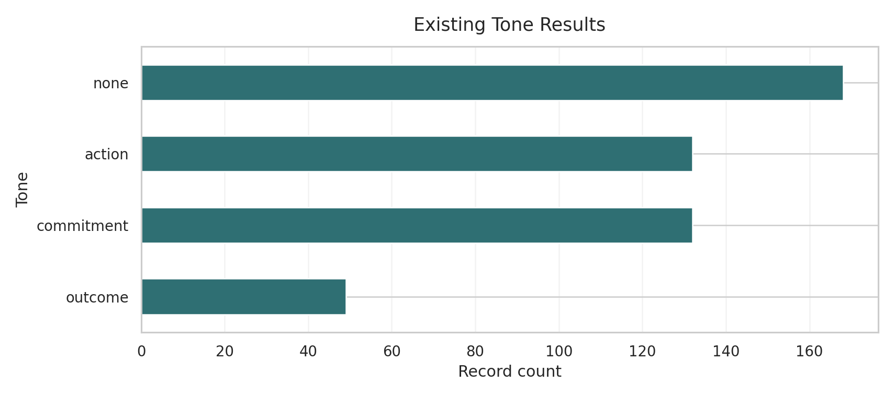
---
## ESG Distribution by Tone

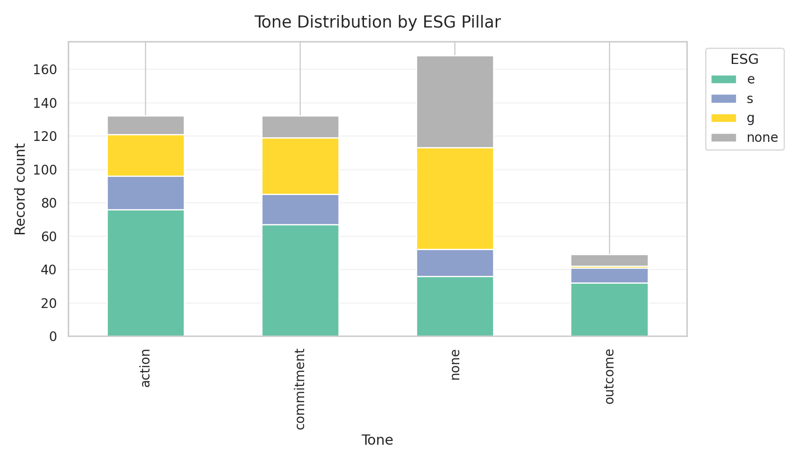
---
## Aspect-by-Tone Structure

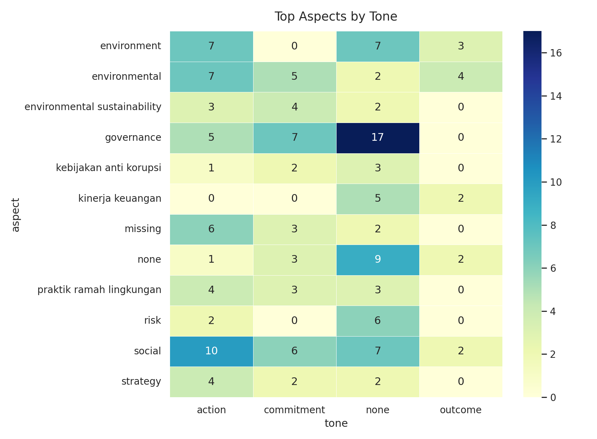
---
## Prompt-Level Extraction Results

- Parse validity is insufficient as a sole metric.
- Tone-aware chain-of-thought prompting is the strongest thesis-facing family.

| Prompt | Parse success | Avg. records | Missing tone |
| --- | --- | --- | --- |
| `data.md` | 100.0% | 3.00 | 100.0% |
| `tone_cot_en` | 100.0% | 6.25 | 0.0% |
| `tone_cot_id` | 100.0% | 4.07 | 0.3% |
| `tone_few_shot_en` | 100.0% | 0.00 | 0.0% |
| `tone_few_shot_id` | 100.0% | 1.00 | 0.0% |
| `tone_zero_shot_en` | 100.0% | 3.93 | 0.0% |
| `tone_zero_shot_id` | 100.0% | 2.62 | 0.0% |
---
## RQ2: Tone vs. ClimateBERT

- Tone commitment versus ClimateBERT-style commitment was evaluated over 332 records.
- The saved comparison reports 83.7% agreement and Cohen's kappa of 0.645.
- The overlap is strong enough to support construct relevance, but not full label equivalence.
- ClimateBERT captures climate-topic or climate-commitment relevance; the tone taxonomy captures disclosure maturity.
---
## Tone and ClimateBERT Cross-Distribution

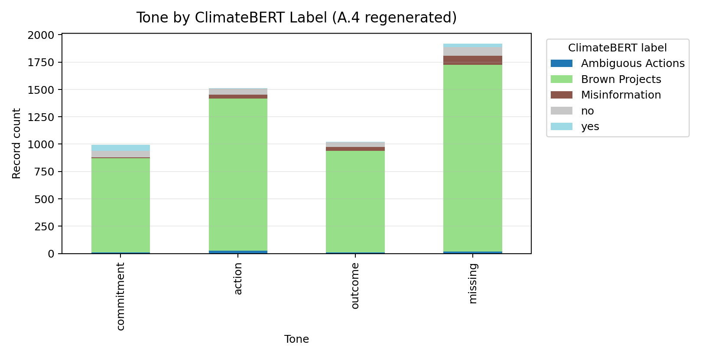
---
## RQ3: Failure-Mode Diagnostics

| Failure mode | Count | Interpretation |
| --- | --- | --- |
| Missing tone | 61 | Core output field omitted despite otherwise parseable extraction |
| Schema drift | 20 | Values placed in the wrong field or schema semantics shifted |
| Hedged or modal language | 10 | Commitment-action boundary blurred by future-oriented phrasing |
| Regulatory or Indonesian domain terms | 3 | Domain-specific wording weakens cue consistency |
| Table or numeric layout | 3 | Tabular formatting disrupts semantic extraction |
| Passive voice | 3 | Outcome versus action distinction becomes unstable |
| Bilingual or code-switched | 1 | Mixed language complicates interpretation |
---
## Failure-Mode Pareto

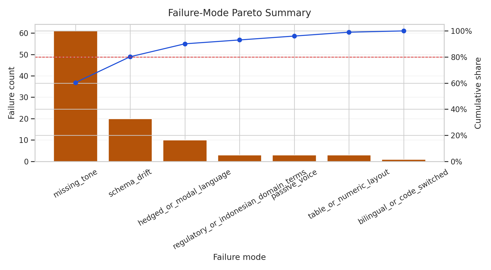
---
## Failure-Mode Composition

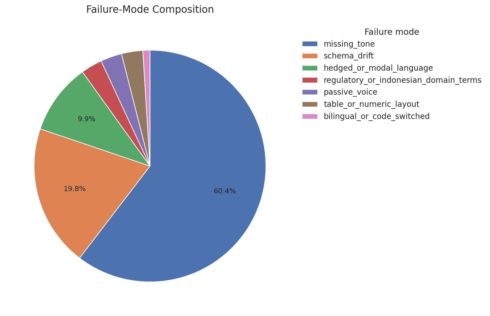
---
## RQ4: Model Stability Trade-Off

The decisive factor is schema-following behavior, not nominal model scale.

| Model | Parse success | Avg. records | Short reading |
| --- | --- | --- | --- |
| `trinity-large-preview` | 100.0% | 3.02 | Best stable thesis-facing baseline |
| `gpt-oss-120b` | 100.0% | 3.00 | Parseable but unusable for tone |
| `trinity-large-thinking` | 89.9% | 12.52 | High yield, weaker formal stability |
| `minimax-m2.5` | 56.6% | 4.94 | High-volume use, weak parse reliability |
| `gpt-oss-20b` | 95.9% | 1.13 | Stable but low yield |
---
## Model Trade-Off Scatter

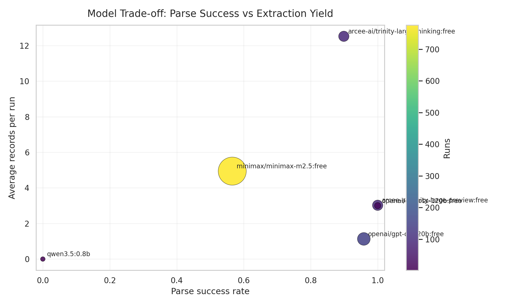
---
## Prompt Strategy Comparison

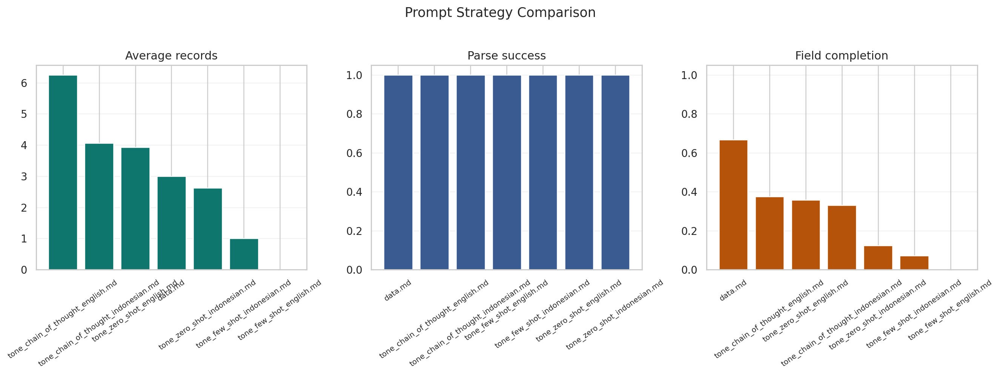
---
## Explainability-Oriented Graphs

  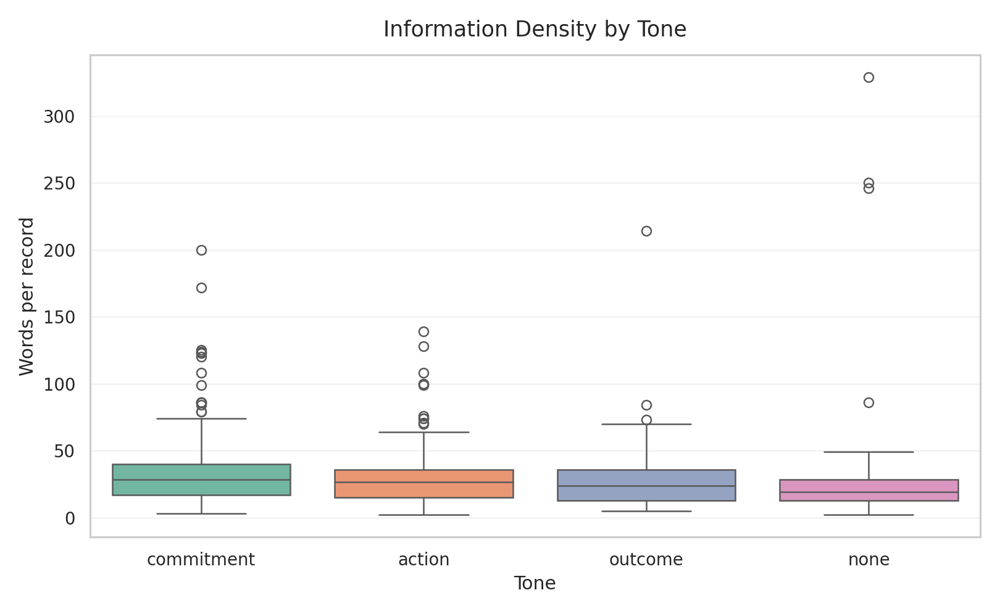
  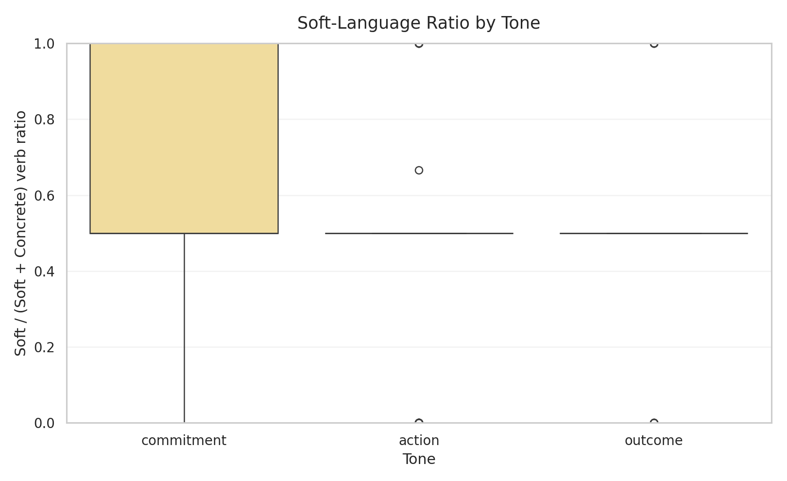

- These charts help explain why commitment-heavy and soft-language segments create boundary failures.
---
<!-- _header: Discussion -->

## Discussion Synthesis

- The thesis shows that ESG disclosure analysis becomes more informative when tone is modeled as a separate field from generic sentiment.
- The dominant evidence pattern is commitment-heavy environmental disclosure rather than outcome-heavy reporting.
- The strongest configuration is a tone-aware prompt paired with a schema-obedient model.
- Ontology coverage is comparatively robust; the main bottleneck is tone stability.
---
## Research Question Resolution Summary

| Research question | Core evidence | Status |
| --- | --- | --- |
| RQ1 | OCR-complete subset, structured records, ontology mapping | Answered positively |
| RQ2 | 83.7% agreement, kappa 0.645, meaningful divergence | Answered positively with qualification |
| RQ3 | Missing tone, schema drift, ambiguity-rich failures | Answered diagnostically |
| RQ4 | Stored artifacts, prompt and model trade-offs, rerunnable outputs | Answered positively with stability caveat |
---
## Commitment-Outcome Screening Gap

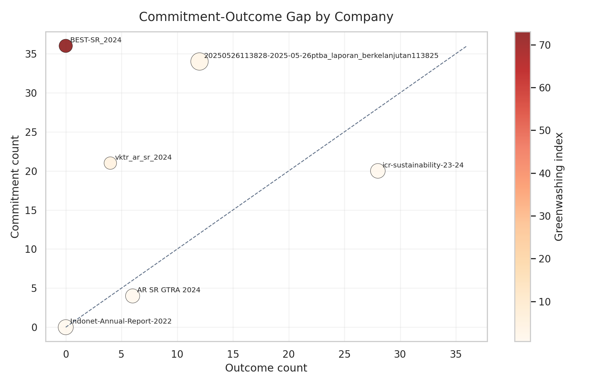
---
## Tone Share Ratio

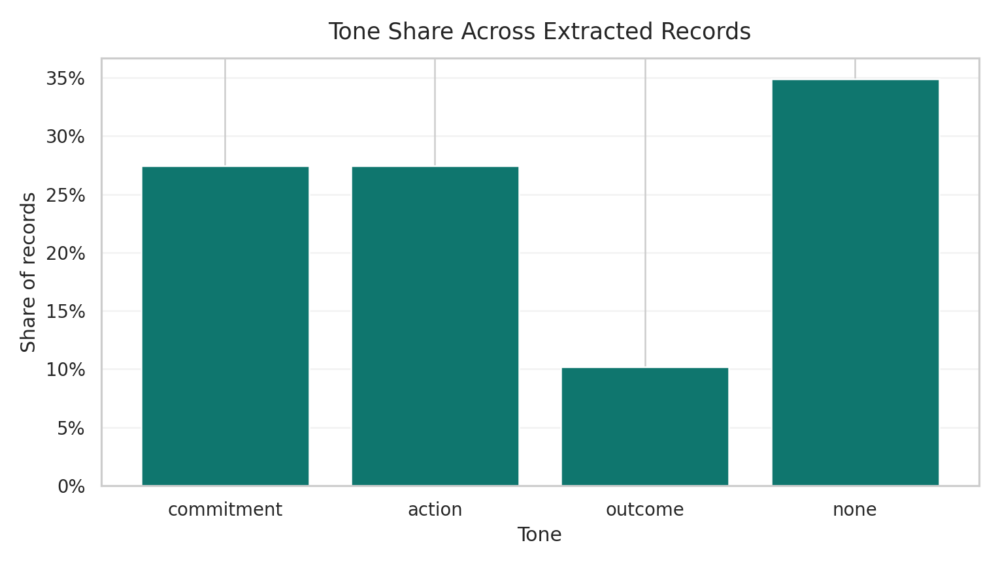
---
## Limitations

- The evaluation layer is still partly weakly supervised and not yet a complete expert-coded gold benchmark.
- The active evidence subset is domain-concentrated and environmentally skewed.
- Prompt and model sensitivity remain material; backend substitution is not safe by default.
- Greenwashing-style ratios are heuristic screening aids, not final adjudicative scores.
---
## Future Work

- Expand pilot review into a stratified expert benchmark with inter-annotator agreement.
- Tighten tone-specific prompting and schema validation with targeted rerun logic.
- Add OCR quality baselines so upstream noise can be separated from downstream extraction failure.
- Complete one-to-one ClimateBERT benchmarking over the full extracted record layer.
- Extend the framework toward analyst-facing review tools and graph-based retrieval workflows.
---
<!-- _header: Appendix and Reproducibility -->

## Operational User Workflow

- Bulk OCR accepts uploaded or server-side PDFs and stores OCR-expanded artifacts under `data/thesis_dataset/`.
- LLM Processing loads one OCR-expanded document, allows page-range selection, and sends batches to one of three provider families.
- Structured ESG records are stored in `results/esg_records.json`.
- ClimateBERT or local comparison models operate downstream as the T1 comparison layer.
---
## Appendix Workflow Figure

- The appendix adds procedural detail on page-range processing, provider choice, and downstream comparison artifacts.
---
## Repository JSON Artifact Families

- `ocr_result.json`: page-level OCR outputs and image metadata.
- `results/esg_records.json`: structured T3 extraction runs and records.
- `results/t1_results.jsonl` and `results/t2_results.jsonl`: resumable benchmark layers.
- `results/revision_analysis/ontology.json`: ontology paths and mapped ESG concepts.
- Dashboard and workflow JSON files support narrative reporting, transfer summaries, and Streamlit page relationships.
---
## Reproducibility Strengths

- The revision workflow indexes 1,220 stored result artifacts and 184 background jobs.
- Prompt templates, logs, JSONL files, visualizations, and chapter-ready outputs are persisted on disk.
- The strongest reproducibility claim is workflow and artifact persistence.
- Exact third-party LLM semantic outputs may still vary across time, providers, and model updates.
---
<!-- _header: Conclusion -->

## Closing Takeaways

- The thesis demonstrates a viable end-to-end framework for converting Indonesian sustainability reports into auditable ESG evidence.
- The most important substantive insight is that commitment-heavy disclosure dominates the current extracted layer.
- The most important technical insight is that prompt design and schema obedience determine practical extraction quality.
- The framework is already useful for structured analysis and diagnostics, but broader benchmarking still requires stronger expert reference data.
---
## Thank You

Questions and discussion
---
