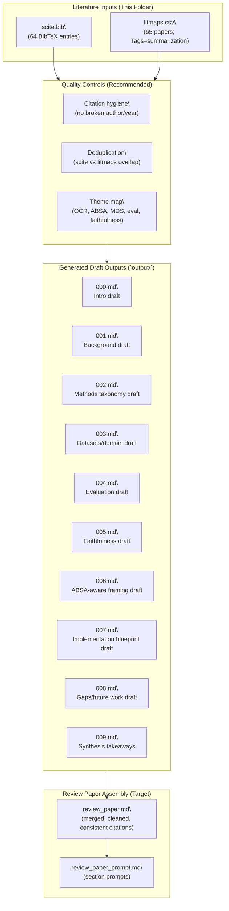
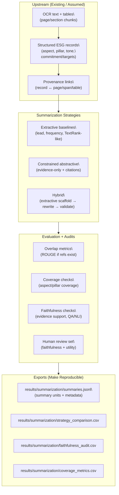

# Mermaid Workflow + Insights (Summarization Track)

Date: 2026-05-30

This document is derived from files in the current folder:
- `output/` (generated section drafts)
- `scite.bib` (BibTeX reference library)
- `litmaps.csv` (Litmaps export for summarization cluster)

---

## 1) Quick Inventory

### 1.1 `output/` contents (what exists)
`output/` contains 10 Markdown files which appear to be section-level generation outputs:
- `output/000.md` → Section 1 (Introduction)
- `output/001.md` → Section 2 (Background / definitions)
- `output/002.md` → Section 3 (Method taxonomy)
- `output/003.md` → Section 4 (Datasets + domain)
- `output/004.md` → Section 5 (Evaluation)
- `output/005.md` → Section 6 (Faithfulness + mitigations)
- `output/006.md` → Section 7 (ABSA-aware framing)
- `output/007.md` → Section 8 (Implementation blueprint)
- `output/008.md` → Section 9 (Research gaps)
- `output/009.md` → Synthesis takeaways (conclusion-like)

**Quality note:** several `output/*.md` files contain malformed inline citations (e.g., dangling commas or missing author/year pairs). Treat `output/` as draft material that requires citation hygiene before reuse in the thesis/review paper.

### 1.2 `scite.bib` status
`scite.bib` contains **64** BibTeX entries and **64** DOI fields (one per entry). Year distribution skews recent (peaks around 2023–2024).

### 1.3 `litmaps.csv` status
`litmaps.csv` contains **65** rows with columns:
`DOI, Title, Authors, Journal, Year, Abstract, LitmapsId, Cited By, References, PubMedId, Tags`.

Notable properties:
- `Tags` is consistently populated with `summarization` and occasionally includes `sna`.
- Year distribution peaks around 2023–2024 and includes a small number of 2026 items.

---

## 2) Insights from the References + Draft Outputs

### 2.1 The cluster is not purely “summarization”
Even inside this summarization track, the reference set includes adjacent themes that imply a broader pipeline:
- **Indonesian NLP resources and pretrained models** (e.g., IndoLEM/IndoBERT-type work present in `litmaps.csv`)
- **Multi-document summarization surveys and methods**
- **ESG disclosure + firm performance** (ESG as a domain context, not only a task)
- **ABSA / aspect-level analysis** (structured intermediate representation for coverage + comparability)

Implication: the strongest research positioning is **ABSA-aware and domain-grounded summarization**, rather than generic summarization benchmarking.

### 2.2 Evaluation must prioritize faithfulness (especially for ESG + OCR)
Your drafts reinforce a key constraint for ESG summarization:
- ROUGE is a baseline, but insufficient for ESG.
- Faithfulness/factual consistency checks and human audits are core requirements for trustworthy outputs.

Practical takeaway: summarization in this repo should be treated as an **audited reporting layer** built on top of structured evidence (records + provenance), not a standalone “free generation” task.

### 2.3 Evidence traceability is the differentiator
`output/006.md` (ABSA-aware framing) captures the main differentiator for this benchmark:
- generate summaries from evidence scaffolds (records, spans, page IDs),
- store provenance + evaluation artifacts per summary unit.

This is the bridge connecting summarization literature to an executable ESG benchmark.

---

## 3) Mermaid Workflow (Folder-Level: How These Artifacts Should Connect)

This diagram treats `output/` as draft-generation outputs and `scite.bib`/`litmaps.csv` as the literature backbone that should drive citation-correct writing.

---

## 4) Mermaid Workflow (Method-to-Artifact Plan for a Repo-Integrated Summarization Track)

This is the engineering workflow implied by the drafts and reference set: summarization is downstream of OCR + structured ESG evidence, with exports and audits.

---

## 5) Actionable Next Steps (Specific to This Folder)

1. **Normalize and clean citations in `output/*.md`**
   - Fix broken inline citations and ensure every cited work exists in `scite.bib` or `litmaps.csv`.
2. **Deduplicate literature**
   - Many papers likely appear in both `scite.bib` and `litmaps.csv`; merge into a single master table for writing.
3. **Clarify the role of `output/`**
   - Either keep it as raw generations, or promote it to `drafts/` with revision tracking.
4. **Implement the export contract**
   - Choose a canonical export root (`results/summarization/` recommended) and start producing `summaries.jsonl` + `faithfulness_audit.csv`.
5. **Tag litmaps beyond “summarization”**
   - Add sub-tags to `litmaps.csv` for: `indonesian`, `absa`, `ocr`, `mds`, `evaluation`, `factuality` to make literature-to-section mapping and review writing much easier.

