# Image Outputs and Explanations

Generated at: `2026-05-09T00:06:21.474625+00:00`

Archived generated image outputs from results/, new_page/results/, new_page/pages/, and new_page/error/. Raw extracted PDF page images under new_page/data/thesis_dataset are intentionally excluded.

Archived image count: **11**

## Category Summary

- **ClimateBERT alignment:** 1
- **ClimateBERT scoring:** 1
- **ESG ABSA distribution:** 3
- **Evaluation metric:** 2
- **Interface evidence:** 4

## Image Inventory

### img_001 - Dashboard Screenshot

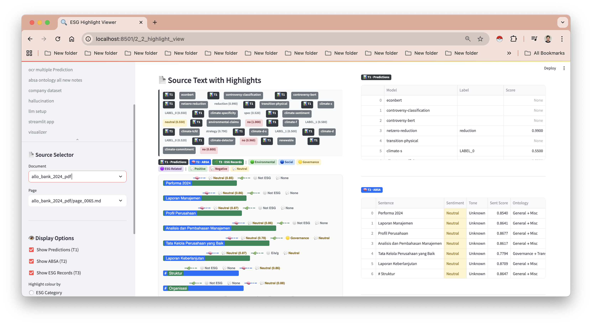

- **Category:** Interface evidence
- **RQ links:** RQ5
- **Source:** `new_page/error/Screenshot 2026-03-24 at 07.47.28.png`
- **Archive:** `results/image_outputs_archive/images/001_screenshot_2026_03_24_at_07_47_28.png`
- **Dimensions:** 3074 x 1688
- **Explanation:** Screenshot captured from dashboard or error-review work. Use it as interface or debugging evidence, not as a quantitative analysis result.
- **Thesis use:** Supports reproducibility, dashboard documentation, and audit-trail notes.

### img_002 - Dashboard Screenshot

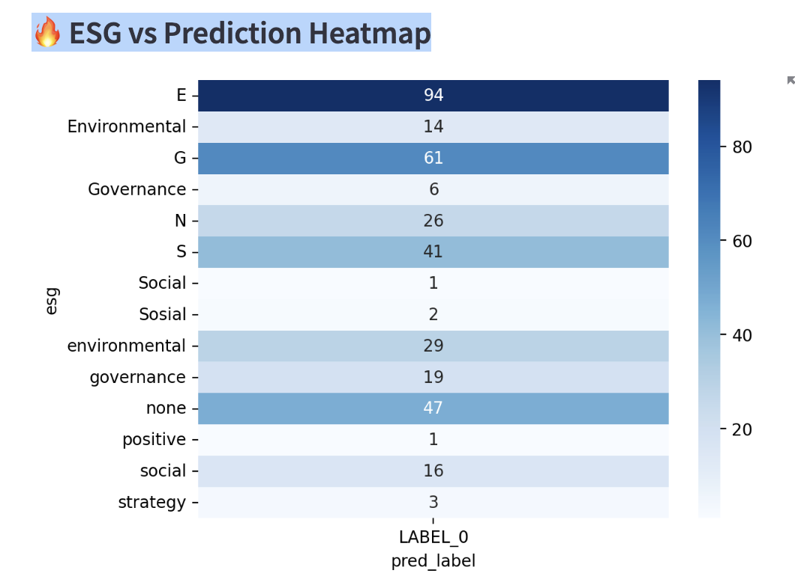

- **Category:** Interface evidence
- **RQ links:** RQ5
- **Source:** `new_page/pages/Screenshot 2026-03-27 at 16.03.58.png`
- **Archive:** `results/image_outputs_archive/images/002_screenshot_2026_03_27_at_16_03_58.png`
- **Dimensions:** 1060 x 778
- **Explanation:** Screenshot captured from dashboard or error-review work. Use it as interface or debugging evidence, not as a quantitative analysis result.
- **Thesis use:** Supports reproducibility, dashboard documentation, and audit-trail notes.

### img_003 - Dashboard Screenshot

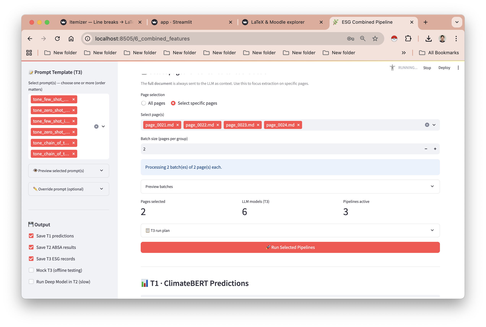

- **Category:** Interface evidence
- **RQ links:** RQ5
- **Source:** `new_page/pages/Screenshot 2026-03-30 at 16.37.27.png`
- **Archive:** `results/image_outputs_archive/images/003_screenshot_2026_03_30_at_16_37_27.png`
- **Dimensions:** 2542 x 1712
- **Explanation:** Screenshot captured from dashboard or error-review work. Use it as interface or debugging evidence, not as a quantitative analysis result.
- **Thesis use:** Supports reproducibility, dashboard documentation, and audit-trail notes.

### img_004 - Dashboard Screenshot

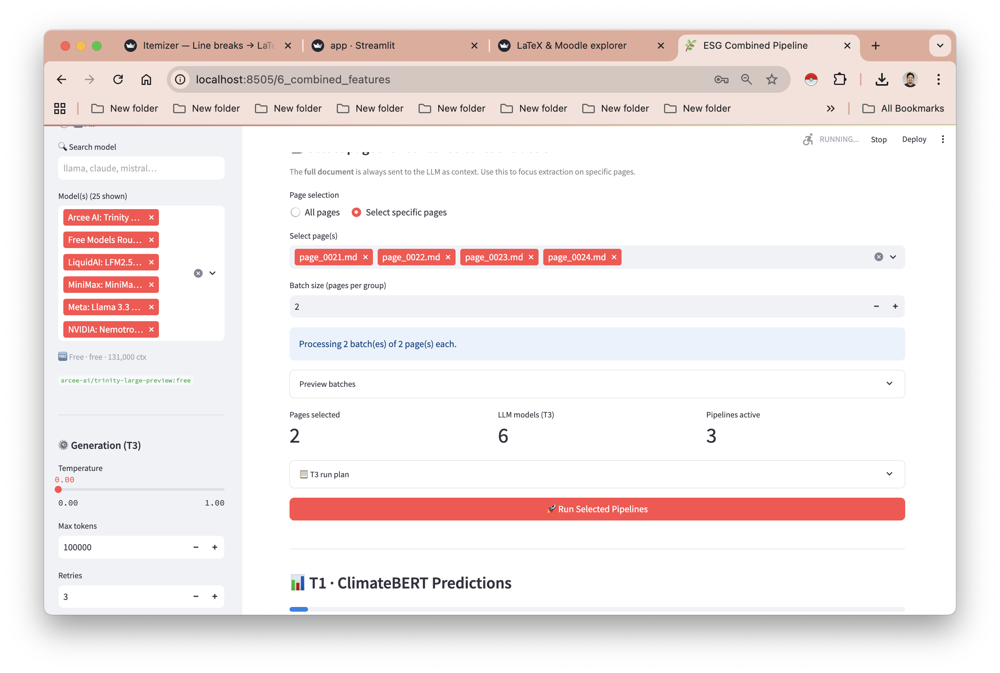

- **Category:** Interface evidence
- **RQ links:** RQ5
- **Source:** `new_page/pages/Screenshot 2026-03-30 at 16.37.29.png`
- **Archive:** `results/image_outputs_archive/images/004_screenshot_2026_03_30_at_16_37_29.png`
- **Dimensions:** 2542 x 1712
- **Explanation:** Screenshot captured from dashboard or error-review work. Use it as interface or debugging evidence, not as a quantitative analysis result.
- **Thesis use:** Supports reproducibility, dashboard documentation, and audit-trail notes.

### img_005 - Aspect by Tone Heatmap

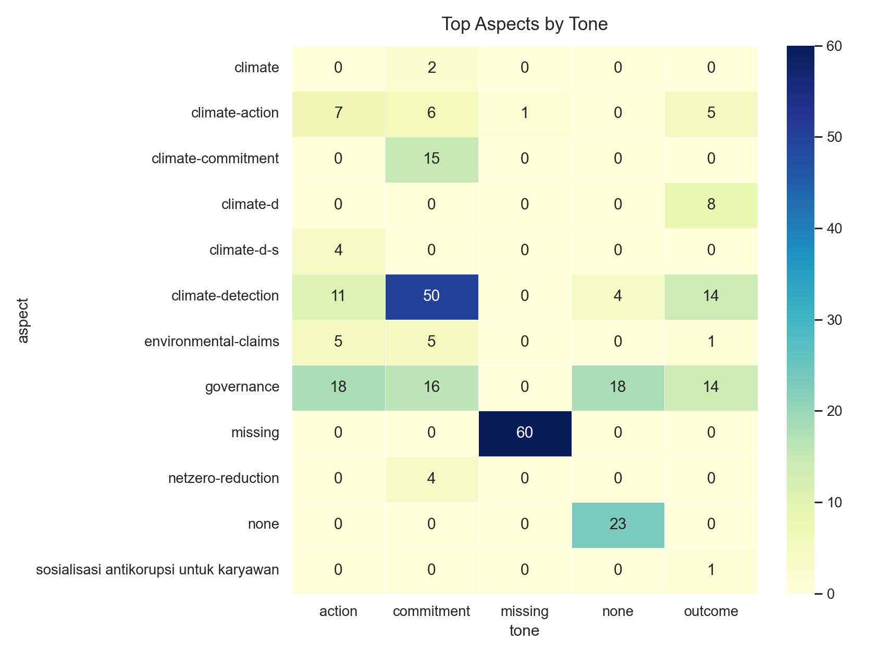

- **Category:** ESG ABSA distribution
- **RQ links:** RQ2, RQ4, RQ6
- **Source:** `new_page/results/visualizations/aspect_by_tone_heatmap.png`
- **Archive:** `results/image_outputs_archive/images/005_aspect_by_tone_heatmap.png`
- **Dimensions:** 1710 x 1260
- **Explanation:** Shows how extracted ESG aspects are distributed across tone categories. Use it to detect which aspects are dominated by commitment, action, outcome, or other tone classes, and to identify sparse aspect-tone cells.
- **Thesis use:** Supports categorization validity, diagnostics for imbalance, and stability discussion across aspect/tone subgroups.

### img_006 - ClimateBERT Label by Tone

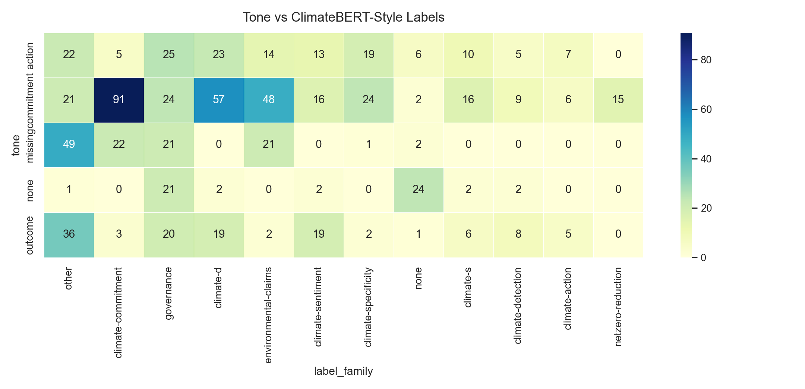

- **Category:** ClimateBERT alignment
- **RQ links:** RQ3, RQ6
- **Source:** `new_page/results/visualizations/climatebert_label_by_tone.png`
- **Archive:** `results/image_outputs_archive/images/006_climatebert_label_by_tone.png`
- **Dimensions:** 2160 x 1044
- **Explanation:** Compares ClimateBERT-style labels against the thesis tone categories. Use it to inspect whether climate labels concentrate in specific tone classes.
- **Thesis use:** Supports the ClimateBERT-versus-tone comparison and highlights where label spaces may align or diverge.

### img_007 - ClimateBERT Remote Top Scores

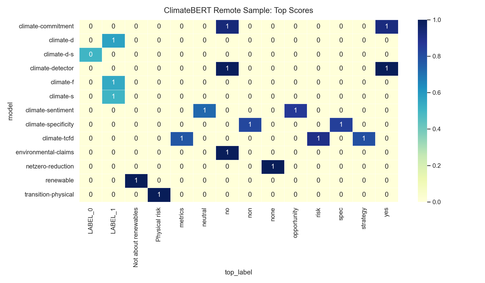

- **Category:** ClimateBERT scoring
- **RQ links:** RQ3, RQ5
- **Source:** `new_page/results/visualizations/climatebert_remote_top_scores.png`
- **Archive:** `results/image_outputs_archive/images/007_climatebert_remote_top_scores.png`
- **Dimensions:** 2160 x 1260
- **Explanation:** Summarizes top remote ClimateBERT scores. It is useful as a sanity check, but should be treated as limited evidence unless the scored rows cover the full dataset.
- **Thesis use:** Supports preliminary model-output inspection and reproducibility documentation, not final model comparison by itself.

### img_008 - ESG Pillar by Tone

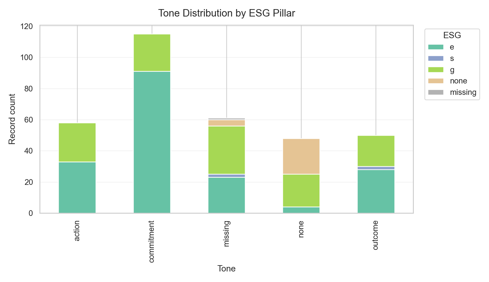

- **Category:** ESG ABSA distribution
- **RQ links:** RQ2, RQ4, RQ6
- **Source:** `new_page/results/visualizations/esg_by_tone.png`
- **Archive:** `results/image_outputs_archive/images/008_esg_by_tone.png`
- **Dimensions:** 1710 x 990
- **Explanation:** Shows how Environmental, Social, and Governance categories distribute across tone classes. This helps reveal pillar imbalance and tone asymmetry.
- **Thesis use:** Supports claims about ESG pillar coverage and warns where Social or other cells are too sparse for strong conclusions.

### img_009 - Tone Distribution

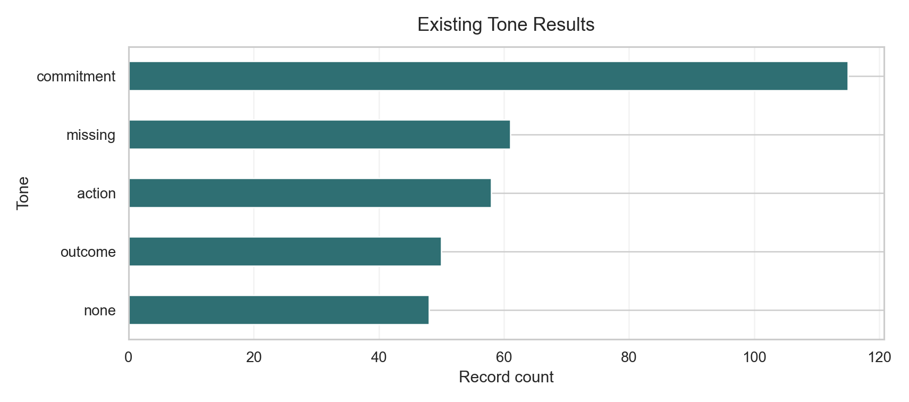

- **Category:** ESG ABSA distribution
- **RQ links:** RQ2, RQ6
- **Source:** `new_page/results/visualizations/tone_distribution.png`
- **Archive:** `results/image_outputs_archive/images/009_tone_distribution.png`
- **Dimensions:** 1710 x 756
- **Explanation:** Displays the overall distribution of extracted tone labels. Use it as a baseline view of class balance before subgroup or model comparisons.
- **Thesis use:** Supports tone-category framing and sample-size reasoning for class balance.

### img_010 - ABSA Sentiment Confusion Matrix

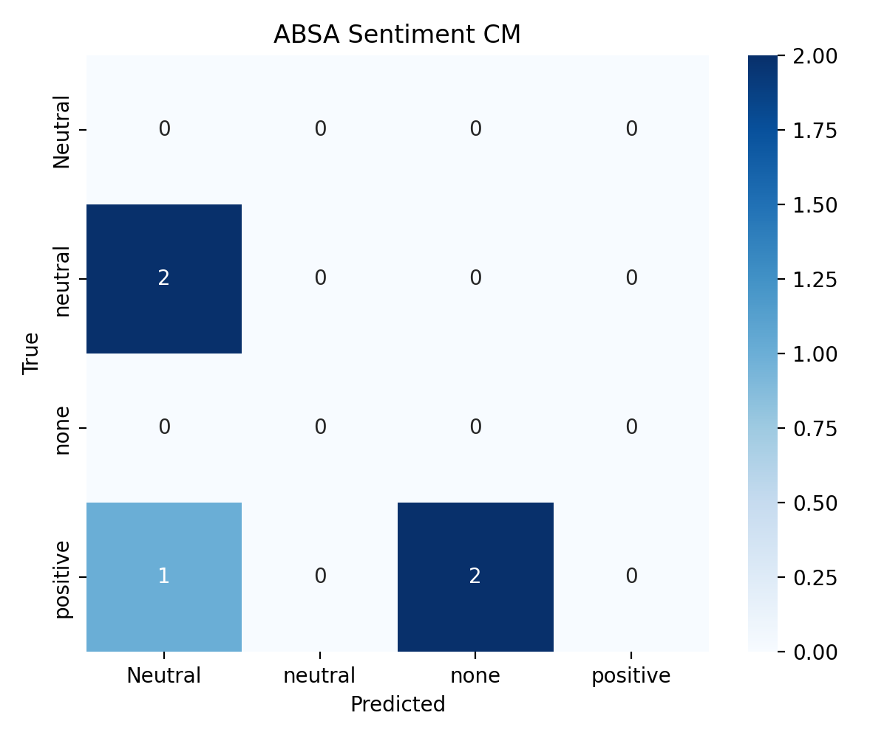

- **Category:** Evaluation metric
- **RQ links:** RQ2, RQ4
- **Source:** `results/confusion_matrices/cm_sentiment_absa.png`
- **Archive:** `results/image_outputs_archive/images/010_cm_sentiment_absa.png`
- **Dimensions:** 1200 x 1000
- **Explanation:** Confusion matrix for ABSA sentiment predictions. It shows which sentiment classes are correctly predicted and which are confused.
- **Thesis use:** Supports model evaluation, error analysis, and diagnostics for sentiment labels.

### img_011 - Ensemble Sentiment Confusion Matrix

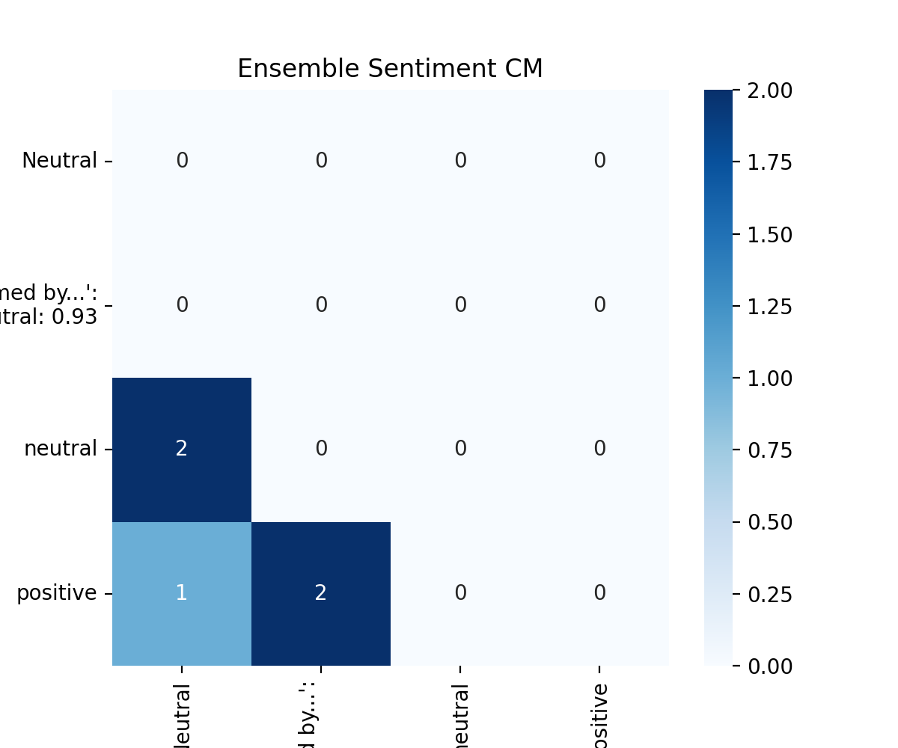

- **Category:** Evaluation metric
- **RQ links:** RQ4, RQ6
- **Source:** `results/confusion_matrices/cm_sentiment_ensemble.png`
- **Archive:** `results/image_outputs_archive/images/011_cm_sentiment_ensemble.png`
- **Dimensions:** 1200 x 1000
- **Explanation:** Confusion matrix for an ensemble sentiment output. Compare it with the ABSA matrix to see whether ensembling changes errors or improves stability.
- **Thesis use:** Supports ensemble/stability discussion and error comparison across strategies.
